

[Introduction]

<ul class="quickLinksUL">
  <li><a href="#overview">Overview</a></li>
  <li><a href="#strategy">Strategy</a></li>
  <li><a href="#floor-guide">Floor Guide</a></li>
  <li><a href="#monsters">Monsters</a></li>
  <li><a href="#items">Items</a></li>
  <li><a href="#traps">Traps</a></li>
</ul>

# Overview

<table class="dungeonOverview">
  <tr>
    <th>Unlock</th>
    <td class="highlightYellow">1. Clear the main story. 2. </td>
  </tr>
  <tr>
    <th>Entrance</th>
    <td class="highlightYellow">Cryptic Rock Valley ()</td>
  </tr>
</table>

<table class="dungeonTable">
  <tr>
    <th>Floors</th>
    <td colspan="3">30F</td>
  </tr>
  <tr>
    <th>Bring Items</th>
    <td>Yes</td>
    <th>Allies</th>
    <td></td>
  </tr>
  <tr>
    <th>Bring Gitan</th>
    <td>Yes</td>
    <th>Bring Level Ups</th>
    <td>Yes</td>
  </tr>
  <tr>
    <th>Starting Item</th>
    <td colspan="3">None</td>
  </tr>
  <tr>
    <th>Unidentified</th>
    <td colspan="3"></td>
  </tr>
  <tr>
    <th>Shops</th>
    <td>No</td>
    <th>Monster Houses</th>
    <td>Yes</td>
  </tr>
  <tr>
    <th>Clear Icon</th>
    <td></td>
    <th>Reward</th>
    <td></td>
  </tr>
</table>

# Strategy

# Floor Guide

# Monsters

See [Monsters](/system/monsters) for individual monster details.

- H - Monster House is possible
- G - Gitan Vault is possible

Numbers in parentheses are HP values. Spawn Rates: Low Medium High

<table class="monsterTable">
  <thead>
    <tr>
      <th>F</th>
      <th>H</th>
      <th>G</th>
      <th colspan="5">Monsters</th>
    </tr>
  </thead>
  <tbody>
    <tr>
      <td rowspan="2">1</td>
      <td rowspan="2" class="highlightMH"></td>
      <td rowspan="2"></td>
      <td class="high">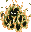 Inferno2 (50)</td>
      <td class="high">Kigny2 (60)</td>
      <td class="mid">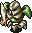 Cell Armor (35)</td>
      <td class="mid">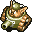 Popster Tank (36)</td>
      <td class="mid">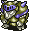 Dremlas (40)</td>
    </tr>
    <tr>
      <td class="low">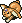 Fluffy Bunny (5)</td>
      <td class="low"> Flying Egg (8)</td>
      <td class="low"> N'Duba (30)</td>
      <td></td>
      <td></td>
    </tr>
    <tr>
      <td colspan="9" class="tableDivider"></td>
    </tr>
    <tr>
      <td rowspan="2">2</td>
      <td rowspan="2" class="highlightMH"></td>
      <td rowspan="2"></td>
      <td class="high"> Inferno2 (50)</td>
      <td class="high">Kigny2 (60)</td>
      <td class="mid"> Cell Armor (35)</td>
      <td class="mid"> Popster Tank (36)</td>
      <td class="mid"> Dremlas (40)</td>
    </tr>
    <tr>
      <td class="low"> Fluffy Bunny (5)</td>
      <td class="low"> Flying Egg (8)</td>
      <td class="low"> N'Duba (30)</td>
      <td></td>
      <td></td>
    </tr>
    <tr>
      <td colspan="9" class="tableDivider"></td>
    </tr>
    <tr>
      <td rowspan="2">3</td>
      <td rowspan="2" class="highlightMH"></td>
      <td rowspan="2"></td>
      <td class="high"> Inferno2 (50)</td>
      <td class="high">Kigny2 (60)</td>
      <td class="high">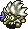 Young Tengu (25)</td>
      <td class="high"> Hell Reaper (45)</td>
      <td class="low"> Evil General (30)</td>
    </tr>
    <tr>
      <td class="low"> Fluffy Bunny (5)</td>
      <td class="low"> Flying Egg (8)</td>
      <td class="low"> N'Duba (30)</td>
      <td class="low">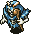 Skull Wizard (35)</td>
      <td></td>
    </tr>
    <tr>
      <td colspan="9" class="tableDivider"></td>
    </tr>
    <tr>
      <td rowspan="3">4</td>
      <td rowspan="3" class="highlightMH"></td>
      <td rowspan="3"></td>
      <td class="high"> Inferno2 (50)</td>
      <td class="high">Kigny2 (60)</td>
      <td class="high"> Young Tengu (25)</td>
      <td class="high"> Hell Reaper (45)</td>
      <td class="low"> Evil General (30)</td>
    </tr>
    <tr>
      <td class="low"> Fluffy Bunny (5)</td>
      <td class="low"> Flying Egg (8)</td>
      <td class="low"> N'Duba (30)</td>
      <td class="low"> Skull Wizard (35)</td>
      <td class="low">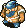 Jar Bandit (25)</td>
    </tr>
    <tr>
      <td class="low">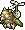 Flutter Fowl (30)</td>
      <td></td>
      <td></td>
      <td></td>
      <td></td>
    </tr>
    <tr>
      <td colspan="9" class="tableDivider"></td>
    </tr>
    <tr>
      <td rowspan="3">5</td>
      <td rowspan="3" class="highlightMH"></td>
      <td rowspan="3"></td>
      <td class="high"> Inferno2 (50)</td>
      <td class="high">Kigny2 (60)</td>
      <td class="low">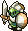 Half Warrior (25)</td>
      <td class="low">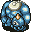 Chainhead (50)</td>
      <td class="low"> Master Hen (50)</td>
    </tr>
    <tr>
      <td class="low"> Fluffy Bunny (5)</td>
      <td class="low"> Flying Egg (8)</td>
      <td class="low"> N'Duba (30)</td>
      <td></td>
      <td class="low"> Jar Bandit (25)</td>
    </tr>
    <tr>
      <td class="low"> Flutter Fowl (30)</td>
      <td></td>
      <td></td>
      <td></td>
      <td></td>
    </tr>
    <tr>
      <td colspan="9" class="tableDivider"></td>
    </tr>
    <tr>
      <td rowspan="3">6</td>
      <td rowspan="3" class="highlightMH"></td>
      <td rowspan="3"></td>
      <td class="high"> Inferno2 (50)</td>
      <td class="high">Kigny2 (60)</td>
      <td class="low"> Half Warrior (25)</td>
      <td class="low"> Chainhead (50)</td>
      <td class="low"> Master Hen (50)</td>
    </tr>
    <tr>
      <td class="low"> Fluffy Bunny (5)</td>
      <td class="low"> Flying Egg (8)</td>
      <td class="low"> N'Duba (30)</td>
      <td class="low"> Super Gaze (51)</td>
      <td></td>
    </tr>
    <tr>
      <td class="low"> Flutter Fowl (30)</td>
      <td></td>
      <td></td>
      <td></td>
      <td></td>
    </tr>
    <tr>
      <td colspan="9" class="tableDivider"></td>
    </tr>
    <tr>
      <td rowspan="2">7</td>
      <td rowspan="2" class="highlightMH"></td>
      <td rowspan="2"></td>
      <td class="high"> Inferno2 (50)</td>
      <td class="high">Kigny2 (60)</td>
      <td class="mid"> Curse Sis (33)</td>
      <td class="low"> Chainhead (50)</td>
      <td class="mid"> Rice Boss (38)</td>
    </tr>
    <tr>
      <td class="low"> Fluffy Bunny (5)</td>
      <td class="low"> Flying Egg (8)</td>
      <td class="low"> N'Duba (30)</td>
      <td class="low"> Super Gaze (51)</td>
      <td class="mid"> Dadster Tank (40)</td>
    </tr>
    <tr>
      <td colspan="9" class="tableDivider"></td>
    </tr>
    <tr>
      <td rowspan="3">8</td>
      <td rowspan="3" class="highlightMH"></td>
      <td rowspan="3"></td>
      <td class="high"> Inferno2 (50)</td>
      <td class="high">Kigny2 (60)</td>
      <td class="mid"> Curse Sis (33)</td>
      <td class="mid"> Blazepuff (40)</td>
      <td class="mid"> Rice Boss (38)</td>
    </tr>
    <tr>
      <td class="low"> Fluffy Bunny (5)</td>
      <td class="low"> Flying Egg (8)</td>
      <td class="low"> N'Duba (30)</td>
      <td class="low"> Super Gaze (51)</td>
      <td class="mid"> Dadster Tank (40)</td>
    </tr>
    <tr>
      <td class="mid"> Mistonos (50)</td>
      <td></td>
      <td></td>
      <td></td>
      <td></td>
    </tr>
    <tr>
      <td colspan="9" class="tableDivider"></td>
    </tr>
    <tr>
      <td rowspan="3">9</td>
      <td rowspan="3" class="highlightMH"></td>
      <td rowspan="3"></td>
      <td class="high"> Inferno2 (50)</td>
      <td class="high">Kigny2 (60)</td>
      <td class="mid"> Curse Sis (33)</td>
      <td class="mid"> Blazepuff (40)</td>
      <td class="mid"> Rice Boss (38)</td>
    </tr>
    <tr>
      <td class="low"> Fluffy Bunny (5)</td>
      <td class="low"> Flying Egg (8)</td>
      <td class="low"> N'Duba (30)</td>
      <td class="low"> Super Gaze (51)</td>
      <td class="mid"> Dadster Tank (40)</td>
    </tr>
    <tr>
      <td class="mid"> Mistonos (50)</td>
      <td></td>
      <td></td>
      <td></td>
      <td></td>
    </tr>
    <tr>
      <td colspan="9" class="tableDivider"></td>
    </tr>
    <tr>
      <td rowspan="2">10</td>
      <td rowspan="2" class="highlightMH"></td>
      <td rowspan="2"></td>
      <td class="high">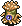 Leech Bug (32)</td>
      <td class="high">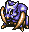 Sabregator (35)</td>
      <td class="high"> Floppy Hani (40)</td>
      <td class="high"> Sleep Radish (55)</td>
      <td class="high"> Grey Slime (70)</td>
    </tr>
    <tr>
      <td class="high"> Spike Blast (80)</td>
      <td class="mid">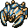 Killer Gather (60)</td>
      <td></td>
      <td></td>
      <td></td>
    </tr>
    <tr>
      <td colspan="9" class="tableDivider"></td>
    </tr>
    <tr>
      <td rowspan="2">11</td>
      <td rowspan="2" class="highlightMH"></td>
      <td rowspan="2"></td>
      <td class="high"> Leech Bug (32)</td>
      <td class="high"> Sabregator (35)</td>
      <td class="high"> Floppy Hani (40)</td>
      <td class="high"> Sleep Radish (55)</td>
      <td class="high"> Grey Slime (70)</td>
    </tr>
    <tr>
      <td class="high"> Spike Blast (80)</td>
      <td class="mid"> Killer Gather (60)</td>
      <td></td>
      <td></td>
      <td></td>
    </tr>
    <tr>
      <td colspan="9" class="tableDivider"></td>
    </tr>
    <tr>
      <td rowspan="2">12</td>
      <td rowspan="2" class="highlightMH"></td>
      <td rowspan="2"></td>
      <td class="high"> Leech Bug (32)</td>
      <td class="high"> Sabregator (35)</td>
      <td class="high"> Floppy Hani (40)</td>
      <td class="high"> Sleep Radish (55)</td>
      <td class="high"> Grey Slime (70)</td>
    </tr>
    <tr>
      <td class="high"> Spike Blast (80)</td>
      <td class="mid"> Killer Gather (60)</td>
      <td></td>
      <td></td>
      <td></td>
    </tr>
    <tr>
      <td colspan="9" class="tableDivider"></td>
    </tr>
    <tr>
      <td rowspan="2">13</td>
      <td rowspan="2" class="highlightMH"></td>
      <td rowspan="2"></td>
      <td class="high">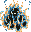 Inferno3 (65)</td>
      <td class="high">Kigny3 (75)</td>
      <td class="low"> Fluffy Bunny (5)</td>
      <td class="low"> Wraith Devil (50)</td>
      <td class="low"> N'Dulu (35)</td>
    </tr>
    <tr>
      <td class="mid"> Pacorepkina (45)</td>
      <td class="mid">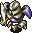 Metal Armor (65)</td>
      <td class="mid"> Pythy (70)</td>
      <td class="low"> Greenwalrus (58)</td>
      <td class="mid"> Haze Hermit (45)</td>
    </tr>
    <tr>
      <td colspan="9" class="tableDivider"></td>
    </tr>
    <tr>
      <td rowspan="2">14</td>
      <td rowspan="2" class="highlightMH"></td>
      <td rowspan="2"></td>
      <td class="high"> Inferno3 (65)</td>
      <td class="high">Kigny3 (75)</td>
      <td class="low"> Fluffy Bunny (5)</td>
      <td class="low"> Wraith Devil (50)</td>
      <td class="low"> N'Dulu (35)</td>
    </tr>
    <tr>
      <td class="mid"> Pacorepkina (45)</td>
      <td class="mid"> Metal Armor (65)</td>
      <td class="mid"> Pythy (70)</td>
      <td class="low"> Greenwalrus (58)</td>
      <td class="mid"> Haze Hermit (45)</td>
    </tr>
    <tr>
      <td colspan="9" class="tableDivider"></td>
    </tr>
    <tr>
      <td rowspan="2">15</td>
      <td rowspan="2" class="highlightMH"></td>
      <td rowspan="2" class="highlightGitan"></td>
      <td class="high"> Inferno3 (65)</td>
      <td class="high">Kigny3 (75)</td>
      <td class="low"> Fluffy Bunny (5)</td>
      <td class="low"> Wraith Devil (50)</td>
      <td class="low"> N'Dulu (35)</td>
    </tr>
    <tr>
      <td class="mid"> Pacorepkina (45)</td>
      <td class="mid"> Metal Armor (65)</td>
      <td class="mid"> Pythy (70)</td>
      <td class="low"> Greenwalrus (58)</td>
      <td class="mid"> Haze Hermit (45)</td>
    </tr>
    <tr>
      <td colspan="9" class="tableDivider"></td>
    </tr>
    <tr>
      <td rowspan="3">16</td>
      <td rowspan="3" class="highlightMH"></td>
      <td rowspan="3" class="highlightGitan"></td>
      <td class="high"> Inferno3 (65)</td>
      <td class="high">Kigny3 (75)</td>
      <td class="low"> Fluffy Bunny (5)</td>
      <td class="low"> Wraith Devil (50)</td>
      <td class="low"> N'Dulu (35)</td>
    </tr>
    <tr>
      <td class="mid"> Pacorepkina (45)</td>
      <td class="mid"> Metal Armor (65)</td>
      <td class="mid"> Pythy (70)</td>
      <td class="low"> Greenwalrus (58)</td>
      <td class="mid"> Haze Hermit (45)</td>
    </tr>
    <tr>
      <td class="mid"> Piggo (50)</td>
      <td class="mid"> Polygon Song (80)</td>
      <td class="mid"> Death Angel (65)</td>
      <td></td>
      <td></td>
    </tr>
    <tr>
      <td colspan="9" class="tableDivider"></td>
    </tr>
    <tr>
      <td rowspan="2">17</td>
      <td rowspan="2" class="highlightMH"></td>
      <td rowspan="2" class="highlightGitan"></td>
      <td class="high"> Inferno3 (65)</td>
      <td class="high">Kigny3 (75)</td>
      <td class="low"> Fluffy Bunny (5)</td>
      <td class="low"> Wraith Devil (50)</td>
      <td class="low"> N'Dulu (35)</td>
    </tr>
    <tr>
      <td class="mid"> Piggo (50)</td>
      <td class="mid"> Polygon Song (80)</td>
      <td class="mid"> Death Angel (65)</td>
      <td></td>
      <td></td>
    </tr>
    <tr>
      <td colspan="9" class="tableDivider"></td>
    </tr>
    <tr>
      <td rowspan="2">18</td>
      <td rowspan="2" class="highlightMH"></td>
      <td rowspan="2" class="highlightGitan"></td>
      <td class="high"> Inferno3 (65)</td>
      <td class="high">Kigny3 (75)</td>
      <td class="low"> Fluffy Bunny (5)</td>
      <td class="low"> Wraith Devil (50)</td>
      <td class="low"> N'Dulu (35)</td>
    </tr>
    <tr>
      <td class="mid"> Piggo (50)</td>
      <td class="mid"> Polygon Song (80)</td>
      <td class="mid"> Death Angel (65)</td>
      <td></td>
      <td></td>
    </tr>
    <tr>
      <td colspan="9" class="tableDivider"></td>
    </tr>
    <tr>
      <td rowspan="3">19</td>
      <td rowspan="3" class="highlightMH"></td>
      <td rowspan="3" class="highlightGitan"></td>
      <td class="high"> Inferno3 (65)</td>
      <td class="high">Kigny3 (75)</td>
      <td class="low"> Fluffy Bunny (5)</td>
      <td class="low"> Wraith Devil (50)</td>
      <td class="low"> N'Dulu (35)</td>
    </tr>
    <tr>
      <td class="mid"> Piggo (50)</td>
      <td class="mid"> Polygon Song (80)</td>
      <td class="mid"> Death Angel (65)</td>
      <td class="mid"> Dragon (90)</td>
      <td class="mid">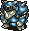 Madremlas (60)</td>
    </tr>
    <tr>
      <td class="mid"> Skull Wraith (60)</td>
      <td></td>
      <td></td>
      <td></td>
      <td></td>
    </tr>
    <tr>
      <td colspan="9" class="tableDivider"></td>
    </tr>
    <tr>
      <td rowspan="2">20</td>
      <td rowspan="2" class="highlightMH"></td>
      <td rowspan="2" class="highlightGitan"></td>
      <td class="high"> Inferno3 (65)</td>
      <td class="high">Kigny3 (75)</td>
      <td class="low"> Fluffy Bunny (5)</td>
      <td class="low"> Wraith Devil (50)</td>
      <td class="low"> N'Dulu (35)</td>
    </tr>
    <tr>
      <td class="mid"> Skull Wraith (60)</td>
      <td></td>
      <td class="mid"> Death Angel (65)</td>
      <td class="mid"> Dragon (90)</td>
      <td class="mid"> Madremlas (60)</td>
    </tr>
    <tr>
      <td colspan="9" class="tableDivider"></td>
    </tr>
    <tr>
      <td rowspan="2">21</td>
      <td rowspan="2" class="highlightMH"></td>
      <td rowspan="2" class="highlightGitan"></td>
      <td class="high"> Inferno3 (65)</td>
      <td class="high">Kigny3 (75)</td>
      <td class="low"> Fluffy Bunny (5)</td>
      <td class="low"> Wraith Devil (50)</td>
      <td class="low"> N'Dulu (35)</td>
    </tr>
    <tr>
      <td class="mid"> Skull Wraith (60)</td>
      <td></td>
      <td></td>
      <td class="mid"> Dragon (90)</td>
      <td class="mid"> Madremlas (60)</td>
    </tr>
    <tr>
      <td colspan="9" class="tableDivider"></td>
    </tr>
    <tr>
      <td rowspan="2">22</td>
      <td rowspan="2" class="highlightMH"></td>
      <td rowspan="2" class="highlightGitan"></td>
      <td class="high"> Inferno3 (65)</td>
      <td class="high">Kigny3 (75)</td>
      <td class="low"> Fluffy Bunny (5)</td>
      <td class="low"> Wraith Devil (50)</td>
      <td class="low"> N'Dulu (35)</td>
    </tr>
    <tr>
      <td class="mid"> Skull Wraith (60)</td>
      <td></td>
      <td></td>
      <td class="mid"> Dragon (90)</td>
      <td class="mid"> Madremlas (60)</td>
    </tr>
    <tr>
      <td colspan="9" class="tableDivider"></td>
    </tr>
    <tr>
      <td rowspan="3">23</td>
      <td rowspan="3" class="highlightMH"></td>
      <td rowspan="3" class="highlightGitan"></td>
      <td class="high"> Inferno3 (65)</td>
      <td class="high">Kigny3 (75)</td>
      <td class="low"> Fluffy Bunny (5)</td>
      <td class="low"> Wraith Devil (50)</td>
      <td class="low"> N'Dulu (35)</td>
    </tr>
    <tr>
      <td class="mid"> Skull Wraith (60)</td>
      <td class="mid"> Leech Fly (41)</td>
      <td class="mid">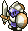 Half Fighter (50)</td>
      <td class="mid"> Dragon (90)</td>
      <td class="mid"> Madremlas (60)</td>
    </tr>
    <tr>
      <td class="mid"> Droopy Hani (55)</td>
      <td></td>
      <td></td>
      <td></td>
      <td></td>
    </tr>
    <tr>
      <td colspan="9" class="tableDivider"></td>
    </tr>
    <tr>
      <td rowspan="2">24</td>
      <td rowspan="2" class="highlightMH"></td>
      <td rowspan="2" class="highlightGitan"></td>
      <td class="high"> Inferno3 (65)</td>
      <td class="high">Kigny3 (75)</td>
      <td class="low"> Fluffy Bunny (5)</td>
      <td class="low"> Wraith Devil (50)</td>
      <td class="low"> N'Dulu (35)</td>
    </tr>
    <tr>
      <td class="mid"> Droopy Hani (55)</td>
      <td class="mid"> Leech Fly (41)</td>
      <td class="mid"> Half Fighter (50)</td>
      <td class="mid">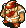 Item Bandit (35)</td>
      <td></td>
    </tr>
    <tr>
      <td colspan="9" class="tableDivider"></td>
    </tr>
    <tr>
      <td rowspan="2">25</td>
      <td rowspan="2" class="highlightMH"></td>
      <td rowspan="2" class="highlightGitan"></td>
      <td class="high"> Inferno4 (80)</td>
      <td class="high">Kigny4 (90)</td>
      <td class="low"> Fluffy Bunny (5)</td>
      <td class="low"> Wraith Devil (50)</td>
      <td class="low"> N'Bama (40)</td>
    </tr>
    <tr>
      <td class="mid"> Droopy Hani (55)</td>
      <td class="mid"> Leech Fly (41)</td>
      <td class="mid"> Half Fighter (50)</td>
      <td class="mid"> Item Bandit (35)</td>
      <td></td>
    </tr>
    <tr>
      <td colspan="9" class="tableDivider"></td>
    </tr>
    <tr>
      <td rowspan="3">26</td>
      <td rowspan="3" class="highlightMH"></td>
      <td rowspan="3" class="highlightGitan"></td>
      <td class="high"> Inferno4 (80)</td>
      <td class="high">Kigny4 (90)</td>
      <td class="low"> Fluffy Bunny (5)</td>
      <td class="low"> Wraith Devil (50)</td>
      <td class="low"> N'Bama (40)</td>
    </tr>
    <tr>
      <td class="mid"> Droopy Hani (55)</td>
      <td class="mid"> Leech Fly (41)</td>
      <td class="mid"> Evil Shogun (50)</td>
      <td class="mid"> Curse Mom (56)</td>
      <td class="mid"> Pacorepking (60)</td>
    </tr>
    <tr>
      <td class="mid">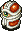 Hyper Gaze (70)</td>
      <td class="mid"> Red Slime (100)</td>
      <td></td>
      <td></td>
      <td></td>
    </tr>
    <tr>
      <td colspan="9" class="tableDivider"></td>
    </tr>
    <tr>
      <td rowspan="2">27</td>
      <td rowspan="2" class="highlightMH"></td>
      <td rowspan="2" class="highlightGitan"></td>
      <td class="high"> Inferno4 (80)</td>
      <td class="high">Kigny4 (90)</td>
      <td class="low"> Fluffy Bunny (5)</td>
      <td class="low"> Wraith Devil (50)</td>
      <td class="low"> N'Bama (40)</td>
    </tr>
    <tr>
      <td class="mid"> Hyper Gaze (70)</td>
      <td class="mid"> Red Slime (100)</td>
      <td class="mid"> Evil Shogun (50)</td>
      <td class="mid"> Curse Mom (56)</td>
      <td class="mid"> Pacorepking (60)</td>
    </tr>
    <tr>
      <td colspan="9" class="tableDivider"></td>
    </tr>
    <tr>
      <td rowspan="2">28</td>
      <td rowspan="2" class="highlightMH"></td>
      <td rowspan="2" class="highlightGitan"></td>
      <td class="high"> Inferno4 (80)</td>
      <td class="high">Kigny4 (90)</td>
      <td class="low"> Fluffy Bunny (5)</td>
      <td class="low"> Wraith Devil (50)</td>
      <td class="low"> N'Bama (40)</td>
    </tr>
    <tr>
      <td class="mid"> Hyper Gaze (70)</td>
      <td class="mid"> Red Slime (100)</td>
      <td class="mid"> Evil Shogun (50)</td>
      <td class="mid"> Curse Mom (56)</td>
      <td class="mid"> Pacorepking (60)</td>
    </tr>
    <tr>
      <td colspan="9" class="tableDivider"></td>
    </tr>
    <tr>
      <td rowspan="2">29</td>
      <td rowspan="2" class="highlightMH"></td>
      <td rowspan="2" class="highlightGitan"></td>
      <td class="high"> Inferno4 (80)</td>
      <td class="high">Kigny4 (90)</td>
      <td class="low"> Fluffy Bunny (5)</td>
      <td class="low"> Wraith Devil (50)</td>
      <td class="low"> N'Bama (40)</td>
    </tr>
    <tr>
      <td class="mid"> Hyper Gaze (70)</td>
      <td class="mid"> Red Slime (100)</td>
      <td class="mid"> Evil Shogun (50)</td>
      <td class="mid"> Curse Mom (56)</td>
      <td class="mid"> Pacorepking (60)</td>
    </tr>
    <tr>
      <td colspan="9" class="tableDivider"></td>
    </tr>
    <tr>
      <td>30</td>
      <td></td>
      <td></td>
      <td colspan="5" class="highlightOffense">Boss</td>
    </tr>
    <tr>
      <td colspan="9" class="tableDivider"></td>
    </tr>
  </tbody>
</table>

# Items

#### Spawn Rates

- F = Floor, Monster drop
- C = Jar of Change, Thiefwalrus drop

 

<table class="dungeonTable">
  <tr>
    <th class="centeredText">Category</th>
    <th class="centeredText">F</th>
    <th class="centeredText">C</th>
    <th rowspan="6" class="tableDivider"></th>
    <th class="centeredText">Category</th>
    <th class="centeredText">F</th>
    <th class="centeredText">C</th>
  </tr>
  <tr>
    <td class="highlightGray">Weapon</td>
    <td>★★</td>
    <td>★★★</td>
    <td class="highlightGray">Herb</td>
    <td>★★★★★</td>
    <td>★★★★★</td>
  </tr>
  <tr>
    <td class="highlightGray">Shield</td>
    <td>★★</td>
    <td>★★★</td>
    <td class="highlightGray">Scroll</td>
    <td>★★★</td>
    <td>★★</td>
  </tr>
  <tr>
    <td class="highlightGray">Armband</td>
    <td>★★★</td>
    <td>★★★</td>
    <td class="highlightGray">Staff</td>
    <td>★★</td>
    <td>★</td>
  </tr>
  <tr>
    <td class="highlightGray">Projectile</td>
    <td>★</td>
    <td>★</td>
    <td class="highlightGray">Jar</td>
    <td>★★</td>
    <td>★</td>
  </tr>
  <tr>
    <td class="highlightGray">Food</td>
    <td>★★</td>
    <td>★★</td>
    <td colspan="3"></td>
  </tr>
</table>

#### Item Table

The values like "1-30" in the Notes column represents the floor range where the item can appear.

- F = Floor, Monster drop
- M = Monster (Fixed drop)
- C = Jar of Change, Thiefwalrus drop

 

<table class="dungeonItemTable">
  <tr>
    <th colspan="5" class="highlightLightblue">Weapon</th>
    <th rowspan="54"></th>
    <th colspan="5" class="highlightLightblue">Herb</th>
  </tr>
  <tr>
    <th>Name</th>
    <th>F</th>
    <th>M</th>
    <th>C</th>
    <th>Notes</th>
    <th>Name</th>
    <th>F</th>
    <th>M</th>
    <th>C</th>
    <th>Notes</th>
  </tr>
  <tr>
    <td class="leftText">Katana</td>
    <td>X</td>
    <td></td>
    <td>X</td>
    <td>1-30</td>
    <td class="leftText">Big Belly Seed</td>
    <td>X</td>
    <td></td>
    <td>X</td>
    <td>1-30</td>
  </tr>
  <tr>
    <td class="leftText">Golden Blade</td>
    <td>X</td>
    <td></td>
    <td>X</td>
    <td>1-30</td>
    <td class="leftText">Herb of Life</td>
    <td>X</td>
    <td></td>
    <td>X</td>
    <td>1-30</td>
  </tr>
  <tr>
    <td class="leftText">Kabra's Blade</td>
    <td></td>
    <td></td>
    <td>X</td>
    <td>10-12</td>
    <td class="leftText">Restorative Herb</td>
    <td>X</td>
    <td></td>
    <td>X</td>
    <td>1-30</td>
  </tr>
  <tr>
    <td class="leftText">Cudgel</td>
    <td>X</td>
    <td></td>
    <td>X</td>
    <td>10-12</td>
    <td class="leftText">Weeds</td>
    <td></td>
    <td>X</td>
    <td></td>
    <td>Field Bandit Type</td>
  </tr>
  <tr>
    <td class="leftText">Air Slayer</td>
    <td>X</td>
    <td></td>
    <td>X</td>
    <td>1-30</td>
    <td class="leftText">Sleeping Herb</td>
    <td></td>
    <td>X</td>
    <td></td>
    <td>Sleep Radish</td>
  </tr>
  <tr>
    <td class="leftText">Sickle Slayer</td>
    <td>X</td>
    <td></td>
    <td>X</td>
    <td>1-30</td>
    <td class="leftText">Herb of Strength</td>
    <td>X</td>
    <td></td>
    <td>X</td>
    <td>1-30</td>
  </tr>
  <tr>
    <td class="leftText">Pickaxe</td>
    <td>X</td>
    <td></td>
    <td>X</td>
    <td>10-12</td>
    <td class="leftText">Antidote Herb</td>
    <td>X</td>
    <td></td>
    <td>X</td>
    <td>1-30</td>
  </tr>
  <tr>
    <td class="leftText">Mastersword</td>
    <td>X</td>
    <td></td>
    <td>X</td>
    <td>1-30</td>
    <td class="leftText">Dragon Herb</td>
    <td>X</td>
    <td></td>
    <td>X</td>
    <td>10-12</td>
  </tr>
  <tr>
    <td class="leftText">Dragonkiller</td>
    <td>X</td>
    <td></td>
    <td>X</td>
    <td>1-9 / 13-30</td>
    <td class="leftText">Herb of Sight</td>
    <td>X</td>
    <td></td>
    <td>X</td>
    <td>1-30</td>
  </tr>
  <tr>
    <td class="leftText">Drain Buster</td>
    <td>X</td>
    <td></td>
    <td>X</td>
    <td>1-30</td>
    <td class="leftText">Medicinal Herb</td>
    <td>X</td>
    <td></td>
    <td>X</td>
    <td>1-30</td>
  </tr>
  <tr>
    <td class="leftText">Polearm</td>
    <td>X</td>
    <td></td>
    <td>X</td>
    <td>1-30</td>
    <th colspan="5" class="highlightLightblue">Scroll</th>
  </tr>
  <tr>
    <td class="leftText">Cyclops Killer</td>
    <td>X</td>
    <td></td>
    <td>X</td>
    <td>1-9 / 13-30</td>
    <th>Name</th>
    <th>F</th>
    <th>M</th>
    <th>C</th>
    <th>Notes</th>
  </tr>
  <tr>
    <td class="leftText">Crescent Arm</td>
    <td>X</td>
    <td></td>
    <td>X</td>
    <td>1-30</td>
    <td class="leftText">Scroll of Light</td>
    <td>X</td>
    <td></td>
    <td>X</td>
    <td>1-30</td>
  </tr>
  <tr>
    <td class="leftText">Razor Wind</td>
    <td>X</td>
    <td></td>
    <td>X</td>
    <td>1-30</td>
    <td class="leftText">Great Hall Scroll</td>
    <td>X</td>
    <td></td>
    <td>X</td>
    <td>1-30</td>
  </tr>
  <tr>
    <th colspan="5" class="highlightLightblue">Shield</th>
    <td class="leftText">Scroll of Blessing</td>
    <td>X</td>
    <td></td>
    <td>X</td>
    <td>1-30</td>
  </tr>
  <tr>
    <th>Name</th>
    <th>F</th>
    <th>M</th>
    <th>C</th>
    <th>Notes</th>
    <td class="leftText">Scroll of Need</td>
    <td>X</td>
    <td></td>
    <td>X</td>
    <td>1-30</td>
  </tr>
  <tr>
    <td class="leftText">Gold Shield</td>
    <td>X</td>
    <td></td>
    <td>X</td>
    <td>1-30</td>
    <td class="leftText">Scroll of Confusion</td>
    <td>X</td>
    <td></td>
    <td>X</td>
    <td>1-30</td>
  </tr>
  <tr>
    <td class="leftText">Armor Ward</td>
    <td>X</td>
    <td></td>
    <td>X</td>
    <td>1-30</td>
    <td class="leftText">Scroll of Identity</td>
    <td>X</td>
    <td></td>
    <td>X</td>
    <td>1-30</td>
  </tr>
  <tr>
    <td class="leftText">Blast Shield</td>
    <td>X</td>
    <td></td>
    <td>X</td>
    <td>1-30</td>
    <td class="leftText">Blastwave Scroll</td>
    <td>X</td>
    <td></td>
    <td>X</td>
    <td>1-30</td>
  </tr>
  <tr>
    <td class="leftText">Bronzeward</td>
    <td>X</td>
    <td></td>
    <td>X</td>
    <td>1-30</td>
    <td class="leftText">Extraction Scroll</td>
    <td>X</td>
    <td></td>
    <td>X</td>
    <td>1-9 / 13-30</td>
  </tr>
  <tr>
    <td class="leftText">Iron Shield</td>
    <td>X</td>
    <td></td>
    <td>X</td>
    <td>1-30</td>
    <td class="leftText">Earth Bless Scroll</td>
    <td>X</td>
    <td></td>
    <td>X</td>
    <td>1-30</td>
  </tr>
  <tr>
    <td class="leftText">Walrus Shield</td>
    <td>X</td>
    <td></td>
    <td>X</td>
    <td>1-30</td>
    <td class="leftText">Air Bless Scroll</td>
    <td>X</td>
    <td></td>
    <td>X</td>
    <td>1-30</td>
  </tr>
  <tr>
    <td class="leftText">Dragonward</td>
    <td>X</td>
    <td></td>
    <td>X</td>
    <td>1-9 / 13-30</td>
    <td class="leftText">Blank Scroll</td>
    <td>X</td>
    <td></td>
    <td>X</td>
    <td>10-12</td>
  </tr>
  <tr>
    <td class="leftText">Spiked Ward</td>
    <td>X</td>
    <td></td>
    <td>X</td>
    <td>1-9 / 13-30</td>
    <td class="leftText">Scroll of Sleep</td>
    <td>X</td>
    <td></td>
    <td>X</td>
    <td>1-30</td>
  </tr>
  <tr>
    <td class="leftText">Hide Shield</td>
    <td>X</td>
    <td></td>
    <td>X</td>
    <td>10-12</td>
    <td class="leftText">Power Up Scroll</td>
    <td>X</td>
    <td></td>
    <td>X</td>
    <td>1-30</td>
  </tr>
  <tr>
    <td class="leftText">Windshield</td>
    <td></td>
    <td></td>
    <td>X</td>
    <td>10-12</td>
    <td class="leftText">Plating Scroll</td>
    <td>X</td>
    <td></td>
    <td>X</td>
    <td>1-30</td>
  </tr>
  <tr>
    <td class="leftText">Evasive Shield</td>
    <td>X</td>
    <td></td>
    <td>X</td>
    <td>1-9 / 13-30</td>
    <th colspan="5" class="highlightLightblue">Staff</th>
  </tr>
  <tr>
    <td class="leftText">Wood Shield</td>
    <td>X</td>
    <td></td>
    <td>X</td>
    <td>10-12</td>
    <th>Name</th>
    <th>F</th>
    <th>M</th>
    <th>C</th>
    <th>Notes</th>
  </tr>
  <tr>
    <th colspan="5" class="highlightLightblue">Armband</th>
    <td class="leftText">Pain Sharing Staff</td>
    <td>X</td>
    <td></td>
    <td>X</td>
    <td>1-30</td>
  </tr>
  <tr>
    <th>Name</th>
    <th>F</th>
    <th>M</th>
    <th>C</th>
    <th>Notes</th>
    <td class="leftText">Staff of Postpone</td>
    <td>X</td>
    <td></td>
    <td>X</td>
    <td>1-30</td>
  </tr>
  <tr>
    <td class="leftText">Pitcher's Armband</td>
    <td>X</td>
    <td></td>
    <td>X</td>
    <td>1-30</td>
    <td class="leftText">Skull Staff</td>
    <td></td>
    <td>X</td>
    <td></td>
    <td>Skull Mage Type</td>
  </tr>
  <tr>
    <td class="leftText">Critical Armband</td>
    <td>X</td>
    <td></td>
    <td>X</td>
    <td>1-9 / 13-30</td>
    <td class="leftText">Staff of Paralysis</td>
    <td>X</td>
    <td></td>
    <td>X</td>
    <td>1-30</td>
  </tr>
  <tr>
    <td class="leftText">Recovery Armband</td>
    <td>X</td>
    <td></td>
    <td>X</td>
    <td>1-9 / 13-30</td>
    <td class="leftText">Staff of Stability</td>
    <td>X</td>
    <td></td>
    <td>X</td>
    <td>1-30</td>
  </tr>
  <tr>
    <td class="leftText">Armband of Calm</td>
    <td>X</td>
    <td></td>
    <td>X</td>
    <td>1-30</td>
    <td class="leftText">Staff of Sloth</td>
    <td>X</td>
    <td></td>
    <td>X</td>
    <td>1-30</td>
  </tr>
  <tr>
    <td class="leftText">Rustless Armband</td>
    <td>X</td>
    <td></td>
    <td>X</td>
    <td>1-30</td>
    <td class="leftText">Switching Staff</td>
    <td>X</td>
    <td></td>
    <td>X</td>
    <td>1-30</td>
  </tr>
  <tr>
    <td class="leftText">Happy Armband</td>
    <td>X</td>
    <td></td>
    <td>X</td>
    <td>1-30</td>
    <td class="leftText">Knockback Staff</td>
    <td>X</td>
    <td></td>
    <td>X</td>
    <td>1-30</td>
  </tr>
  <tr>
    <td class="leftText">Passage Armband</td>
    <td>X</td>
    <td></td>
    <td>X</td>
    <td>1-9 / 13-30</td>
    <td class="leftText">Doppelganger Staff</td>
    <td>X</td>
    <td></td>
    <td>X</td>
    <td>1-30</td>
  </tr>
  <tr>
    <td class="leftText">Armband of Sight</td>
    <td>X</td>
    <td></td>
    <td>X</td>
    <td>1-30</td>
    <td class="leftText">Lightning Staff</td>
    <td>X</td>
    <td></td>
    <td>X</td>
    <td>1-30</td>
  </tr>
  <tr>
    <td class="leftText">Antidote Armband</td>
    <td>X</td>
    <td></td>
    <td>X</td>
    <td>1-30</td>
    <th colspan="5" class="highlightLightblue">Jar</th>
  </tr>
  <tr>
    <td class="leftText">Antidrain Armband</td>
    <td>X</td>
    <td></td>
    <td>X</td>
    <td>10-12</td>
    <th>Name</th>
    <th>F</th>
    <th>M</th>
    <th>C</th>
    <th>Notes</th>
  </tr>
  <tr>
    <td class="leftText">Discount Armband</td>
    <td>X</td>
    <td></td>
    <td>X</td>
    <td>1-30 ※1</td>
    <td class="leftText">Melding Jar</td>
    <td>X</td>
    <td></td>
    <td></td>
    <td>10-12</td>
  </tr>
  <tr>
    <td class="leftText">Sleepless Armband</td>
    <td>X</td>
    <td></td>
    <td>X</td>
    <td>1-30</td>
    <td class="leftText">Chiropractic Jar</td>
    <td>X</td>
    <td></td>
    <td>X</td>
    <td>1-30</td>
  </tr>
  <tr>
    <th colspan="5" class="highlightLightblue">Projectile</th>
    <td class="leftText">Storehouse Jar</td>
    <td>X</td>
    <td></td>
    <td>X</td>
    <td>1-30</td>
  </tr>
  <tr>
    <th>Name</th>
    <th>F</th>
    <th>M</th>
    <th>C</th>
    <th>Notes</th>
    <td class="leftText">Walrus Jar</td>
    <td>X</td>
    <td></td>
    <td>X</td>
    <td>10-12</td>
  </tr>
  <tr>
    <td class="leftText">Wooden Arrow</td>
    <td>X</td>
    <td></td>
    <td>X</td>
    <td>10-12</td>
    <td class="leftText">Jar of Change</td>
    <td>X</td>
    <td></td>
    <td>X</td>
    <td>1-30</td>
  </tr>
  <tr>
    <td class="leftText">Silver Arrow</td>
    <td></td>
    <td></td>
    <td>X</td>
    <td>10-12</td>
    <td class="leftText">Jar of Holding</td>
    <td>X</td>
    <td></td>
    <td>X</td>
    <td>1-30</td>
  </tr>
  <tr>
    <th colspan="5" class="highlightLightblue">Food</th>
    <td class="leftText">Jar of Hiding</td>
    <td>X</td>
    <td></td>
    <td></td>
    <td>10-12</td>
  </tr>
  <tr>
    <th>Name</th>
    <th>F</th>
    <th>M</th>
    <th>C</th>
    <th>Notes</th>
    <td rowspan="5" colspan="5"></td>
  </tr>
  <tr>
    <td class="leftText">Big Riceball</td>
    <td>X</td>
    <td>X</td>
    <td>X</td>
    <td>1-30 Rice Boss</td>
  </tr>
  <tr>
    <td class="leftText">Riceball</td>
    <td>X</td>
    <td></td>
    <td>X</td>
    <td>1-30</td>
  </tr>
  <tr>
    <td class="leftText">Giant Riceball</td>
    <td>X</td>
    <td></td>
    <td>X</td>
    <td>1-9 / 13-30</td>
  </tr>
  <tr>
    <td class="leftText">Rotten Riceball</td>
    <td>X</td>
    <td></td>
    <td>X</td>
    <td>1-30</td>
  </tr>
</table>

※1 - Never found on the floor between 10-12F.

# Traps
