

[Introduction]

<ul class="quickLinksUL">
  <li><a href="#overview">Overview</a></li>
  <li><a href="#strategy">Strategy</a></li>
  <li><a href="#floor-guide">Floor Guide</a></li>
  <li><a href="#monsters">Monsters</a></li>
  <li><a href="#items">Items</a></li>
  <li><a href="#traps">Traps</a></li>
</ul>

# Overview

<table class="dungeonOverview">
  <tr>
    <th>Unlock</th>
    <td class="highlightYellow">1. Clear the main story. 2. </td>
  </tr>
  <tr>
    <th>Entrance</th>
    <td class="highlightYellow">Canyon Hamlet ()</td>
  </tr>
</table>

<table class="dungeonTable">
  <tr>
    <th>Floors</th>
    <td colspan="3">99F</td>
  </tr>
  <tr>
    <th>Bring Items</th>
    <td>No</td>
    <th>Allies</th>
    <td>No</td>
  </tr>
  <tr>
    <th>Bring Gitan</th>
    <td>No</td>
    <th>Bring Level Ups</th>
    <td>No</td>
  </tr>
  <tr>
    <th>Starting Item</th>
    <td colspan="3">Big Riceball</td>
  </tr>
  <tr>
    <th>Unidentified</th>
    <td colspan="3">All categories</td>
  </tr>
  <tr>
    <th>Shops</th>
    <td>Yes</td>
    <th>Monster Houses</th>
    <td>Yes</td>
  </tr>
  <tr>
    <th>Clear Icon</th>
    <td></td>
    <th>Reward</th>
    <td>Borg Mamel</td>
  </tr>
</table>

#### Special Monster House Floors

<table class="dungeonTable">
  <tr>
    <th></th>
    <th>Lv1</th>
    <th>Lv2</th>
    <th>Lv3</th>
    <th>Lv4</th>
    <th>ALL</th>
  </tr>
  <tr>
    <th>One-eye</th>
    <td>1-10</td>
    <td>11-25</td>
    <td>26-50</td>
    <td>51-99</td>
    <td>51-99</td>
  </tr>
  <tr>
    <th>Ghost</th>
    <td>1-10</td>
    <td>11-25</td>
    <td>26-50</td>
    <td>51-99</td>
    <td>51-99</td>
  </tr>
  <tr>
    <th>Drain</th>
    <td>1-10</td>
    <td>11-25</td>
    <td>26-50</td>
    <td>51-99</td>
    <td>51-99</td>
  </tr>
  <tr>
    <th>Dragon</th>
    <td>1-25</td>
    <td>26-45</td>
    <td>71-80</td>
    <td>81-99</td>
    <td>71-99</td>
  </tr>
  <tr>
    <th>Sky</th>
    <td>1-20</td>
    <td>21-70</td>
    <td>71-99</td>
    <td>-</td>
    <td>71-99</td>
  </tr>
  <tr>
    <th>Power</th>
    <td>1-10</td>
    <td>11-25</td>
    <td>26-50</td>
    <td>51-99</td>
    <td>51-99</td>
  </tr>
  <tr>
    <th>Thief</th>
    <td>1-10</td>
    <td>11-30</td>
    <td>-</td>
    <td>-</td>
    <td>31-99</td>
  </tr>
  <tr>
    <th>Guard dogs</th>
    <td>-</td>
    <td>-</td>
    <td>-</td>
    <td>-</td>
    <td>-</td>
  </tr>
</table>

# Strategy

# Floor Guide

# Monsters

See [Monsters](/system/monsters) for individual monster details.

- S - Shop is possible
- H - Monster House is possible
- G - Gitan Vault is possible

Numbers in parentheses are HP values. Spawn Rates: Low Medium High

<table class="monsterTable">
  <thead>
    <tr>
      <th>F</th>
      <th>S</th>
      <th>H</th>
      <th>G</th>
      <th colspan="5">Monsters</th>
    </tr>
  </thead>
  <tbody>
    <tr>
      <td>1</td>
      <td class="highlightShop"></td>
      <td class="highlightMH"></td>
      <td class="highlightGitan"></td>
      <td class="high"> Mamel (5)</td>
      <td class="high"> Pit Mamel (5)</td>
      <td class=""></td>
      <td class=""></td>
      <td class=""></td>
    </tr>
    <tr>
      <td colspan="9" class="tableDivider"></td>
    </tr>
    <tr>
      <td>2</td>
      <td class="highlightShop"></td>
      <td class="highlightMH"></td>
      <td class="highlightGitan"></td>
      <td class="high"> Mamel (5)</td>
      <td class="high"> Pit Mamel (5)</td>
      <td class="high">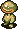 Rice Baby (7)</td>
      <td class=""></td>
      <td class=""></td>
    </tr>
    <tr>
      <td colspan="9" class="tableDivider"></td>
    </tr>
    <tr>
      <td rowspan="2">3</td>
      <td rowspan="2" class="highlightShop"></td>
      <td rowspan="2" class="highlightMH"></td>
      <td rowspan="2" class="highlightGitan"></td>
      <td class="high">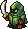 Dark Eye (6)</td>
      <td class="mid"> Pit Mamel (5)</td>
      <td class="high"> Rice Baby (7)</td>
      <td class="high"> Ghost Radish (12)</td>
      <td class="high"> Bowboy (12)</td>
    </tr>
    <tr>
      <td class=""></td>
      <td class=""></td>
      <td class="low"> Pickpocket (10)</td>
      <td class="low"> Egg Thing (5)</td>
      <td class=""></td>
    </tr>
    <tr>
      <td colspan="9" class="tableDivider"></td>
    </tr>
    <tr>
      <td rowspan="2">4</td>
      <td rowspan="2" class="highlightShop"></td>
      <td rowspan="2" class="highlightMH"></td>
      <td rowspan="2" class="highlightGitan"></td>
      <td class="high"> Dark Eye (6)</td>
      <td class="high">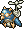 Flying Fowl (16)</td>
      <td class="high"> Rice Changer (23)</td>
      <td class="high"> Ghost Radish (12)</td>
      <td class="high"> Bowboy (12)</td>
    </tr>
    <tr>
      <td class="mid"> Evil Soldier (18)</td>
      <td class=""></td>
      <td class="low"> Pickpocket (10)</td>
      <td class="low"> Egg Thing (5)</td>
      <td class=""></td>
    </tr>
    <tr>
      <td colspan="9" class="tableDivider"></td>
    </tr>
    <tr>
      <td rowspan="3">5</td>
      <td rowspan="3" class="highlightShop"></td>
      <td rowspan="3" class="highlightMH"></td>
      <td rowspan="3" class="highlightGitan"></td>
      <td class="mid"> Dark Eye (6)</td>
      <td class="high"> Flying Fowl (16)</td>
      <td class="high"> Rice Changer (23)</td>
      <td class="high">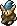 Crossbowboy (16)</td>
      <td class="high">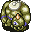 Ironhead (20)</td>
    </tr>
    <tr>
      <td class="mid"> Evil Soldier (18)</td>
      <td class="high">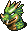 Floor Dragon (20)</td>
      <td class="low"> Pickpocket (10)</td>
      <td class="low"> Egg Thing (5)</td>
      <td class="low"> N'Duba (30)</td>
    </tr>
    <tr>
      <td class="mid"> Field Bandit (18)</td>
      <td class=""></td>
      <td class=""></td>
      <td class=""></td>
      <td class=""></td>
    </tr>
    <tr>
      <td colspan="9" class="tableDivider"></td>
    </tr>
    <tr>
      <td rowspan="3">6</td>
      <td rowspan="3" class="highlightShop"></td>
      <td rowspan="3" class="highlightMH"></td>
      <td rowspan="3" class="highlightGitan"></td>
      <td class="high">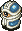 Gaze (18)</td>
      <td class="high"> Flying Fowl (16)</td>
      <td class="high"> Rice Changer (23)</td>
      <td class="high"> Crossbowboy (16)</td>
      <td class="high"> Ironhead (20)</td>
    </tr>
    <tr>
      <td class="high"> Skull Mage (21)</td>
      <td class="high"> Floor Dragon (20)</td>
      <td class="low"> Pickpocket (10)</td>
      <td class="low"> Egg Thing (5)</td>
      <td class="low"> N'Duba (30)</td>
    </tr>
    <tr>
      <td class="mid"> Field Bandit (18)</td>
      <td class="high"> Death Reaper (23)</td>
      <td class=""></td>
      <td class=""></td>
      <td class=""></td>
    </tr>
    <tr>
      <td colspan="9" class="tableDivider"></td>
    </tr>
    <tr>
      <td rowspan="2">7</td>
      <td rowspan="2" class="highlightShop"></td>
      <td rowspan="2" class="highlightMH"></td>
      <td rowspan="2" class="highlightGitan"></td>
      <td class="high"> Gaze (18)</td>
      <td class="high"> Floor Dragon (20)</td>
      <td class="high">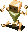 Polygon Spin (25)</td>
      <td class="high"> Crossbowboy (16)</td>
      <td class=""></td>
    </tr>
    <tr>
      <td class="high"> Skull Mage (21)</td>
      <td class="high"> Death Reaper (23)</td>
      <td class="low"> Pickpocket (10)</td>
      <td class="low"> Egg Thing (5)</td>
      <td class="low"> N'Duba (30)</td>
    </tr>
    <tr>
      <td colspan="9" class="tableDivider"></td>
    </tr>
    <tr>
      <td rowspan="3">8</td>
      <td rowspan="3" class="highlightShop"></td>
      <td rowspan="3" class="highlightMH"></td>
      <td rowspan="3" class="highlightGitan"></td>
      <td class="high"> Gaze (18)</td>
      <td class="high">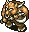 Taur (28)</td>
      <td class="high"> Polygon Spin (25)</td>
      <td class="high"> Tiger Uho (33)</td>
      <td class="high"> Spike Bomb (50)</td>
    </tr>
    <tr>
      <td class="high"> Skull Mage (21)</td>
      <td class="high"> Death Reaper (23)</td>
      <td class="low"> Thief (15)</td>
      <td class="low"> Egg Thing (5)</td>
      <td class="low"> N'Duba (30)</td>
    </tr>
    <tr>
      <td class="mid"> Soldier Ant (20)</td>
      <td class="low">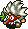 Baby Tengu (10)</td>
      <td class=""></td>
      <td class="low"> Thiefwalrus (45)</td>
      <td class="low">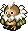 Dark Owl (4)</td>
    </tr>
    <tr>
      <td colspan="9" class="tableDivider"></td>
    </tr>
    <tr>
      <td rowspan="3">9</td>
      <td rowspan="3" class="highlightShop"></td>
      <td rowspan="3" class="highlightMH"></td>
      <td rowspan="3" class="highlightGitan"></td>
      <td class=""></td>
      <td class="high"> Taur (28)</td>
      <td class="high"> Polygon Spin (25)</td>
      <td class="high"> Tiger Uho (33)</td>
      <td class="high"> Spike Bomb (50)</td>
    </tr>
    <tr>
      <td class="mid"> Soldier Ant (20)</td>
      <td class="low"> Baby Tengu (10)</td>
      <td class="low"> Thief (15)</td>
      <td class="low"> Egg Thing (5)</td>
      <td class="low"> N'Duba (30)</td>
    </tr>
    <tr>
      <td class=""></td>
      <td class=""></td>
      <td class=""></td>
      <td class="low"> Thiefwalrus (45)</td>
      <td class="low"> Dark Owl (4)</td>
    </tr>
    <tr>
      <td colspan="9" class="tableDivider"></td>
    </tr>
    <tr>
      <td rowspan="3">10</td>
      <td rowspan="3" class="highlightShop"></td>
      <td rowspan="3" class="highlightMH"></td>
      <td rowspan="3" class="highlightGitan"></td>
      <td class="high"> Curse Girl (25)</td>
      <td class="high"> Taur (28)</td>
      <td class="low"> Fluffy Bunny (5)</td>
      <td class="high"> Tiger Uho (33)</td>
      <td class="high"> Spike Bomb (50)</td>
    </tr>
    <tr>
      <td class="mid"> Soldier Ant (20)</td>
      <td class="low"> Baby Tengu (10)</td>
      <td class="low"> Thief (15)</td>
      <td class="low"> Running Egg (5)</td>
      <td class="low"> N'Duba (30)</td>
    </tr>
    <tr>
      <td class="high"> Pacorepkin (28)</td>
      <td class="high"> Piggy (34)</td>
      <td class="high"> Popster Tank (36)</td>
      <td class="low"> Thiefwalrus (45)</td>
      <td class="low"> Dark Owl (4)</td>
    </tr>
    <tr>
      <td colspan="9" class="tableDivider"></td>
    </tr>
    <tr>
      <td rowspan="3">11</td>
      <td rowspan="3" class="highlightShop"></td>
      <td rowspan="3" class="highlightMH"></td>
      <td rowspan="3" class="highlightGitan"></td>
      <td class="high"> Curse Girl (25)</td>
      <td class="high"> Inferno (35)</td>
      <td class="low"> Fluffy Bunny (5)</td>
      <td class="high"> Kigny (40)</td>
      <td class="high"> Leech Worm (23)</td>
    </tr>
    <tr>
      <td class="mid"> Soldier Ant (20)</td>
      <td class="high">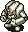 Parthenos (30)</td>
      <td class="low"> Thief (15)</td>
      <td class="low"> Running Egg (5)</td>
      <td class="low"> N'Duba (30)</td>
    </tr>
    <tr>
      <td class="high"> Pacorepkin (28)</td>
      <td class="high"> Piggy (34)</td>
      <td class="high"> Popster Tank (36)</td>
      <td class="low"> Thiefwalrus (45)</td>
      <td class="low"> Dark Owl (4)</td>
    </tr>
    <tr>
      <td colspan="9" class="tableDivider"></td>
    </tr>
    <tr>
      <td rowspan="4">12</td>
      <td rowspan="4" class="highlightShop"></td>
      <td rowspan="4" class="highlightMH"></td>
      <td rowspan="4" class="highlightGitan"></td>
      <td class="high"> Curse Girl (25)</td>
      <td class="high"> Inferno (35)</td>
      <td class="low"> Fluffy Bunny (5)</td>
      <td class="high"> Kigny (40)</td>
      <td class="high"> Leech Worm (23)</td>
    </tr>
    <tr>
      <td class="mid"> Soldier Ant (20)</td>
      <td class="high"> Parthenos (30)</td>
      <td class="low"> Thief (15)</td>
      <td class="low"> Running Egg (5)</td>
      <td class="low"> N'Duba (30)</td>
    </tr>
    <tr>
      <td class="high"> Pacorepkin (28)</td>
      <td class="high"> Piggy (34)</td>
      <td class="high"> Popster Tank (36)</td>
      <td class="low"> Thiefwalrus (45)</td>
      <td class="low"> Dark Owl (4)</td>
    </tr>
    <tr>
      <td class="high">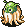 Fog Hermit (25)</td>
      <td class="high">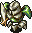 Cell Armor (35)</td>
      <td class="high">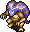 Vipy (35)</td>
      <td class=""></td>
      <td class=""></td>
    </tr>
    <tr>
      <td colspan="9" class="tableDivider"></td>
    </tr>
    <tr>
      <td rowspan="3">13</td>
      <td rowspan="3" class="highlightShop"></td>
      <td rowspan="3" class="highlightMH"></td>
      <td rowspan="3" class="highlightGitan"></td>
      <td class="mid"> Soldier Ant (20)</td>
      <td class="high"> Inferno (35)</td>
      <td class="low"> Fluffy Bunny (5)</td>
      <td class="high"> Kigny (40)</td>
      <td class="high"> Baby Tank (25)</td>
    </tr>
    <tr>
      <td class="high"> Pacorepkin (28)</td>
      <td class="high"> Parthenos (30)</td>
      <td class="low"> Thief (15)</td>
      <td class="low"> Running Egg (5)</td>
      <td class="low"> N'Duba (30)</td>
    </tr>
    <tr>
      <td class="high"> Fog Hermit (25)</td>
      <td class="high"> Cell Armor (35)</td>
      <td class="high"> Vipy (35)</td>
      <td class="high">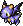 Flamepuff (28)</td>
      <td class="low"> Dark Owl (4)</td>
    </tr>
    <tr>
      <td colspan="9" class="tableDivider"></td>
    </tr>
    <tr>
      <td rowspan="3">14</td>
      <td rowspan="3" class="highlightShop"></td>
      <td rowspan="3" class="highlightMH"></td>
      <td rowspan="3" class="highlightGitan"></td>
      <td class="mid"> Soldier Ant (20)</td>
      <td class="high"> Daze Radish (30)</td>
      <td class="low"> Fluffy Bunny (5)</td>
      <td class="high">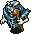 Skull Wizard (35)</td>
      <td class="high"> Baby Tank (25)</td>
    </tr>
    <tr>
      <td class=""></td>
      <td class=""></td>
      <td class="low"> Thief (15)</td>
      <td class="low"> Running Egg (5)</td>
      <td class="low"> N'Duba (30)</td>
    </tr>
    <tr>
      <td class="high"> Fog Hermit (25)</td>
      <td class="high"> Cell Armor (35)</td>
      <td class="high"> Vipy (35)</td>
      <td class="high"> Flamepuff (28)</td>
      <td class=""></td>
    </tr>
    <tr>
      <td colspan="9" class="tableDivider"></td>
    </tr>
    <tr>
      <td rowspan="4">15</td>
      <td rowspan="4" class="highlightShop"></td>
      <td rowspan="4" class="highlightMH"></td>
      <td rowspan="4" class="highlightGitan"></td>
      <td class="high"> Twisty Hani (25)</td>
      <td class="high"> Daze Radish (30)</td>
      <td class="low"> Fluffy Bunny (5)</td>
      <td class="high"> Skull Wizard (35)</td>
      <td class="high"> Baby Tank (25)</td>
    </tr>
    <tr>
      <td class="high"> Sabregator (35)</td>
      <td class="mid"> Evil General (30)</td>
      <td class="high">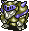 Dremlas (40)</td>
      <td class="low"> Running Egg (5)</td>
      <td class="low"> N'Dulu (35)</td>
    </tr>
    <tr>
      <td class="high"> Fog Hermit (25)</td>
      <td class="mid">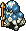 Corporal Ant (35)</td>
      <td class="high"> Vipy (35)</td>
      <td class="high"> Flamepuff (28)</td>
      <td class="mid"> Air Devil (50)</td>
    </tr>
    <tr>
      <td class="high"> Purple Slime (40)</td>
      <td class="high"> Gather (36)</td>
      <td class=""></td>
      <td class=""></td>
      <td class=""></td>
    </tr>
    <tr>
      <td colspan="9" class="tableDivider"></td>
    </tr>
    <tr>
      <td rowspan="3">16</td>
      <td rowspan="3" class="highlightShop"></td>
      <td rowspan="3" class="highlightMH"></td>
      <td rowspan="3" class="highlightGitan"></td>
      <td class="high"> Twisty Hani (25)</td>
      <td class="mid"> Corporal Ant (35)</td>
      <td class="low"> Fluffy Bunny (5)</td>
      <td class="high"> Skull Wizard (35)</td>
      <td class="low"> N'Dulu (35)</td>
    </tr>
    <tr>
      <td class="high"> Sabregator (35)</td>
      <td class="mid"> Evil General (30)</td>
      <td class="high"> Dremlas (40)</td>
      <td class="low"> Running Egg (5)</td>
      <td class="mid"> Air Devil (50)</td>
    </tr>
    <tr>
      <td class="high"> Purple Slime (40)</td>
      <td class="high"> Gather (36)</td>
      <td class="high">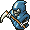 Hell Reaper (45)</td>
      <td class="high"> Chainhead (50)</td>
      <td class=""></td>
    </tr>
    <tr>
      <td colspan="9" class="tableDivider"></td>
    </tr>
    <tr>
      <td rowspan="3">17</td>
      <td rowspan="3" class="highlightShop"></td>
      <td rowspan="3" class="highlightMH"></td>
      <td rowspan="3" class="highlightGitan"></td>
      <td class="high"> Curse Sis (33)</td>
      <td class="mid"> Corporal Ant (35)</td>
      <td class="low"> Fluffy Bunny (5)</td>
      <td class="high"> Master Hen (50)</td>
      <td class="low"> N'Dulu (35)</td>
    </tr>
    <tr>
      <td class="mid">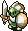 Half Warrior (25)</td>
      <td class="mid"> Evil General (30)</td>
      <td class="high"> Dremlas (40)</td>
      <td class="low"> Running Egg (5)</td>
      <td class="mid"> Air Devil (50)</td>
    </tr>
    <tr>
      <td class=""></td>
      <td class=""></td>
      <td class="high"> Hell Reaper (45)</td>
      <td class="high"> Chainhead (50)</td>
      <td class="low"> Greenwalrus (58)</td>
    </tr>
    <tr>
      <td colspan="9" class="tableDivider"></td>
    </tr>
    <tr>
      <td rowspan="3">18</td>
      <td rowspan="3" class="highlightShop"></td>
      <td rowspan="3" class="highlightMH"></td>
      <td rowspan="3" class="highlightGitan"></td>
      <td class="high"> Curse Sis (33)</td>
      <td class="mid"> Corporal Ant (35)</td>
      <td class="low"> Fluffy Bunny (5)</td>
      <td class="high"> Master Hen (50)</td>
      <td class="low"> N'Dulu (35)</td>
    </tr>
    <tr>
      <td class="mid"> Half Warrior (25)</td>
      <td class="mid"> Evil General (30)</td>
      <td class="high"> Dremlas (40)</td>
      <td class="low"> Running Egg (5)</td>
      <td class="mid"> Air Devil (50)</td>
    </tr>
    <tr>
      <td class="high">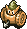 Mini Tank (28)</td>
      <td class=""></td>
      <td class="high"> Hell Reaper (45)</td>
      <td class="high"> Chainhead (50)</td>
      <td class="low"> Greenwalrus (58)</td>
    </tr>
    <tr>
      <td colspan="9" class="tableDivider"></td>
    </tr>
    <tr>
      <td rowspan="3">19</td>
      <td rowspan="3" class="highlightShop"></td>
      <td rowspan="3" class="highlightMH"></td>
      <td rowspan="3" class="highlightGitan"></td>
      <td class="high"> Curse Sis (33)</td>
      <td class="mid"> Corporal Ant (35)</td>
      <td class="low"> Fluffy Bunny (5)</td>
      <td class="high"> Master Hen (50)</td>
      <td class="low"> N'Dulu (35)</td>
    </tr>
    <tr>
      <td class="mid"> Half Warrior (25)</td>
      <td class="low"> Young Tengu (25)</td>
      <td class="high"> Hell Reaper (45)</td>
      <td class="low"> Running Egg (5)</td>
      <td class="mid"> Air Devil (50)</td>
    </tr>
    <tr>
      <td class="high"> Mini Tank (28)</td>
      <td class=""></td>
      <td class=""></td>
      <td class="high"> Chainhead (50)</td>
      <td class="low"> Greenwalrus (58)</td>
    </tr>
    <tr>
      <td colspan="9" class="tableDivider"></td>
    </tr>
    <tr>
      <td rowspan="3">20</td>
      <td rowspan="3" class="highlightShop"></td>
      <td rowspan="3" class="highlightMH"></td>
      <td rowspan="3" class="highlightGitan"></td>
      <td class="high"> Mistonos (50)</td>
      <td class="mid"> Corporal Ant (35)</td>
      <td class="low"> Fluffy Bunny (5)</td>
      <td class="high"> Master Hen (50)</td>
      <td class="low"> N'Dulu (35)</td>
    </tr>
    <tr>
      <td class="mid"> Half Warrior (25)</td>
      <td class="low"> Young Tengu (25)</td>
      <td class="low"> Ghost Owl (7)</td>
      <td class="low"> Flying Egg (8)</td>
      <td class="mid"> Air Devil (50)</td>
    </tr>
    <tr>
      <td class="high"> Mini Tank (28)</td>
      <td class=""></td>
      <td class=""></td>
      <td class="high"> Chainhead (50)</td>
      <td class=""></td>
    </tr>
  </tbody>
</table>

# Items

#### Spawn Rates

- F = Floor, Monster drop
- S = Shop
- C = Jar of Change, Thiefwalrus drop

 

<table class="dungeonTable">
  <tr>
    <th class="centeredText">Category</th>
    <th class="centeredText">F</th>
    <th class="centeredText">S</th>
    <th class="centeredText">C</th>
    <th rowspan="6" class="tableDivider"></th>
    <th class="centeredText">Category</th>
    <th class="centeredText">F</th>
    <th class="centeredText">S</th>
    <th class="centeredText">C</th>
  </tr>
  <tr>
    <td class="highlightGray">Weapon</td>
    <td>★</td>
    <td>★★</td>
    <td>★</td>
    <td class="highlightGray">Herb</td>
    <td>★★★★</td>
    <td>★★★</td>
    <td>★★★</td>
  </tr>
  <tr>
    <td class="highlightGray">Shield</td>
    <td>★</td>
    <td>★★</td>
    <td>★</td>
    <td class="highlightGray">Scroll</td>
    <td>★★★</td>
    <td>★★★</td>
    <td>★★★</td>
  </tr>
  <tr>
    <td class="highlightGray">Armband</td>
    <td>★</td>
    <td>★</td>
    <td>★★</td>
    <td class="highlightGray">Staff</td>
    <td>★★</td>
    <td>★★</td>
    <td>★★</td>
  </tr>
  <tr>
    <td class="highlightGray">Projectile</td>
    <td>★</td>
    <td>★</td>
    <td>★</td>
    <td class="highlightGray">Jar</td>
    <td>★★</td>
    <td>★★★</td>
    <td>★★</td>
  </tr>
  <tr>
    <td class="highlightGray">Food</td>
    <td>★</td>
    <td>★★</td>
    <td>★</td>
    <td class="highlightGray">Meat</td>
    <td>-</td>
    <td>★</td>
    <td>-</td>
  </tr>
</table>

#### Item Table

The values like "1-99" in the Notes column represents the floor range where the item can appear.

- F = Floor, Monster drop
- S = Shop
- M = Monster (Fixed drop)
- C = Jar of Change, Thiefwalrus drop

 

<table class="dungeonItemTable">
  <tr>
    <th colspan="6" class="highlightLightblue">Weapon</th>
    <th rowspan="110"></th>
    <th colspan="6" class="highlightLightblue">Scroll</th>
  </tr>
  <tr>
    <th>Name</th>
    <th>F</th>
    <th>S</th>
    <th>M</th>
    <th>C</th>
    <th>Notes</th>
    <th>Name</th>
    <th>F</th>
    <th>S</th>
    <th>M</th>
    <th>C</th>
    <th>Notes</th>
  </tr>
  <tr>
    <td class="leftText">Katana</td>
    <td>X</td>
    <td>X</td>
    <td></td>
    <td>X</td>
    <td>1-99</td>
    <td class="leftText">Great Hall Scroll</td>
    <td>X</td>
    <td>X</td>
    <td></td>
    <td>X</td>
    <td>1-99</td>
  </tr>
  <tr>
    <td class="leftText">Golden Blade</td>
    <td>X</td>
    <td>X</td>
    <td></td>
    <td>X</td>
    <td>1-99</td>
    <td class="leftText">Riceball Scroll</td>
    <td>X</td>
    <td>X</td>
    <td></td>
    <td>X</td>
    <td>1-99</td>
  </tr>
  <tr>
    <td class="leftText">Kabra's Blade</td>
    <td>X</td>
    <td>X</td>
    <td></td>
    <td>X</td>
    <td>6-99</td>
    <td class="leftText">Scroll of Blessing</td>
    <td>X</td>
    <td>X</td>
    <td></td>
    <td>X</td>
    <td>1-99</td>
  </tr>
  <tr>
    <td class="leftText">Cudgel</td>
    <td>X</td>
    <td>X</td>
    <td></td>
    <td>X</td>
    <td>1-99</td>
    <td class="leftText">Scroll of Silence</td>
    <td>X</td>
    <td></td>
    <td></td>
    <td>X</td>
    <td>1-99</td>
  </tr>
  <tr>
    <td class="leftText">Air Slayer</td>
    <td>X</td>
    <td>X</td>
    <td></td>
    <td>X</td>
    <td>1-99</td>
    <td class="leftText">Scroll of Need</td>
    <td>X</td>
    <td>X</td>
    <td></td>
    <td>X</td>
    <td>1-99</td>
  </tr>
  <tr>
    <td class="leftText">Sickle Slayer</td>
    <td>X</td>
    <td>X</td>
    <td></td>
    <td>X</td>
    <td>1-99</td>
    <td class="leftText">Scroll of Confusion</td>
    <td>X</td>
    <td></td>
    <td></td>
    <td></td>
    <td>1-15</td>
  </tr>
  <tr>
    <td class="leftText">Fragile Edge</td>
    <td></td>
    <td>X</td>
    <td></td>
    <td></td>
    <td>1-99</td>
    <td class="leftText">Scroll of Removal</td>
    <td></td>
    <td>X</td>
    <td></td>
    <td>X</td>
    <td>1-99</td>
  </tr>
  <tr>
    <td class="leftText">Pickaxe</td>
    <td>X</td>
    <td></td>
    <td></td>
    <td>X</td>
    <td>1-99</td>
    <td class="leftText">Scroll of Identity</td>
    <td>X</td>
    <td>X</td>
    <td></td>
    <td>X</td>
    <td>1-99</td>
  </tr>
  <tr>
    <td class="leftText">Mastersword</td>
    <td>X</td>
    <td>X</td>
    <td></td>
    <td>X</td>
    <td>1-99</td>
    <td class="leftText">Scroll of Explosion</td>
    <td>X</td>
    <td>X</td>
    <td></td>
    <td>X</td>
    <td>1-99</td>
  </tr>
  <tr>
    <td class="leftText">Dragonkiller</td>
    <td>X</td>
    <td>X</td>
    <td></td>
    <td>X</td>
    <td>1-99</td>
    <td class="leftText">Blastwave Scroll</td>
    <td>X</td>
    <td></td>
    <td></td>
    <td></td>
    <td>1-15</td>
  </tr>
  <tr>
    <td class="leftText">Drain Buster</td>
    <td>X</td>
    <td>X</td>
    <td></td>
    <td>X</td>
    <td>1-99</td>
    <td class="leftText">Extraction Scroll</td>
    <td>X</td>
    <td>X</td>
    <td></td>
    <td>X</td>
    <td>1-99</td>
  </tr>
  <tr>
    <td class="leftText">Polearm</td>
    <td>X</td>
    <td>X</td>
    <td></td>
    <td>X</td>
    <td>1-99</td>
    <td class="leftText">Earth Bless Scroll</td>
    <td>X</td>
    <td>X</td>
    <td></td>
    <td>X</td>
    <td>1-99</td>
  </tr>
  <tr>
    <td class="leftText">Cyclops Killer</td>
    <td>X</td>
    <td>X</td>
    <td></td>
    <td>X</td>
    <td>1-99</td>
    <td class="leftText">Air Bless Scroll</td>
    <td>X</td>
    <td>X</td>
    <td></td>
    <td>X</td>
    <td>1-99</td>
  </tr>
  <tr>
    <td class="leftText">Bufu's Cleaver</td>
    <td></td>
    <td>X</td>
    <td></td>
    <td></td>
    <td>51-99</td>
    <td class="leftText">Scroll of Haste</td>
    <td>X</td>
    <td></td>
    <td></td>
    <td>X</td>
    <td>1-99</td>
  </tr>
  <tr>
    <td class="leftText">Crescent Arm</td>
    <td>X</td>
    <td>X</td>
    <td></td>
    <td>X</td>
    <td>1-99</td>
    <td class="leftText">Blank Scroll</td>
    <td>X</td>
    <td>X</td>
    <td></td>
    <td>X</td>
    <td>1-99 ※1</td>
  </tr>
  <tr>
    <td class="leftText">Minotaur's Axe</td>
    <td></td>
    <td></td>
    <td>X</td>
    <td></td>
    <td>Taur Type</td>
    <td class="leftText">Scroll of Sleep</td>
    <td>X</td>
    <td></td>
    <td></td>
    <td></td>
    <td>1-15</td>
  </tr>
  <tr>
    <td class="leftText">Razor Wind</td>
    <td>X</td>
    <td>X</td>
    <td></td>
    <td>X</td>
    <td>1-99</td>
    <td class="leftText">Power Up Scroll</td>
    <td>X</td>
    <td>X</td>
    <td></td>
    <td>X</td>
    <td>1-99</td>
  </tr>
  <tr>
    <th colspan="6" class="highlightLightblue">Shield</th>
    <td class="leftText">Hands Full Scroll</td>
    <td>X</td>
    <td></td>
    <td></td>
    <td>X</td>
    <td>1-99</td>
  </tr>
  <tr>
    <th>Name</th>
    <th>F</th>
    <th>S</th>
    <th>M</th>
    <th>C</th>
    <th>Notes</th>
    <td class="leftText">Wandering Scroll</td>
    <td>X</td>
    <td></td>
    <td></td>
    <td>X</td>
    <td>1-99</td>
  </tr>
  <tr>
    <td class="leftText">Gold Shield</td>
    <td>X</td>
    <td>X</td>
    <td></td>
    <td>X</td>
    <td>1-99</td>
    <td class="leftText">Plating Scroll</td>
    <td></td>
    <td>X</td>
    <td></td>
    <td></td>
    <td>1-99</td>
  </tr>
  <tr>
    <td class="leftText">Armor Ward</td>
    <td>X</td>
    <td>X</td>
    <td></td>
    <td>X</td>
    <td>1-99</td>
    <td class="leftText">Monster Scroll</td>
    <td>X</td>
    <td>X</td>
    <td></td>
    <td>X</td>
    <td>1-99</td>
  </tr>
  <tr>
    <td class="leftText">Blast Shield</td>
    <td>X</td>
    <td>X</td>
    <td></td>
    <td>X</td>
    <td>1-99</td>
    <td class="leftText">Scroll of Traps</td>
    <td>X</td>
    <td>X</td>
    <td></td>
    <td>X</td>
    <td>1-99</td>
  </tr>
  <tr>
    <td class="leftText">Bronzeward</td>
    <td>X</td>
    <td>X</td>
    <td></td>
    <td>X</td>
    <td>1-99</td>
    <th colspan="6" class="highlightLightblue">Staff</th>
  </tr>
  <tr>
    <td class="leftText">Fragile Shield</td>
    <td></td>
    <td>X</td>
    <td></td>
    <td></td>
    <td>1-99</td>
    <th>Name</th>
    <th>F</th>
    <th>S</th>
    <th>M</th>
    <th>C</th>
    <th>Notes</th>
  </tr>
  <tr>
    <td class="leftText">Iron Shield</td>
    <td>X</td>
    <td>X</td>
    <td></td>
    <td>X</td>
    <td>1-99</td>
    <td class="leftText">Pain Sharing Staff</td>
    <td>X</td>
    <td>X</td>
    <td></td>
    <td>X</td>
    <td>1-99</td>
  </tr>
  <tr>
    <td class="leftText">Walrus Shield</td>
    <td>X</td>
    <td>X</td>
    <td></td>
    <td>X</td>
    <td>1-99</td>
    <td class="leftText">Staff of Postpone</td>
    <td>X</td>
    <td>X</td>
    <td></td>
    <td>X</td>
    <td>1-99</td>
  </tr>
  <tr>
    <td class="leftText">Dragonward</td>
    <td>X</td>
    <td>X</td>
    <td></td>
    <td>X</td>
    <td>1-99</td>
    <td class="leftText">Skull Staff</td>
    <td></td>
    <td></td>
    <td>X</td>
    <td></td>
    <td>Skull Mage Type</td>
  </tr>
  <tr>
    <td class="leftText">Spiked Ward</td>
    <td>X</td>
    <td>X</td>
    <td></td>
    <td>X</td>
    <td>1-99</td>
    <td class="leftText">Staff of Recovery</td>
    <td>X</td>
    <td>X</td>
    <td></td>
    <td>X</td>
    <td>1-99</td>
  </tr>
  <tr>
    <td class="leftText">Hide Shield</td>
    <td>X</td>
    <td>X</td>
    <td></td>
    <td>X</td>
    <td>1-99</td>
    <td class="leftText">Accelerating Staff</td>
    <td>X</td>
    <td>X</td>
    <td></td>
    <td>X</td>
    <td>1-99</td>
  </tr>
  <tr>
    <td class="leftText">Windshield</td>
    <td>X</td>
    <td>X</td>
    <td></td>
    <td>X</td>
    <td>6-99</td>
    <td class="leftText">Staff of Paralysis</td>
    <td>X</td>
    <td>X</td>
    <td></td>
    <td>X</td>
    <td>1-99</td>
  </tr>
  <tr>
    <td class="leftText">Fancy Shield</td>
    <td>X</td>
    <td>X</td>
    <td></td>
    <td>X</td>
    <td>1-99</td>
    <td class="leftText">Staff of Stability</td>
    <td>X</td>
    <td>X</td>
    <td></td>
    <td>X</td>
    <td>1-99</td>
  </tr>
  <tr>
    <td class="leftText">Evasive Shield</td>
    <td>X</td>
    <td>X</td>
    <td></td>
    <td>X</td>
    <td>1-99</td>
    <td class="leftText">Staff of Happiness</td>
    <td>X</td>
    <td>X</td>
    <td></td>
    <td>X</td>
    <td>1-99</td>
  </tr>
  <tr>
    <td class="leftText">Wood Shield</td>
    <td>X</td>
    <td>X</td>
    <td></td>
    <td>X</td>
    <td>1-99</td>
    <td class="leftText">Staff of Sloth</td>
    <td>X</td>
    <td>X</td>
    <td></td>
    <td>X</td>
    <td>1-99</td>
  </tr>
  <tr>
    <th colspan="6" class="highlightLightblue">Armband</th>
    <td class="leftText">Switching Staff</td>
    <td>X</td>
    <td>X</td>
    <td></td>
    <td>X</td>
    <td>1-99</td>
  </tr>
  <tr>
    <th>Name</th>
    <th>F</th>
    <th>S</th>
    <th>M</th>
    <th>C</th>
    <th>Notes</th>
    <td class="leftText">Sealing Staff</td>
    <td>X</td>
    <td>X</td>
    <td></td>
    <td>X</td>
    <td>1-99</td>
  </tr>
  <tr>
    <td class="leftText">Pitcher's Armband</td>
    <td>X</td>
    <td>X</td>
    <td></td>
    <td>X</td>
    <td>1-99</td>
    <td class="leftText">Knockback Staff</td>
    <td>X</td>
    <td>X</td>
    <td></td>
    <td>X</td>
    <td>1-99</td>
  </tr>
  <tr>
    <td class="leftText">Critical Armband</td>
    <td>X</td>
    <td>X</td>
    <td></td>
    <td>X</td>
    <td>1-99</td>
    <td class="leftText">Staff of Misfortune</td>
    <td>X</td>
    <td>X</td>
    <td></td>
    <td>X</td>
    <td>1-99</td>
  </tr>
  <tr>
    <td class="leftText">Recovery Armband</td>
    <td>X</td>
    <td>X</td>
    <td></td>
    <td>X</td>
    <td>1-99</td>
    <td class="leftText">Bufu's Staff</td>
    <td>X</td>
    <td>X</td>
    <td></td>
    <td>X</td>
    <td>1-99</td>
  </tr>
  <tr>
    <td class="leftText">Armband of Calm</td>
    <td>X</td>
    <td>X</td>
    <td></td>
    <td>X</td>
    <td>1-99</td>
    <td class="leftText">Doppelganger Staff</td>
    <td>X</td>
    <td>X</td>
    <td></td>
    <td>X</td>
    <td>1-99</td>
  </tr>
  <tr>
    <td class="leftText">Rustless Armband</td>
    <td>X</td>
    <td>X</td>
    <td></td>
    <td>X</td>
    <td>1-99</td>
    <td class="leftText">Lightning Staff</td>
    <td>X</td>
    <td>X</td>
    <td></td>
    <td>X</td>
    <td>1-99</td>
  </tr>
  <tr>
    <td class="leftText">Happy Armband</td>
    <td>X</td>
    <td>X</td>
    <td></td>
    <td>X</td>
    <td>1-99</td>
    <th colspan="6" class="highlightLightblue">Meat</th>
  </tr>
  <tr>
    <td class="leftText">Identity Armband</td>
    <td></td>
    <td>X</td>
    <td></td>
    <td></td>
    <td>21-99</td>
    <th>Name</th>
    <th>F</th>
    <th>S</th>
    <th>M</th>
    <th>C</th>
    <th>Notes</th>
  </tr>
  <tr>
    <td class="leftText">Armband of Loss</td>
    <td>X</td>
    <td>X</td>
    <td></td>
    <td>X</td>
    <td>1-99</td>
    <td class="leftText">Ironhead</td>
    <td></td>
    <td>X</td>
    <td></td>
    <td></td>
    <td>11-99</td>
  </tr>
  <tr>
    <td class="leftText">Passage Armband</td>
    <td>X</td>
    <td>X</td>
    <td></td>
    <td>X</td>
    <td>1-99</td>
    <td class="leftText">Pit Mamel</td>
    <td></td>
    <td>X</td>
    <td></td>
    <td></td>
    <td>1-99</td>
  </tr>
  <tr>
    <td class="leftText">Armband of Regret</td>
    <td>X</td>
    <td>X</td>
    <td></td>
    <td>X</td>
    <td>1-99</td>
    <td class="leftText">Skull Wraith</td>
    <td></td>
    <td>X</td>
    <td></td>
    <td></td>
    <td>31-99</td>
  </tr>
  <tr>
    <td class="leftText">Armband of Sight</td>
    <td>X</td>
    <td>X</td>
    <td></td>
    <td>X</td>
    <td>1-99</td>
    <td class="leftText">Skull Wizard</td>
    <td></td>
    <td>X</td>
    <td></td>
    <td></td>
    <td>11-99</td>
  </tr>
  <tr>
    <td class="leftText">Antidote Armband</td>
    <td>X</td>
    <td>X</td>
    <td></td>
    <td>X</td>
    <td>1-99</td>
    <td class="leftText">Skull Mage</td>
    <td></td>
    <td>X</td>
    <td></td>
    <td></td>
    <td>1-99</td>
  </tr>
  <tr>
    <td class="leftText">Antidrain Armband</td>
    <td>X</td>
    <td>X</td>
    <td></td>
    <td>X</td>
    <td>1-99</td>
    <td class="leftText">Mist Hermit</td>
    <td></td>
    <td>X</td>
    <td></td>
    <td></td>
    <td>51-99</td>
  </tr>
  <tr>
    <td class="leftText">Discount Armband</td>
    <td>X</td>
    <td>X</td>
    <td></td>
    <td>X</td>
    <td>1-99</td>
    <td class="leftText">Thief</td>
    <td></td>
    <td>X</td>
    <td></td>
    <td></td>
    <td>11-99</td>
  </tr>
  <tr>
    <td class="leftText">Sleepless Armband</td>
    <td>X</td>
    <td>X</td>
    <td></td>
    <td>X</td>
    <td>1-99</td>
    <td class="leftText">Burglar</td>
    <td></td>
    <td>X</td>
    <td></td>
    <td></td>
    <td>21-99</td>
  </tr>
  <tr>
    <td class="leftText">Trap Armband</td>
    <td></td>
    <td>X</td>
    <td></td>
    <td></td>
    <td>51-99</td>
    <td class="leftText">Pickpocket</td>
    <td></td>
    <td>X</td>
    <td></td>
    <td></td>
    <td>1-99</td>
  </tr>
  <tr>
    <th colspan="6" class="highlightLightblue">Projectile</th>
    <td class="leftText">Gigahead</td>
    <td></td>
    <td>X</td>
    <td></td>
    <td></td>
    <td>41-99</td>
  </tr>
  <tr>
    <th>Name</th>
    <th>F</th>
    <th>S</th>
    <th>M</th>
    <th>C</th>
    <th>Notes</th>
    <td class="leftText">Evil Soldier</td>
    <td></td>
    <td>X</td>
    <td></td>
    <td></td>
    <td>1-99</td>
  </tr>
  <tr>
    <td class="leftText">Wooden Arrow</td>
    <td>X</td>
    <td>X</td>
    <td>X</td>
    <td>X</td>
    <td>1-99 Bowboy</td>
    <td class="leftText">Gather</td>
    <td></td>
    <td>X</td>
    <td></td>
    <td></td>
    <td>1-99</td>
  </tr>
  <tr>
    <td class="leftText">Silver Arrow</td>
    <td></td>
    <td>X</td>
    <td>X</td>
    <td></td>
    <td>1-99 Mini Tank</td>
    <td class="leftText">Leech Fly</td>
    <td></td>
    <td>X</td>
    <td></td>
    <td></td>
    <td>31-99</td>
  </tr>
  <tr>
    <td class="leftText">Iron Arrow</td>
    <td></td>
    <td>X</td>
    <td>X</td>
    <td></td>
    <td>1-99 Crossbowboy Baby Tank</td>
    <td class="leftText">Leech Bug</td>
    <td></td>
    <td>X</td>
    <td></td>
    <td></td>
    <td>11-99</td>
  </tr>
  <tr>
    <th colspan="6" class="highlightLightblue">Food</th>
    <td class="leftText">Leech Worm</td>
    <td></td>
    <td>X</td>
    <td></td>
    <td></td>
    <td>1-99</td>
  </tr>
  <tr>
    <th>Name</th>
    <th>F</th>
    <th>S</th>
    <th>M</th>
    <th>C</th>
    <th>Notes</th>
    <td class="leftText">Killer Gather</td>
    <td></td>
    <td>X</td>
    <td></td>
    <td></td>
    <td>21-99</td>
  </tr>
  <tr>
    <td class="leftText">Big Riceball</td>
    <td>X</td>
    <td>X</td>
    <td>X</td>
    <td>X</td>
    <td>1-99 Running Egg</td>
    <td class="leftText">Fog Hermit</td>
    <td></td>
    <td>X</td>
    <td></td>
    <td></td>
    <td>1-99</td>
  </tr>
  <tr>
    <td class="leftText">Riceball</td>
    <td>X</td>
    <td></td>
    <td>X</td>
    <td>X</td>
    <td>1-99 Egg Thing</td>
    <td class="leftText">Crossbowboy</td>
    <td></td>
    <td>X</td>
    <td></td>
    <td></td>
    <td>11-99</td>
  </tr>
  <tr>
    <td class="leftText">Giant Riceball</td>
    <td>X</td>
    <td>X</td>
    <td>X</td>
    <td></td>
    <td>1-99 Rice Master</td>
    <td class="leftText">Metal Armor</td>
    <td></td>
    <td>X</td>
    <td></td>
    <td></td>
    <td>21-99</td>
  </tr>
  <tr>
    <td class="leftText">Special Riceball</td>
    <td></td>
    <td>X</td>
    <td></td>
    <td></td>
    <td>1-99</td>
    <td class="leftText">Gaze</td>
    <td></td>
    <td>X</td>
    <td></td>
    <td></td>
    <td>11-99</td>
  </tr>
  <tr>
    <th colspan="6" class="highlightLightblue">Herb</th>
    <td class="leftText">Purple Slime</td>
    <td></td>
    <td>X</td>
    <td></td>
    <td></td>
    <td>11-99</td>
  </tr>
  <tr>
    <th>Name</th>
    <th>F</th>
    <th>S</th>
    <th>M</th>
    <th>C</th>
    <th>Notes</th>
    <td class="leftText">Baby Tank</td>
    <td></td>
    <td>X</td>
    <td></td>
    <td></td>
    <td>21-99</td>
  </tr>
  <tr>
    <td class="leftText">Big Belly Seed</td>
    <td>X</td>
    <td>X</td>
    <td></td>
    <td>X</td>
    <td>1-99</td>
    <td class="leftText">Sabregator</td>
    <td></td>
    <td>X</td>
    <td></td>
    <td></td>
    <td>11-99</td>
  </tr>
  <tr>
    <td class="leftText">Little Belly Seed</td>
    <td>X</td>
    <td>X</td>
    <td></td>
    <td>X</td>
    <td>1-99</td>
    <td class="leftText">Hell Reaper</td>
    <td></td>
    <td>X</td>
    <td></td>
    <td></td>
    <td>11-99</td>
  </tr>
  <tr>
    <td class="leftText">Herb of Life</td>
    <td>X</td>
    <td>X</td>
    <td></td>
    <td>X</td>
    <td>1-99</td>
    <td class="leftText">Death Angel</td>
    <td></td>
    <td>X</td>
    <td></td>
    <td></td>
    <td>31-99</td>
  </tr>
  <tr>
    <td class="leftText">Restorative Herb</td>
    <td>X</td>
    <td>X</td>
    <td></td>
    <td>X</td>
    <td>1-99</td>
    <td class="leftText">Death Reaper</td>
    <td></td>
    <td>X</td>
    <td></td>
    <td></td>
    <td>1-99</td>
  </tr>
  <tr>
    <td class="leftText">Herb of Invisibility</td>
    <td></td>
    <td>X</td>
    <td></td>
    <td></td>
    <td>51-99</td>
    <td class="leftText">Evil General</td>
    <td></td>
    <td>X</td>
    <td></td>
    <td></td>
    <td>21-99</td>
  </tr>
  <tr>
    <td class="leftText">Kigny Seed</td>
    <td>X</td>
    <td>X</td>
    <td>X</td>
    <td>X</td>
    <td>1-99 Fear Radish</td>
    <td class="leftText">Super Gaze</td>
    <td></td>
    <td>X</td>
    <td></td>
    <td></td>
    <td>21-99</td>
  </tr>
  <tr>
    <td class="leftText">Bitter Herb</td>
    <td>X</td>
    <td>X</td>
    <td></td>
    <td>X</td>
    <td>1-99</td>
    <td class="leftText">Cell Armor</td>
    <td></td>
    <td>X</td>
    <td></td>
    <td></td>
    <td>11-99</td>
  </tr>
  <tr>
    <td class="leftText">Herb of Confusion</td>
    <td>X</td>
    <td>X</td>
    <td>X</td>
    <td>X</td>
    <td>1-99 Daze Radish</td>
    <td class="leftText">Tiger Uho</td>
    <td></td>
    <td>X</td>
    <td></td>
    <td></td>
    <td>11-99</td>
  </tr>
  <tr>
    <td class="leftText">Weeds</td>
    <td></td>
    <td></td>
    <td>X</td>
    <td></td>
    <td>Field Bandit Type</td>
    <td class="leftText">Tiger Uhoho</td>
    <td></td>
    <td>X</td>
    <td></td>
    <td></td>
    <td>21-99</td>
  </tr>
  <tr>
    <td class="leftText">Happiness Herb</td>
    <td></td>
    <td>X</td>
    <td></td>
    <td></td>
    <td>11-99</td>
    <td class="leftText">Captain Ant</td>
    <td></td>
    <td>X</td>
    <td></td>
    <td></td>
    <td>31-99</td>
  </tr>
  <tr>
    <td class="leftText">Sleeping Herb</td>
    <td>X</td>
    <td>X</td>
    <td>X</td>
    <td>X</td>
    <td>1-99 Sleep Radish</td>
    <td class="leftText">Corporal Ant</td>
    <td></td>
    <td>X</td>
    <td></td>
    <td></td>
    <td>11-99</td>
  </tr>
  <tr>
    <td class="leftText">Herb of Strength</td>
    <td>X</td>
    <td>X</td>
    <td></td>
    <td>X</td>
    <td>1-99</td>
    <td class="leftText">Taur</td>
    <td></td>
    <td>X</td>
    <td></td>
    <td></td>
    <td>1-99</td>
  </tr>
  <tr>
    <td class="leftText">Seed of Ill Luck</td>
    <td></td>
    <td>X</td>
    <td></td>
    <td></td>
    <td>51-99</td>
    <td class="leftText">Chainhead</td>
    <td></td>
    <td>X</td>
    <td></td>
    <td></td>
    <td>21-99</td>
  </tr>
  <tr>
    <td class="leftText">Angel Seed</td>
    <td></td>
    <td>X</td>
    <td></td>
    <td></td>
    <td>51-99</td>
    <td class="leftText">Jar Bandit</td>
    <td></td>
    <td>X</td>
    <td></td>
    <td></td>
    <td>11-99</td>
  </tr>
  <tr>
    <td class="leftText">Antidote Herb</td>
    <td>X</td>
    <td>X</td>
    <td></td>
    <td>X</td>
    <td>1-99</td>
    <td class="leftText">Piggy</td>
    <td></td>
    <td>X</td>
    <td></td>
    <td></td>
    <td>1-99</td>
  </tr>
  <tr>
    <td class="leftText">Poison Herb</td>
    <td>X</td>
    <td>X</td>
    <td>X</td>
    <td>X</td>
    <td>1-99 Ghost Radish</td>
    <td class="leftText">Piggo</td>
    <td></td>
    <td>X</td>
    <td></td>
    <td></td>
    <td>21-99</td>
  </tr>
  <tr>
    <td class="leftText">Seed of Misfortune</td>
    <td></td>
    <td>X</td>
    <td></td>
    <td></td>
    <td>11-99</td>
    <td class="leftText">Floor Dragon</td>
    <td></td>
    <td>X</td>
    <td></td>
    <td></td>
    <td>1-99</td>
  </tr>
  <tr>
    <td class="leftText">Herb of Revival</td>
    <td>X</td>
    <td>X</td>
    <td></td>
    <td>X</td>
    <td>1-99</td>
    <td class="leftText">Flying Egg</td>
    <td></td>
    <td>X</td>
    <td></td>
    <td></td>
    <td>21-99</td>
  </tr>
  <tr>
    <td class="leftText">Herb of Victory</td>
    <td>X</td>
    <td>X</td>
    <td></td>
    <td>X</td>
    <td>1-99</td>
    <td class="leftText">Dragon Head</td>
    <td></td>
    <td>X</td>
    <td></td>
    <td></td>
    <td>21-99</td>
  </tr>
  <tr>
    <td class="leftText">Herb of Sight</td>
    <td>X</td>
    <td>X</td>
    <td></td>
    <td>X</td>
    <td>1-99</td>
    <td class="leftText">Knifegator</td>
    <td></td>
    <td>X</td>
    <td></td>
    <td></td>
    <td>1-99</td>
  </tr>
  <tr>
    <td class="leftText">Herb of Amnesia</td>
    <td></td>
    <td>X</td>
    <td></td>
    <td></td>
    <td>51-99</td>
    <td class="leftText">Running Egg</td>
    <td></td>
    <td>X</td>
    <td></td>
    <td></td>
    <td>11-99</td>
  </tr>
  <tr>
    <td class="leftText">Medicinal Herb</td>
    <td>X</td>
    <td>X</td>
    <td></td>
    <td>X</td>
    <td>1-99</td>
    <td class="leftText">Hyper Gaze</td>
    <td></td>
    <td>X</td>
    <td></td>
    <td></td>
    <td>51-99</td>
  </tr>
  <tr>
    <th colspan="6" class="highlightLightblue">Jar</th>
    <td class="leftText">Pacorepkina</td>
    <td></td>
    <td>X</td>
    <td></td>
    <td></td>
    <td>21-99</td>
  </tr>
  <tr>
    <th>Name</th>
    <th>F</th>
    <th>S</th>
    <th>M</th>
    <th>C</th>
    <th>Notes</th>
    <td class="leftText">Pacorepkin</td>
    <td></td>
    <td>X</td>
    <td></td>
    <td></td>
    <td>1-99</td>
  </tr>
  <tr>
    <td class="leftText">Pointless Jar</td>
    <td>X</td>
    <td>X</td>
    <td></td>
    <td>X</td>
    <td>1-99</td>
    <td class="leftText">Field Bandit</td>
    <td></td>
    <td>X</td>
    <td></td>
    <td></td>
    <td>1-99</td>
  </tr>
  <tr>
    <td class="leftText">Venting Jar</td>
    <td>X</td>
    <td>X</td>
    <td></td>
    <td>X</td>
    <td>1-99</td>
    <td class="leftText">Snaky</td>
    <td></td>
    <td>X</td>
    <td></td>
    <td></td>
    <td>1-99</td>
  </tr>
  <tr>
    <td class="leftText">Gaibara's Jar</td>
    <td>X</td>
    <td>X</td>
    <td></td>
    <td>X</td>
    <td>1-99</td>
    <td class="leftText">Evil Veteran</td>
    <td></td>
    <td>X</td>
    <td></td>
    <td></td>
    <td>11-99</td>
  </tr>
  <tr>
    <td class="leftText">Strengthening Jar</td>
    <td>X</td>
    <td>X</td>
    <td></td>
    <td>X</td>
    <td>1-99</td>
    <td class="leftText">Egg Thing</td>
    <td></td>
    <td>X</td>
    <td></td>
    <td></td>
    <td>1-99</td>
  </tr>
  <tr>
    <td class="leftText">Melding Jar</td>
    <td>X</td>
    <td>X</td>
    <td></td>
    <td>X</td>
    <td>1-99</td>
    <td class="leftText">Hidden Eye</td>
    <td></td>
    <td>X</td>
    <td></td>
    <td></td>
    <td>11-99</td>
  </tr>
  <tr>
    <td class="leftText">Jar of Identity</td>
    <td>X</td>
    <td>X</td>
    <td></td>
    <td>X</td>
    <td>1-99</td>
    <td class="leftText">Soldier Ant</td>
    <td></td>
    <td>X</td>
    <td></td>
    <td></td>
    <td>1-99</td>
  </tr>
  <tr>
    <td class="leftText">Weakening Jar</td>
    <td>X</td>
    <td>X</td>
    <td></td>
    <td>X</td>
    <td>1-99</td>
    <td class="leftText">Bowboy</td>
    <td></td>
    <td>X</td>
    <td></td>
    <td></td>
    <td>1-99</td>
  </tr>
  <tr>
    <td class="leftText">Chiropractic Jar</td>
    <td>X</td>
    <td>X</td>
    <td></td>
    <td>X</td>
    <td>1-99</td>
    <td class="leftText">Master Hen</td>
    <td></td>
    <td>X</td>
    <td></td>
    <td></td>
    <td>21-99</td>
  </tr>
  <tr>
    <td class="leftText">Storehouse Jar</td>
    <td>X</td>
    <td></td>
    <td></td>
    <td>X</td>
    <td>1-99</td>
    <td class="leftText">Vipy</td>
    <td></td>
    <td>X</td>
    <td></td>
    <td></td>
    <td>11-99</td>
  </tr>
  <tr>
    <td class="leftText">Bottomless Jar</td>
    <td>X</td>
    <td></td>
    <td></td>
    <td>X</td>
    <td>1-99</td>
    <td class="leftText">Mamel</td>
    <td></td>
    <td>X</td>
    <td></td>
    <td></td>
    <td>1-99</td>
  </tr>
  <tr>
    <td class="leftText">Walrus Jar</td>
    <td>X</td>
    <td></td>
    <td></td>
    <td>X</td>
    <td>1-99</td>
    <td class="leftText">Green Slime</td>
    <td></td>
    <td>X</td>
    <td></td>
    <td></td>
    <td>1-99</td>
  </tr>
  <tr>
    <td class="leftText">Jar of Change</td>
    <td>X</td>
    <td>X</td>
    <td></td>
    <td>X</td>
    <td>1-99</td>
    <td class="leftText">Haze Hermit</td>
    <td></td>
    <td>X</td>
    <td></td>
    <td></td>
    <td>11-99</td>
  </tr>
  <tr>
    <td class="leftText">Jar of Holding</td>
    <td>X</td>
    <td>X</td>
    <td></td>
    <td>X</td>
    <td>1-99</td>
    <td class="leftText">Minotaur</td>
    <td></td>
    <td>X</td>
    <td></td>
    <td></td>
    <td>21-99</td>
  </tr>
  <tr>
    <td class="leftText">Monster Jar</td>
    <td>X</td>
    <td>X</td>
    <td></td>
    <td>X</td>
    <td>1-99</td>
    <td class="leftText">Item Bandit</td>
    <td></td>
    <td>X</td>
    <td></td>
    <td></td>
    <td>31-99</td>
  </tr>
  <tr>
    <td class="leftText">Jar of Hiding</td>
    <td>X</td>
    <td>X</td>
    <td></td>
    <td>X</td>
    <td>1-99</td>
    <td class="leftText">Dark Eye</td>
    <td></td>
    <td>X</td>
    <td></td>
    <td></td>
    <td>1-99</td>
  </tr>
  <tr>
    <td class="leftText">Unbreakable Jar</td>
    <td>X</td>
    <td>X</td>
    <td></td>
    <td>X</td>
    <td>1-99</td>
    <td class="leftText">Dark Owl</td>
    <td></td>
    <td>X</td>
    <td></td>
    <td></td>
    <td>1-99</td>
  </tr>
  <tr>
    <td rowspan="4" colspan="6"></td>
    <td class="leftText">Rice Boss</td>
    <td></td>
    <td>X</td>
    <td></td>
    <td></td>
    <td>41-50</td>
  </tr>
  <tr>
    <td class="leftText">Rice Changer</td>
    <td></td>
    <td>X</td>
    <td></td>
    <td></td>
    <td>11-99</td>
  </tr>
  <tr>
    <td class="leftText">Rice Baby</td>
    <td></td>
    <td>X</td>
    <td></td>
    <td></td>
    <td>1-99</td>
  </tr>
  <tr>
    <td class="leftText">Ghost Owl</td>
    <td></td>
    <td>X</td>
    <td></td>
    <td></td>
    <td>11-99</td>
  </tr>
</table>

※1 - Never found on the floor between 1-50F.

# Traps
