

[Introduction]

<ul class="quickLinksUL">
  <li><a href="#overview">Overview</a></li>
  <li><a href="#strategy">Strategy</a></li>
  <li><a href="#floor-guide">Floor Guide</a></li>
  <li><a href="#monsters">Monsters</a></li>
  <li><a href="#items">Items</a></li>
  <li><a href="#traps">Traps</a></li>
</ul>

# Overview

<table class="dungeonOverview">
  <tr>
    <th>Unlock</th>
    <td class="highlightYellow">1. Clear the main story. 2. </td>
  </tr>
  <tr>
    <th>Entrance</th>
    <td class="highlightYellow">Janus Valley ()</td>
  </tr>
</table>

<table class="dungeonTable">
  <tr>
    <th>Floors</th>
    <td colspan="3">50F (Can escape from 26F)</td>
  </tr>
  <tr>
    <th>Bring Items</th>
    <td>Yes</td>
    <th>Allies</th>
    <td></td>
  </tr>
  <tr>
    <th>Bring Gitan</th>
    <td>Yes</td>
    <th>Bring Level Ups</th>
    <td>Yes</td>
  </tr>
  <tr>
    <th>Starting Item</th>
    <td colspan="3">None</td>
  </tr>
  <tr>
    <th>Unidentified</th>
    <td colspan="3"></td>
  </tr>
  <tr>
    <th>Shops</th>
    <td>No</td>
    <th>Monster Houses</th>
    <td>Yes</td>
  </tr>
  <tr>
    <th>Clear Icon</th>
    <td></td>
    <th>Reward</th>
    <td></td>
  </tr>
</table>

#### Special Monster House Floors

<table class="dungeonTable">
  <tr>
    <th></th>
    <th>Lv1</th>
    <th>Lv2</th>
    <th>Lv3</th>
    <th>Lv4</th>
    <th>ALL</th>
  </tr>
  <tr>
    <th>One-eye</th>
    <td>-</td>
    <td>-</td>
    <td>-</td>
    <td>-</td>
    <td>1-50</td>
  </tr>
  <tr>
    <th>Ghost</th>
    <td>-</td>
    <td>-</td>
    <td>-</td>
    <td>-</td>
    <td>1-50</td>
  </tr>
  <tr>
    <th>Drain</th>
    <td>-</td>
    <td>-</td>
    <td>-</td>
    <td>-</td>
    <td>1-50</td>
  </tr>
  <tr>
    <th>Dragon</th>
    <td>-</td>
    <td>-</td>
    <td>-</td>
    <td>-</td>
    <td>1-50</td>
  </tr>
  <tr>
    <th>Sky</th>
    <td>-</td>
    <td>-</td>
    <td>-</td>
    <td>-</td>
    <td>1-50</td>
  </tr>
  <tr>
    <th>Power</th>
    <td>-</td>
    <td>-</td>
    <td>-</td>
    <td>-</td>
    <td>1-50</td>
  </tr>
  <tr>
    <th>Thief</th>
    <td>-</td>
    <td>-</td>
    <td>-</td>
    <td>-</td>
    <td>-</td>
  </tr>
  <tr>
    <th>Guard dogs</th>
    <td>-</td>
    <td>-</td>
    <td>-</td>
    <td>-</td>
    <td>-</td>
  </tr>
</table>

# Strategy

# Floor Guide

# Monsters

See [Monsters](/system/monsters) for individual monster details.

- H - Monster House is possible

Numbers in parentheses are HP values. Spawn Rates: Low Medium High

<table class="monsterTable">
  <thead>
    <tr>
      <th>F</th>
      <th>H</th>
      <th colspan="5">Monsters</th>
    </tr>
  </thead>
  <tbody>
    <tr>
      <td rowspan="2">1</td>
      <td rowspan="2" class="highlightMH"></td>
      <td class="high"> Pacorepkina (45)</td>
      <td class="high"> Chainhead (50)</td>
      <td class="high">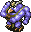 Master Hen (50)</td>
      <td class="high">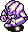 Mistonos (50)</td>
      <td class="mid"> Evil General (30)</td>
    </tr>
    <tr>
      <td class="mid"> Air Devil (50)</td>
      <td class="low"> N'Bama (40)</td>
      <td class="high">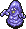 Purple Slime (40)</td>
      <td class=""></td>
      <td class=""></td>
    </tr>
    <tr>
      <td colspan="9" class="tableDivider"></td>
    </tr>
    <tr>
      <td rowspan="2">2</td>
      <td rowspan="2" class="highlightMH"></td>
      <td class="high"> Pacorepkina (45)</td>
      <td class="high"> Chainhead (50)</td>
      <td class="high"> Master Hen (50)</td>
      <td class="high"> Mistonos (50)</td>
      <td class="mid"> Evil General (30)</td>
    </tr>
    <tr>
      <td class="mid"> Air Devil (50)</td>
      <td class="low"> N'Bama (40)</td>
      <td class="high"> Purple Slime (40)</td>
      <td class="high">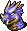 Dragon Head (70)</td>
      <td class="high">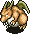 Dragon (90)</td>
    </tr>
    <tr>
      <td colspan="9" class="tableDivider"></td>
    </tr>
    <tr>
      <td rowspan="3">3</td>
      <td rowspan="3" class="highlightMH"></td>
      <td class="high"> Pacorepkina (45)</td>
      <td class="high"> Chainhead (50)</td>
      <td class="high"> Super Gaze (51)</td>
      <td class="high"> Mistonos (50)</td>
      <td class="mid"> Evil General (30)</td>
    </tr>
    <tr>
      <td class="high"> Minotaur (55)</td>
      <td class="low"> N'Bama (40)</td>
      <td class="high"> Purple Slime (40)</td>
      <td class="high"> Dragon Head (70)</td>
      <td class="high"> Dragon (90)</td>
    </tr>
    <tr>
      <td class="high"> Killer Gather (60)</td>
      <td class="low"> Running Egg (5)</td>
      <td class=""></td>
      <td class=""></td>
      <td class=""></td>
    </tr>
    <tr>
      <td colspan="9" class="tableDivider"></td>
    </tr>
    <tr>
      <td rowspan="3">4</td>
      <td rowspan="3" class="highlightMH"></td>
      <td class="high"> Item Bandit (35)</td>
      <td class="high"> Dadster Tank (40)</td>
      <td class="high"> Super Gaze (51)</td>
      <td class="high"> Mistonos (50)</td>
      <td class="mid"> Evil General (30)</td>
    </tr>
    <tr>
      <td class="high"> Minotaur (55)</td>
      <td class="low"> N'Bama (40)</td>
      <td class="high"> Blazepuff (40)</td>
      <td class="high"> Dragon Head (70)</td>
      <td class="high"> Dragon (90)</td>
    </tr>
    <tr>
      <td class="high"> Killer Gather (60)</td>
      <td class="low"> Running Egg (5)</td>
      <td class="high">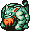 Tiger Uhoho (65)</td>
      <td class=""></td>
      <td class=""></td>
    </tr>
    <tr>
      <td colspan="9" class="tableDivider"></td>
    </tr>
    <tr>
      <td rowspan="3">5</td>
      <td rowspan="3" class="highlightMH"></td>
      <td class="high"> Item Bandit (35)</td>
      <td class="high"> Dadster Tank (40)</td>
      <td class="high"> Super Gaze (51)</td>
      <td class="high"> Rice Boss (38)</td>
      <td class="mid"> Evil General (30)</td>
    </tr>
    <tr>
      <td class="high"> Minotaur (55)</td>
      <td class="low"> N'Bama (40)</td>
      <td class="high"> Blazepuff (40)</td>
      <td class="high"> Madremlas (60)</td>
      <td class=""></td>
    </tr>
    <tr>
      <td class="high"> Killer Gather (60)</td>
      <td class="low"> Running Egg (5)</td>
      <td class="high"> Tiger Uhoho (65)</td>
      <td class=""></td>
      <td class=""></td>
    </tr>
    <tr>
      <td colspan="9" class="tableDivider"></td>
    </tr>
    <tr>
      <td rowspan="3">6</td>
      <td rowspan="3" class="highlightMH"></td>
      <td class="high"> Item Bandit (35)</td>
      <td class="high"> Dadster Tank (40)</td>
      <td class="high"> Super Gaze (51)</td>
      <td class="high"> Rice Boss (38)</td>
      <td class="mid"> Evil General (30)</td>
    </tr>
    <tr>
      <td class="high"> Minotaur (55)</td>
      <td class="low"> N'Bama (40)</td>
      <td class="high"> Blazepuff (40)</td>
      <td class="high"> Madremlas (60)</td>
      <td class=""></td>
    </tr>
    <tr>
      <td class="high"> Killer Gather (60)</td>
      <td class="low">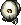 Flying Egg (8)</td>
      <td class="high"> Tiger Uhoho (65)</td>
      <td class=""></td>
      <td class=""></td>
    </tr>
    <tr>
      <td colspan="9" class="tableDivider"></td>
    </tr>
    <tr>
      <td rowspan="3">7</td>
      <td rowspan="3" class="highlightMH"></td>
      <td class="high"> Shadow Eye (40)</td>
      <td class="high"> Dadster Tank (40)</td>
      <td class="high"> Sleep Radish (55)</td>
      <td class="high"> Rice Boss (38)</td>
      <td class="mid"> Evil General (30)</td>
    </tr>
    <tr>
      <td class="high"> Curse Mom (56)</td>
      <td class="low"> N'Bama (40)</td>
      <td class="high"> Blazepuff (40)</td>
      <td class="high"> Madremlas (60)</td>
      <td class="low"> Tengu Chief (40)</td>
    </tr>
    <tr>
      <td class=""></td>
      <td class="low"> Flying Egg (8)</td>
      <td class="high"> Tiger Uhoho (65)</td>
      <td class=""></td>
      <td class=""></td>
    </tr>
    <tr>
      <td colspan="9" class="tableDivider"></td>
    </tr>
    <tr>
      <td rowspan="3">8</td>
      <td rowspan="3" class="highlightMH"></td>
      <td class="high"> Shadow Eye (40)</td>
      <td class="high">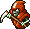 Death Angel (65)</td>
      <td class="high"> Sleep Radish (55)</td>
      <td class="high"> Rice Boss (38)</td>
      <td class="mid"> Evil General (30)</td>
    </tr>
    <tr>
      <td class="high"> Curse Mom (56)</td>
      <td class="low"> N'Bama (40)</td>
      <td class="mid"> Wraith Devil (50)</td>
      <td class="high"> Madremlas (60)</td>
      <td class="low"> Tengu Chief (40)</td>
    </tr>
    <tr>
      <td class=""></td>
      <td class="low"> Flying Egg (8)</td>
      <td class=""></td>
      <td class=""></td>
      <td class=""></td>
    </tr>
    <tr>
      <td colspan="9" class="tableDivider"></td>
    </tr>
    <tr>
      <td rowspan="3">9</td>
      <td rowspan="3" class="highlightMH"></td>
      <td class="high"> Shadow Eye (40)</td>
      <td class="high"> Death Angel (65)</td>
      <td class="high"> Sleep Radish (55)</td>
      <td class="high">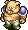 Piggo (50)</td>
      <td class="mid"> Evil General (30)</td>
    </tr>
    <tr>
      <td class="high"> Curse Mom (56)</td>
      <td class="low"> N'Bama (40)</td>
      <td class="mid"> Wraith Devil (50)</td>
      <td class="high"> Skull Wraith (60)</td>
      <td class="low"> Tengu Chief (40)</td>
    </tr>
    <tr>
      <td class="high"> Steel Armor (80)</td>
      <td class="low"> Flying Egg (8)</td>
      <td class="high">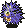 Spike Blast (80)</td>
      <td class=""></td>
      <td class=""></td>
    </tr>
    <tr>
      <td colspan="9" class="tableDivider"></td>
    </tr>
    <tr>
      <td rowspan="3">10</td>
      <td rowspan="3" class="highlightMH"></td>
      <td class="high"> Shadow Eye (40)</td>
      <td class="high"> Death Angel (65)</td>
      <td class="high"> Sleep Radish (55)</td>
      <td class="high"> Piggo (50)</td>
      <td class="mid"> Evil General (30)</td>
    </tr>
    <tr>
      <td class="high"> Curse Mom (56)</td>
      <td class="low"> N'Bama (40)</td>
      <td class="mid"> Wraith Devil (50)</td>
      <td class="high"> Skull Wraith (60)</td>
      <td class="low"> Tengu Chief (40)</td>
    </tr>
    <tr>
      <td class="high"> Steel Armor (80)</td>
      <td class="low"> Flying Egg (8)</td>
      <td class="high"> Spike Blast (80)</td>
      <td class="high"> Sky Dragon (100)</td>
      <td class=""></td>
    </tr>
    <tr>
      <td colspan="9" class="tableDivider"></td>
    </tr>
    <tr>
      <td rowspan="3">11</td>
      <td rowspan="3" class="highlightMH"></td>
      <td class="high">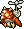 Hover Fowl (45)</td>
      <td class="high"> Death Angel (65)</td>
      <td class="high"> Grey Slime (70)</td>
      <td class="high"> Piggo (50)</td>
      <td class="mid"> Evil General (30)</td>
    </tr>
    <tr>
      <td class="low"> Ironwalrus (70)</td>
      <td class="low"> N'Bama (40)</td>
      <td class="mid"> Wraith Devil (50)</td>
      <td class="high"> Skull Wraith (60)</td>
      <td class="low"> Tengu Chief (40)</td>
    </tr>
    <tr>
      <td class="high"> Steel Armor (80)</td>
      <td class=""></td>
      <td class="high"> Spike Blast (80)</td>
      <td class="high"> Sky Dragon (100)</td>
      <td class=""></td>
    </tr>
    <tr>
      <td colspan="9" class="tableDivider"></td>
    </tr>
    <tr>
      <td rowspan="3">12</td>
      <td rowspan="3" class="highlightMH"></td>
      <td class="high"> Hover Fowl (45)</td>
      <td class="high"> Electroid (70)</td>
      <td class="high"> Grey Slime (70)</td>
      <td class="high"> Piggo (50)</td>
      <td class="mid"> Evil General (30)</td>
    </tr>
    <tr>
      <td class="low"> Ironwalrus (70)</td>
      <td class="low"> N'Bama (40)</td>
      <td class="high"> Cave Mamel (5)</td>
      <td class="high"> Skull Wraith (60)</td>
      <td class="low"> Tengu Chief (40)</td>
    </tr>
    <tr>
      <td class="high"> Steel Armor (80)</td>
      <td class="high"> Great Hen (60)</td>
      <td class="high"> Spike Blast (80)</td>
      <td class="high"> Sky Dragon (100)</td>
      <td class=""></td>
    </tr>
    <tr>
      <td colspan="9" class="tableDivider"></td>
    </tr>
    <tr>
      <td rowspan="3">13</td>
      <td rowspan="3" class="highlightMH"></td>
      <td class="high"> Hover Fowl (45)</td>
      <td class="high"> Electroid (70)</td>
      <td class="high"> Grey Slime (70)</td>
      <td class="high"> Leech Fly (41)</td>
      <td class="mid"> Evil General (30)</td>
    </tr>
    <tr>
      <td class="low"> Ironwalrus (70)</td>
      <td class="low"> N'Bama (40)</td>
      <td class="high"> Cave Mamel (5)</td>
      <td class="high"> Sky Dragon (100)</td>
      <td class="low"> Tengu Chief (40)</td>
    </tr>
    <tr>
      <td class=""></td>
      <td class="high"> Great Hen (60)</td>
      <td class=""></td>
      <td class=""></td>
      <td class=""></td>
    </tr>
    <tr>
      <td colspan="9" class="tableDivider"></td>
    </tr>
    <tr>
      <td rowspan="3">14</td>
      <td rowspan="3" class="highlightMH"></td>
      <td class="high"> Hover Fowl (45)</td>
      <td class="high"> Electroid (70)</td>
      <td class="high"> Grey Slime (70)</td>
      <td class="high"> Leech Fly (41)</td>
      <td class="mid"> Evil General (30)</td>
    </tr>
    <tr>
      <td class="low"> Ironwalrus (70)</td>
      <td class="low"> N'Bama (40)</td>
      <td class="high"> Cave Mamel (5)</td>
      <td class=""></td>
      <td class=""></td>
    </tr>
    <tr>
      <td class=""></td>
      <td class="high"> Great Hen (60)</td>
      <td class=""></td>
      <td class=""></td>
      <td class=""></td>
    </tr>
    <tr>
      <td colspan="9" class="tableDivider"></td>
    </tr>
    <tr>
      <td rowspan="3">15</td>
      <td rowspan="3" class="highlightMH"></td>
      <td class="high"> Oldster Tank (50)</td>
      <td class="high"> Electroid (70)</td>
      <td class="high"> Grey Slime (70)</td>
      <td class="high"> Leech Fly (41)</td>
      <td class="mid"> Evil General (30)</td>
    </tr>
    <tr>
      <td class="high"> Pacorepking (60)</td>
      <td class="low"> N'Bama (40)</td>
      <td class="high"> Cave Mamel (5)</td>
      <td class="high"> Gigahead (70)</td>
      <td class="high"> Verginos (70)</td>
    </tr>
    <tr>
      <td class="high"> Megataur (90)</td>
      <td class="high"> Great Hen (60)</td>
      <td class=""></td>
      <td class=""></td>
      <td class=""></td>
    </tr>
    <tr>
      <td colspan="9" class="tableDivider"></td>
    </tr>
    <tr>
      <td rowspan="3">16</td>
      <td rowspan="3" class="highlightMH"></td>
      <td class="high"> Oldster Tank (50)</td>
      <td class="high"> Mist Hermit (60)</td>
      <td class="high"> Grey Slime (70)</td>
      <td class="high"> Leech Fly (41)</td>
      <td class="mid"> Evil General (30)</td>
    </tr>
    <tr>
      <td class="high"> Pacorepking (60)</td>
      <td class="low"> N'Bama (40)</td>
      <td class="high"> Hell Gather (90)</td>
      <td class="high"> Gigahead (70)</td>
      <td class="high"> Verginos (70)</td>
    </tr>
    <tr>
      <td class="high"> Megataur (90)</td>
      <td class="high"> Hardremlas (130)</td>
      <td class="mid"> Mirage Devil (50)</td>
      <td class=""></td>
      <td class=""></td>
    </tr>
    <tr>
      <td colspan="9" class="tableDivider"></td>
    </tr>
    <tr>
      <td rowspan="3">17</td>
      <td rowspan="3" class="highlightMH"></td>
      <td class="high"> Oldster Tank (50)</td>
      <td class="high"> Mist Hermit (60)</td>
      <td class="high"> Grey Slime (70)</td>
      <td class="high"> Leech Fly (41)</td>
      <td class="mid"> Evil General (30)</td>
    </tr>
    <tr>
      <td class="high"> Pacorepking (60)</td>
      <td class="low"> N'Bama (40)</td>
      <td class="high"> Hell Gather (90)</td>
      <td class="high"> Gigahead (70)</td>
      <td class="high"> Verginos (70)</td>
    </tr>
    <tr>
      <td class="high"> Megataur (90)</td>
      <td class="high"> Hardremlas (130)</td>
      <td class="mid"> Mirage Devil (50)</td>
      <td class=""></td>
      <td class=""></td>
    </tr>
    <tr>
      <td colspan="9" class="tableDivider"></td>
    </tr>
    <tr>
      <td rowspan="3">18</td>
      <td rowspan="3" class="highlightMH"></td>
      <td class="high"> Oldster Tank (50)</td>
      <td class="high"> Mist Hermit (60)</td>
      <td class="high"> Grey Slime (70)</td>
      <td class=""></td>
      <td class="mid"> Evil General (30)</td>
    </tr>
    <tr>
      <td class="high"> Pacorepking (60)</td>
      <td class="low"> N'Bama (40)</td>
      <td class="high"> Hell Gather (90)</td>
      <td class="high"> Gigahead (70)</td>
      <td class="high"> Verginos (70)</td>
    </tr>
    <tr>
      <td class="high"> Megataur (90)</td>
      <td class="high"> Hardremlas (130)</td>
      <td class="mid"> Mirage Devil (50)</td>
      <td class=""></td>
      <td class=""></td>
    </tr>
    <tr>
      <td colspan="9" class="tableDivider"></td>
    </tr>
    <tr>
      <td rowspan="3">19</td>
      <td rowspan="3" class="highlightMH"></td>
      <td class="high"> Oldster Tank (50)</td>
      <td class="high"> Mist Hermit (60)</td>
      <td class="high"> Grey Slime (70)</td>
      <td class=""></td>
      <td class="mid"> Evil General (30)</td>
    </tr>
    <tr>
      <td class="high"> Pacorepking (60)</td>
      <td class="low"> N'Bama (40)</td>
      <td class="high"> Hell Gather (90)</td>
      <td class="high"> Gigahead (70)</td>
      <td class="high"> Verginos (70)</td>
    </tr>
    <tr>
      <td class="high"> Megataur (90)</td>
      <td class="high"> Hardremlas (130)</td>
      <td class="mid"> Mirage Devil (50)</td>
      <td class=""></td>
      <td class=""></td>
    </tr>
    <tr>
      <td colspan="9" class="tableDivider"></td>
    </tr>
    <tr>
      <td rowspan="3">20</td>
      <td rowspan="3" class="highlightMH"></td>
      <td class="high"> Oldster Tank (50)</td>
      <td class="high"> Mist Hermit (60)</td>
      <td class="high"> Grey Slime (70)</td>
      <td class="high"> Hyper Gaze (70)</td>
      <td class="mid"> Evil General (30)</td>
    </tr>
    <tr>
      <td class="high"> Pacorepking (60)</td>
      <td class="low"> N'Bama (40)</td>
      <td class="high"> Hell Gather (90)</td>
      <td class="high"> Infernopuff (80)</td>
      <td class="high"> Dirt Dragon (80)</td>
    </tr>
    <tr>
      <td class="high"> Ark Dragon (120)</td>
      <td class="high"> Hardremlas (130)</td>
      <td class="mid"> Mirage Devil (50)</td>
      <td class=""></td>
      <td class=""></td>
    </tr>
    <tr>
      <td colspan="9" class="tableDivider"></td>
    </tr>
    <tr>
      <td rowspan="2">21</td>
      <td rowspan="2" class="highlightMH"></td>
      <td class="high"> Trove Bandit (50)</td>
      <td class="low"> N'Bama (40)</td>
      <td class="high"> Spike Fire (120)</td>
      <td class="high"> Hyper Gaze (70)</td>
      <td class="mid"> Evil General (30)</td>
    </tr>
    <tr>
      <td class="high"> Ark Dragon (120)</td>
      <td class="high"> Hardremlas (130)</td>
      <td class=""></td>
      <td class="high"> Infernopuff (80)</td>
      <td class="high"> Dirt Dragon (80)</td>
    </tr>
    <tr>
      <td colspan="9" class="tableDivider"></td>
    </tr>
    <tr>
      <td rowspan="2">22</td>
      <td rowspan="2" class="highlightMH"></td>
      <td class="high"> Trove Bandit (50)</td>
      <td class="low"> N'Bama (40)</td>
      <td class="high"> Spike Fire (120)</td>
      <td class="high"> Hyper Gaze (70)</td>
      <td class="mid"> Evil General (30)</td>
    </tr>
    <tr>
      <td class="high"> Ark Dragon (120)</td>
      <td class="high"> Tiger Uhon (80)</td>
      <td class=""></td>
      <td class="high"> Infernopuff (80)</td>
      <td class="high"> Dirt Dragon (80)</td>
    </tr>
    <tr>
      <td colspan="9" class="tableDivider"></td>
    </tr>
    <tr>
      <td rowspan="2">23</td>
      <td rowspan="2" class="highlightMH"></td>
      <td class="high"> Trove Bandit (50)</td>
      <td class="low"> N'Bama (40)</td>
      <td class="high"> Spike Fire (120)</td>
      <td class="high"> Hyper Gaze (70)</td>
      <td class="mid"> Evil General (30)</td>
    </tr>
    <tr>
      <td class="high"> Ark Dragon (120)</td>
      <td class="high"> Tiger Uhon (80)</td>
      <td class="high"> Piggora (70)</td>
      <td class="high"> Infernopuff (80)</td>
      <td class="high"> Dirt Dragon (80)</td>
    </tr>
    <tr>
      <td colspan="9" class="tableDivider"></td>
    </tr>
    <tr>
      <td rowspan="3">24</td>
      <td rowspan="3" class="highlightMH"></td>
      <td class="high"> Trove Bandit (50)</td>
      <td class="low"> N'Bama (40)</td>
      <td class="high"> Spike Fire (120)</td>
      <td class="high"> Hyper Gaze (70)</td>
      <td class="mid"> Evil General (30)</td>
    </tr>
    <tr>
      <td class="high"> Ark Dragon (120)</td>
      <td class="high"> Tiger Uhon (80)</td>
      <td class="high"> Piggora (70)</td>
      <td class="high"> Infernopuff (80)</td>
      <td class="high"> Dirt Dragon (80)</td>
    </tr>
    <tr>
      <td class=""></td>
      <td class=""></td>
      <td class=""></td>
      <td class="low"> Tengu Elder (55)</td>
      <td class=""></td>
    </tr>
    <tr>
      <td colspan="9" class="tableDivider"></td>
    </tr>
    <tr>
      <td rowspan="2">25</td>
      <td rowspan="2" class="highlightMH"></td>
      <td class="high"> Trove Bandit (50)</td>
      <td class="low"> N'Bama (40)</td>
      <td class="high"> Spike Fire (120)</td>
      <td class="high"> Hyper Gaze (70)</td>
      <td class="mid"> Evil General (30)</td>
    </tr>
    <tr>
      <td class="high"> Ark Dragon (120)</td>
      <td class="high"> Tiger Uhon (80)</td>
      <td class="high"> Piggora (70)</td>
      <td class="low"> Tengu Elder (55)</td>
      <td class="high"> Dirt Dragon (80)</td>
    </tr>
    <tr>
      <td colspan="9" class="tableDivider"></td>
    </tr>
    <tr>
      <td rowspan="2">26</td>
      <td rowspan="2" class="highlightMH"></td>
      <td class="high"> Trove Bandit (50)</td>
      <td class="high"> Fear Eye (60)</td>
      <td class="high"> Death Master (77)</td>
      <td class="high"> Bioroid (80)</td>
      <td class="mid"> Evil Shogun (50)</td>
    </tr>
    <tr>
      <td class="high"> Ark Dragon (120)</td>
      <td class="high"> Tiger Uhon (80)</td>
      <td class="high"> Piggora (70)</td>
      <td class="low"> Tengu Elder (55)</td>
      <td class="low"> N'Balun (50)</td>
    </tr>
    <tr>
      <td colspan="9" class="tableDivider"></td>
    </tr>
    <tr>
      <td rowspan="3">27</td>
      <td rowspan="3" class="highlightMH"></td>
      <td class="high"> Trove Bandit (50)</td>
      <td class="high"> Fear Eye (60)</td>
      <td class="high"> Death Master (77)</td>
      <td class="high"> Bioroid (80)</td>
      <td class="mid"> Evil Shogun (50)</td>
    </tr>
    <tr>
      <td class="high"> Ark Dragon (120)</td>
      <td class="high"> Tiger Uhon (80)</td>
      <td class="high"> Piggora (70)</td>
      <td class="low"> Tengu Elder (55)</td>
      <td class="low"> N'Balun (50)</td>
    </tr>
    <tr>
      <td class="high"> Curse Gran (72)</td>
      <td class="low"> Hiding Egg (10)</td>
      <td class=""></td>
      <td class=""></td>
      <td class=""></td>
    </tr>
    <tr>
      <td colspan="9" class="tableDivider"></td>
    </tr>
    <tr>
      <td rowspan="3">28</td>
      <td rowspan="3" class="highlightMH"></td>
      <td class="high"> Trove Bandit (50)</td>
      <td class="high"> Fear Eye (60)</td>
      <td class="high"> Death Master (77)</td>
      <td class="high"> Bioroid (80)</td>
      <td class="mid"> Evil Shogun (50)</td>
    </tr>
    <tr>
      <td class="high"> Ark Dragon (120)</td>
      <td class="high"> Alloy Armor (100)</td>
      <td class="high"> Piggora (70)</td>
      <td class="low"> Tengu Elder (55)</td>
      <td class="low"> N'Balun (50)</td>
    </tr>
    <tr>
      <td class="high"> Curse Gran (72)</td>
      <td class="low"> Hiding Egg (10)</td>
      <td class=""></td>
      <td class=""></td>
      <td class=""></td>
    </tr>
    <tr>
      <td colspan="9" class="tableDivider"></td>
    </tr>
    <tr>
      <td rowspan="3">29</td>
      <td rowspan="3" class="highlightMH"></td>
      <td class="high"> Trove Bandit (50)</td>
      <td class="high"> Fear Eye (60)</td>
      <td class="high"> Death Master (77)</td>
      <td class="high"> Bioroid (80)</td>
      <td class="mid"> Evil Shogun (50)</td>
    </tr>
    <tr>
      <td class="high"> Ark Dragon (120)</td>
      <td class="high"> Alloy Armor (100)</td>
      <td class="high"> Piggora (70)</td>
      <td class="low"> Tengu Elder (55)</td>
      <td class="low"> N'Balun (50)</td>
    </tr>
    <tr>
      <td class="high"> Curse Gran (72)</td>
      <td class="low"> Hiding Egg (10)</td>
      <td class="high"> Fear Radish (70)</td>
      <td class=""></td>
      <td class=""></td>
    </tr>
    <tr>
      <td colspan="9" class="tableDivider"></td>
    </tr>
    <tr>
      <td rowspan="4">30</td>
      <td rowspan="4" class="highlightMH"></td>
      <td class="high"> Trove Bandit (50)</td>
      <td class="high"> Fear Eye (60)</td>
      <td class="high"> Death Master (77)</td>
      <td class="high"> Bioroid (80)</td>
      <td class="mid"> Evil Shogun (50)</td>
    </tr>
    <tr>
      <td class="high"> Ark Dragon (120)</td>
      <td class="high"> Alloy Armor (100)</td>
      <td class="high"> Piggora (70)</td>
      <td class="low"> Tengu Elder (55)</td>
      <td class="low"> N'Balun (50)</td>
    </tr>
    <tr>
      <td class="high"> Curse Gran (72)</td>
      <td class="low"> Hiding Egg (10)</td>
      <td class="high"> Fear Radish (70)</td>
      <td class="high"> Fallen Gather (130)</td>
      <td class="high"> Pacorepgod (80)</td>
    </tr>
    <tr>
      <td class="high"> Red Slime (100)</td>
      <td class=""></td>
      <td class=""></td>
      <td class=""></td>
      <td class=""></td>
    </tr>
    <tr>
      <td colspan="9" class="tableDivider"></td>
    </tr>
    <tr>
      <td rowspan="4">31</td>
      <td rowspan="4" class="highlightMH"></td>
      <td class="high"> Rice Master (70)</td>
      <td class="high"> Fear Eye (60)</td>
      <td class="high"> Death Master (77)</td>
      <td class="high"> Bioroid (80)</td>
      <td class="mid"> Evil Shogun (50)</td>
    </tr>
    <tr>
      <td class="high"> Ark Dragon (120)</td>
      <td class="high"> Alloy Armor (100)</td>
      <td class="high"> Skull Demon (75)</td>
      <td class="high"> Miracle Hen (80)</td>
      <td class="low"> N'Balun (50)</td>
    </tr>
    <tr>
      <td class="high"> Curse Gran (72)</td>
      <td class="low"> Hiding Egg (10)</td>
      <td class="high"> Fear Radish (70)</td>
      <td class="high"> Fallen Gather (130)</td>
      <td class="high"> Pacorepgod (80)</td>
    </tr>
    <tr>
      <td class="high"> Red Slime (100)</td>
      <td class=""></td>
      <td class=""></td>
      <td class=""></td>
      <td class=""></td>
    </tr>
    <tr>
      <td colspan="9" class="tableDivider"></td>
    </tr>
    <tr>
      <td rowspan="4">32</td>
      <td rowspan="4" class="highlightMH"></td>
      <td class="high"> Rice Master (70)</td>
      <td class="high"> Fear Eye (60)</td>
      <td class="high"> Death Master (77)</td>
      <td class="high"> Bioroid (80)</td>
      <td class="mid"> Evil Shogun (50)</td>
    </tr>
    <tr>
      <td class="high"> Cranky Tank (80)</td>
      <td class="high"> Alloy Armor (100)</td>
      <td class="high"> Skull Demon (75)</td>
      <td class="high"> Miracle Hen (80)</td>
      <td class="low"> N'Balun (50)</td>
    </tr>
    <tr>
      <td class="high"> Curse Gran (72)</td>
      <td class="low"> Hiding Egg (10)</td>
      <td class="high"> Fear Radish (70)</td>
      <td class="high"> Fallen Gather (130)</td>
      <td class="high"> Pacorepgod (80)</td>
    </tr>
    <tr>
      <td class="high"> Red Slime (100)</td>
      <td class=""></td>
      <td class=""></td>
      <td class=""></td>
      <td class=""></td>
    </tr>
    <tr>
      <td colspan="9" class="tableDivider"></td>
    </tr>
    <tr>
      <td rowspan="4">33</td>
      <td rowspan="4" class="highlightMH"></td>
      <td class="high"> Rice Master (70)</td>
      <td class="high"> Fear Eye (60)</td>
      <td class="high"> Death Master (77)</td>
      <td class="high"> Bioroid (80)</td>
      <td class="mid"> Evil Shogun (50)</td>
    </tr>
    <tr>
      <td class="high"> Cranky Tank (80)</td>
      <td class="high"> Alloy Armor (100)</td>
      <td class="high"> Skull Demon (75)</td>
      <td class="high"> Miracle Hen (80)</td>
      <td class="low"> N'Balun (50)</td>
    </tr>
    <tr>
      <td class="high"> Curse Gran (72)</td>
      <td class="low"> Hiding Egg (10)</td>
      <td class="high"> Fear Radish (70)</td>
      <td class="high"> Fallen Gather (130)</td>
      <td class="high"> Pacorepgod (80)</td>
    </tr>
    <tr>
      <td class="high"> Red Slime (100)</td>
      <td class=""></td>
      <td class=""></td>
      <td class=""></td>
      <td class=""></td>
    </tr>
    <tr>
      <td colspan="9" class="tableDivider"></td>
    </tr>
    <tr>
      <td rowspan="4">34</td>
      <td rowspan="4" class="highlightMH"></td>
      <td class="high"> Rice Master (70)</td>
      <td class="high"> Fear Eye (60)</td>
      <td class="high"> Death Master (77)</td>
      <td class="high"> Bioroid (80)</td>
      <td class="mid"> Evil Shogun (50)</td>
    </tr>
    <tr>
      <td class="high"> Cranky Tank (80)</td>
      <td class="high"> Alloy Armor (100)</td>
      <td class="high"> Skull Demon (75)</td>
      <td class="high"> Miracle Hen (80)</td>
      <td class="low"> N'Balun (50)</td>
    </tr>
    <tr>
      <td class="high"> Curse Gran (72)</td>
      <td class="low"> Hiding Egg (10)</td>
      <td class="high"> Leech Queen (50)</td>
      <td class="high"> Fallen Gather (130)</td>
      <td class="high"> Pacorepgod (80)</td>
    </tr>
    <tr>
      <td class="high"> Red Slime (100)</td>
      <td class="high"> Spike Erupt (200)</td>
      <td class=""></td>
      <td class=""></td>
      <td class=""></td>
    </tr>
    <tr>
      <td colspan="9" class="tableDivider"></td>
    </tr>
    <tr>
      <td rowspan="4">35</td>
      <td rowspan="4" class="highlightMH"></td>
      <td class="high"> Rice Master (70)</td>
      <td class="high"> Fear Eye (60)</td>
      <td class="high"> Death Master (77)</td>
      <td class="high"> Bioroid (80)</td>
      <td class="mid"> Evil Shogun (50)</td>
    </tr>
    <tr>
      <td class="high"> Cranky Tank (80)</td>
      <td class="high"> Alloy Armor (100)</td>
      <td class="high"> Skull Demon (75)</td>
      <td class="high"> Miracle Hen (80)</td>
      <td class="low"> N'Balun (50)</td>
    </tr>
    <tr>
      <td class="high"> Curse Gran (72)</td>
      <td class="low"> Hiding Egg (10)</td>
      <td class="high"> Leech Queen (50)</td>
      <td class="high"> Fallen Gather (130)</td>
      <td class="high"> Pacorepgod (80)</td>
    </tr>
    <tr>
      <td class="high"> Red Slime (100)</td>
      <td class="high"> Spike Erupt (200)</td>
      <td class="mid"> Showpin (60)</td>
      <td class="high"> Heavyremlas (150)</td>
      <td class=""></td>
    </tr>
    <tr>
      <td colspan="9" class="tableDivider"></td>
    </tr>
    <tr>
      <td rowspan="4">36</td>
      <td rowspan="4" class="highlightMH"></td>
      <td class="high"> Rice Master (70)</td>
      <td class="high"> Jet Fowl (80)</td>
      <td class="high"> Deathhead (100)</td>
      <td class="high"> Bioroid (80)</td>
      <td class="mid"> Evil Shogun (50)</td>
    </tr>
    <tr>
      <td class="high"> Cranky Tank (80)</td>
      <td class="high"> Alloy Armor (100)</td>
      <td class="high"> Skull Demon (75)</td>
      <td class="high"> Miracle Hen (80)</td>
      <td class="low"> N'Balun (50)</td>
    </tr>
    <tr>
      <td class="low"> Roguewalrus (100)</td>
      <td class="high"> Spike Erupt (200)</td>
      <td class="high"> Leech Queen (50)</td>
      <td class="high"> Fallen Gather (130)</td>
      <td class="high"> Pacorepgod (80)</td>
    </tr>
    <tr>
      <td class="high"> Red Slime (100)</td>
      <td class=""></td>
      <td class="mid"> Showpin (60)</td>
      <td class="high"> Heavyremlas (150)</td>
      <td class=""></td>
    </tr>
    <tr>
      <td colspan="9" class="tableDivider"></td>
    </tr>
    <tr>
      <td rowspan="4">37</td>
      <td rowspan="4" class="highlightMH"></td>
      <td class="high"> Rice Master (70)</td>
      <td class="high"> Jet Fowl (80)</td>
      <td class="high"> Deathhead (100)</td>
      <td class="high"> Bioroid (80)</td>
      <td class="mid"> Evil Shogun (50)</td>
    </tr>
    <tr>
      <td class="high"> Cranky Tank (80)</td>
      <td class="high"> Alloy Armor (100)</td>
      <td class="high"> Skull Demon (75)</td>
      <td class="high"> Miracle Hen (80)</td>
      <td class="low"> N'Balun (50)</td>
    </tr>
    <tr>
      <td class="low"> Roguewalrus (100)</td>
      <td class="high"> Spike Erupt (200)</td>
      <td class="high"> Leech Queen (50)</td>
      <td class="high"> Fallen Gather (130)</td>
      <td class=""></td>
    </tr>
    <tr>
      <td class="high"> Red Slime (100)</td>
      <td class=""></td>
      <td class="mid"> Showpin (60)</td>
      <td class="high"> Heavyremlas (150)</td>
      <td class=""></td>
    </tr>
    <tr>
      <td colspan="9" class="tableDivider"></td>
    </tr>
    <tr>
      <td rowspan="4">38</td>
      <td rowspan="4" class="highlightMH"></td>
      <td class="high"> Rice Master (70)</td>
      <td class="high"> Jet Fowl (80)</td>
      <td class="high"> Deathhead (100)</td>
      <td class="high"> Bioroid (80)</td>
      <td class="mid"> Evil Shogun (50)</td>
    </tr>
    <tr>
      <td class="high"> Cranky Tank (80)</td>
      <td class="high"> Cloud Hermit (70)</td>
      <td class="high"> Skull Demon (75)</td>
      <td class="high"> Miracle Hen (80)</td>
      <td class="low"> N'Balun (50)</td>
    </tr>
    <tr>
      <td class="low"> Roguewalrus (100)</td>
      <td class="high"> Spike Erupt (200)</td>
      <td class="high"> Leech Queen (50)</td>
      <td class="high"> Fallen Gather (130)</td>
      <td class="high"> Gigataur (120)</td>
    </tr>
    <tr>
      <td class="high"> Red Slime (100)</td>
      <td class=""></td>
      <td class="mid"> Showpin (60)</td>
      <td class="high"> Heavyremlas (150)</td>
      <td class=""></td>
    </tr>
    <tr>
      <td colspan="9" class="tableDivider"></td>
    </tr>
    <tr>
      <td rowspan="4">39</td>
      <td rowspan="4" class="highlightMH"></td>
      <td class="high"> Rice Master (70)</td>
      <td class="high"> Jet Fowl (80)</td>
      <td class="high"> Deathhead (100)</td>
      <td class="high"> Bioroid (80)</td>
      <td class="mid"> Evil Shogun (50)</td>
    </tr>
    <tr>
      <td class="high"> Cranky Tank (80)</td>
      <td class="high"> Cloud Hermit (70)</td>
      <td class="high"> Hell Dragon (150)</td>
      <td class="high"> Miracle Hen (80)</td>
      <td class="low"> N'Balun (50)</td>
    </tr>
    <tr>
      <td class="low"> Roguewalrus (100)</td>
      <td class=""></td>
      <td class="high"> Leech Queen (50)</td>
      <td class="high"> Fallen Gather (130)</td>
      <td class="high"> Gigataur (120)</td>
    </tr>
    <tr>
      <td class=""></td>
      <td class=""></td>
      <td class="mid"> Showpin (60)</td>
      <td class="high"> Heavyremlas (150)</td>
      <td class=""></td>
    </tr>
    <tr>
      <td colspan="9" class="tableDivider"></td>
    </tr>
    <tr>
      <td rowspan="4">40</td>
      <td rowspan="4" class="highlightMH"></td>
      <td class="high"> Rice Master (70)</td>
      <td class="high"> Jet Fowl (80)</td>
      <td class="high"> Deathhead (100)</td>
      <td class="high"> Bioroid (80)</td>
      <td class="mid"> Evil Shogun (50)</td>
    </tr>
    <tr>
      <td class="high"> Cranky Tank (80)</td>
      <td class="high"> Cloud Hermit (70)</td>
      <td class="high"> Hell Dragon (150)</td>
      <td class="high"> Miracle Hen (80)</td>
      <td class="low"> N'Balun (50)</td>
    </tr>
    <tr>
      <td class="low"> Roguewalrus (100)</td>
      <td class="high"> Ultra Gaze (90)</td>
      <td class="high"> Leech Queen (50)</td>
      <td class="high"> Fallen Gather (130)</td>
      <td class="high"> Gigataur (120)</td>
    </tr>
    <tr>
      <td class=""></td>
      <td class=""></td>
      <td class="mid"> Showpin (60)</td>
      <td class="high"> Heavyremlas (150)</td>
      <td class=""></td>
    </tr>
    <tr>
      <td colspan="9" class="tableDivider"></td>
    </tr>
    <tr>
      <td rowspan="4">41</td>
      <td rowspan="4" class="highlightMH"></td>
      <td class="high"> Rice Master (70)</td>
      <td class="high"> Piggaron (90)</td>
      <td class="high"> Deathhead (100)</td>
      <td class="high"> Bioroid (80)</td>
      <td class="mid"> Evil Shogun (50)</td>
    </tr>
    <tr>
      <td class="high"> Cranky Tank (80)</td>
      <td class="high"> Cloud Hermit (70)</td>
      <td class="high"> Hell Dragon (150)</td>
      <td class="high"> Fallen Gather (130)</td>
      <td class="low"> N'Balun (50)</td>
    </tr>
    <tr>
      <td class="low"> Roguewalrus (100)</td>
      <td class="high"> Ultra Gaze (90)</td>
      <td class="high"> Leech Queen (50)</td>
      <td class="high"> Heavyremlas (150)</td>
      <td class="high"> Gigataur (120)</td>
    </tr>
    <tr>
      <td class=""></td>
      <td class=""></td>
      <td class="mid"> Showpin (60)</td>
      <td class=""></td>
      <td class=""></td>
    </tr>
    <tr>
      <td colspan="9" class="tableDivider"></td>
    </tr>
    <tr>
      <td rowspan="3">42</td>
      <td rowspan="3" class="highlightMH"></td>
      <td class="high"> Rice Master (70)</td>
      <td class="high"> Piggaron (90)</td>
      <td class="high"> Deathhead (100)</td>
      <td class="high"> Bioroid (80)</td>
      <td class="mid"> Evil Shogun (50)</td>
    </tr>
    <tr>
      <td class="high"> Cranky Tank (80)</td>
      <td class="high"> Cloud Hermit (70)</td>
      <td class="high"> Hell Dragon (150)</td>
      <td class="high"> Fallen Gather (130)</td>
      <td class="low"> N'Balun (50)</td>
    </tr>
    <tr>
      <td class="low"> Roguewalrus (100)</td>
      <td class="high"> Ultra Gaze (90)</td>
      <td class="mid"> Showpin (60)</td>
      <td class="high"> Heavyremlas (150)</td>
      <td class="high"> Gigataur (120)</td>
    </tr>
    <tr>
      <td colspan="9" class="tableDivider"></td>
    </tr>
    <tr>
      <td rowspan="3">43</td>
      <td rowspan="3" class="highlightMH"></td>
      <td class="high"> Rice Master (70)</td>
      <td class="high"> Piggaron (90)</td>
      <td class="high"> Deathhead (100)</td>
      <td class="high"> Bioroid (80)</td>
      <td class="mid"> Evil Shogun (50)</td>
    </tr>
    <tr>
      <td class="high"> Cranky Tank (80)</td>
      <td class="high"> Cloud Hermit (70)</td>
      <td class="high"> Hell Dragon (150)</td>
      <td class="high"> Fallen Gather (130)</td>
      <td class="low"> N'Balun (50)</td>
    </tr>
    <tr>
      <td class="low"> Roguewalrus (100)</td>
      <td class="high"> Ultra Gaze (90)</td>
      <td class="mid"> Showpin (60)</td>
      <td class="high"> Heavyremlas (150)</td>
      <td class="high"> Gigataur (120)</td>
    </tr>
    <tr>
      <td colspan="9" class="tableDivider"></td>
    </tr>
    <tr>
      <td rowspan="4">44</td>
      <td rowspan="4" class="highlightMH"></td>
      <td class="high"> Rice Master (70)</td>
      <td class="high"> Piggaron (90)</td>
      <td class="high"> Tiger Uboho (100)</td>
      <td class="high"> Bioroid (80)</td>
      <td class="mid"> Evil Shogun (50)</td>
    </tr>
    <tr>
      <td class="high"> Cranky Tank (80)</td>
      <td class="high"> Cloud Hermit (70)</td>
      <td class="high"> Hell Dragon (150)</td>
      <td class="high"> Fallen Gather (130)</td>
      <td class="low"> N'Balun (50)</td>
    </tr>
    <tr>
      <td class="low"> Roguewalrus (100)</td>
      <td class="high"> Ultra Gaze (90)</td>
      <td class="mid"> Showpin (60)</td>
      <td class="high"> Heavyremlas (150)</td>
      <td class="high"> Gigataur (120)</td>
    </tr>
    <tr>
      <td class="high"> Earth Dragon (110)</td>
      <td class=""></td>
      <td class=""></td>
      <td class=""></td>
      <td class=""></td>
    </tr>
    <tr>
      <td colspan="9" class="tableDivider"></td>
    </tr>
    <tr>
      <td rowspan="4">45</td>
      <td rowspan="4" class="highlightMH"></td>
      <td class="high"> Rice Master (70)</td>
      <td class="high"> Piggaron (90)</td>
      <td class="high"> Tiger Uboho (100)</td>
      <td class="high"> Bioroid (80)</td>
      <td class="mid"> Evil Shogun (50)</td>
    </tr>
    <tr>
      <td class="high"> Cranky Tank (80)</td>
      <td class="high"> Cloud Hermit (70)</td>
      <td class="high"> Hell Dragon (150)</td>
      <td class="high"> Fallen Gather (130)</td>
      <td class="low"> N'Balun (50)</td>
    </tr>
    <tr>
      <td class="low"> Roguewalrus (100)</td>
      <td class="high"> Ultra Gaze (90)</td>
      <td class="mid"> Showpin (60)</td>
      <td class="mid"> Astral Devil (50)</td>
      <td class="high"> Gigataur (120)</td>
    </tr>
    <tr>
      <td class="high"> Earth Dragon (110)</td>
      <td class="low"> Gitan Mamel (6)</td>
      <td class="high"> Red Slime (100)</td>
      <td class=""></td>
      <td class=""></td>
    </tr>
    <tr>
      <td colspan="9" class="tableDivider"></td>
    </tr>
    <tr>
      <td rowspan="4">46</td>
      <td rowspan="4" class="highlightMH"></td>
      <td class="high"> Rice Master (70)</td>
      <td class="high"> Piggaron (90)</td>
      <td class="high"> Tiger Uboho (100)</td>
      <td class="high"> Bioroid (80)</td>
      <td class="mid"> Evil Shogun (50)</td>
    </tr>
    <tr>
      <td class="high"> Cranky Tank (80)</td>
      <td class="high"> Cloud Hermit (70)</td>
      <td class="high"> Hell Dragon (150)</td>
      <td class="high"> Fallen Gather (130)</td>
      <td class="low"> N'Balun (50)</td>
    </tr>
    <tr>
      <td class="low"> Roguewalrus (100)</td>
      <td class="high"> Ultra Gaze (90)</td>
      <td class="mid"> Showpin (60)</td>
      <td class="mid"> Astral Devil (50)</td>
      <td class="high"> Gigataur (120)</td>
    </tr>
    <tr>
      <td class="high"> Earth Dragon (110)</td>
      <td class="low"> Gitan Mamel (6)</td>
      <td class="high"> Red Slime (100)</td>
      <td class="high"> Swordgator (100)</td>
      <td class=""></td>
    </tr>
    <tr>
      <td colspan="9" class="tableDivider"></td>
    </tr>
    <tr>
      <td rowspan="4">47</td>
      <td rowspan="4" class="highlightMH"></td>
      <td class="high"> Rice Master (70)</td>
      <td class="high"> Piggaron (90)</td>
      <td class="high"> Tiger Uboho (100)</td>
      <td class="high"> Bioroid (80)</td>
      <td class="mid"> Evil Shogun (50)</td>
    </tr>
    <tr>
      <td class="high"> Cranky Tank (80)</td>
      <td class="high"> Cloud Hermit (70)</td>
      <td class="high"> Hell Dragon (150)</td>
      <td class="high"> Fallen Gather (130)</td>
      <td class="low"> N'Balun (50)</td>
    </tr>
    <tr>
      <td class="low"> Roguewalrus (100)</td>
      <td class="high"> Ultra Gaze (90)</td>
      <td class="mid"> Showpin (60)</td>
      <td class="mid"> Astral Devil (50)</td>
      <td class="high"> Gigataur (120)</td>
    </tr>
    <tr>
      <td class="high"> Earth Dragon (110)</td>
      <td class="low"> Gitan Mamel (6)</td>
      <td class="high"> Red Slime (100)</td>
      <td class="high"> Swordgator (100)</td>
      <td class=""></td>
    </tr>
    <tr>
      <td colspan="9" class="tableDivider"></td>
    </tr>
    <tr>
      <td rowspan="4">48</td>
      <td rowspan="4" class="highlightMH"></td>
      <td class="high"> Rice Master (70)</td>
      <td class=""></td>
      <td class="high"> Tiger Uboho (100)</td>
      <td class="high"> Bioroid (80)</td>
      <td class="mid"> Evil Shogun (50)</td>
    </tr>
    <tr>
      <td class="high"> Cranky Tank (80)</td>
      <td class="high"> Cloud Hermit (70)</td>
      <td class="high"> Hell Dragon (150)</td>
      <td class="high"> Fallen Gather (130)</td>
      <td class="low"> N'Balun (50)</td>
    </tr>
    <tr>
      <td class="low"> Roguewalrus (100)</td>
      <td class="high"> Ultra Gaze (90)</td>
      <td class="mid"> Showpin (60)</td>
      <td class="mid"> Astral Devil (50)</td>
      <td class="high"> Gigataur (120)</td>
    </tr>
    <tr>
      <td class="high"> Earth Dragon (110)</td>
      <td class="low"> Gitan Mamel (6)</td>
      <td class="high"> Red Slime (100)</td>
      <td class="high"> Swordgator (100)</td>
      <td class=""></td>
    </tr>
    <tr>
      <td colspan="9" class="tableDivider"></td>
    </tr>
    <tr>
      <td rowspan="4">49</td>
      <td rowspan="4" class="highlightMH"></td>
      <td class="high"> Rice Master (70)</td>
      <td class=""></td>
      <td class="high"> Tiger Uboho (100)</td>
      <td class="high"> Bioroid (80)</td>
      <td class="mid"> Evil Shogun (50)</td>
    </tr>
    <tr>
      <td class="high"> Cranky Tank (80)</td>
      <td class="high"> Cloud Hermit (70)</td>
      <td class="high"> Hell Dragon (150)</td>
      <td class="high"> Fallen Gather (130)</td>
      <td class="low"> N'Balun (50)</td>
    </tr>
    <tr>
      <td class="low"> Roguewalrus (100)</td>
      <td class="high"> Ultra Gaze (90)</td>
      <td class="mid"> Showpin (60)</td>
      <td class="mid"> Astral Devil (50)</td>
      <td class="high"> Gigataur (120)</td>
    </tr>
    <tr>
      <td class="high"> Earth Dragon (110)</td>
      <td class="low"> Gitan Mamel (6)</td>
      <td class="high"> Red Slime (100)</td>
      <td class="high"> Swordgator (100)</td>
      <td class=""></td>
    </tr>
    <tr>
      <td colspan="9" class="tableDivider"></td>
    </tr>
    <tr>
      <td rowspan="4">50</td>
      <td rowspan="4" class="highlightMH"></td>
      <td class="high"> Rice Master (70)</td>
      <td class=""></td>
      <td class="high"> Tiger Uboho (100)</td>
      <td class="high"> Bioroid (80)</td>
      <td class="mid"> Evil Shogun (50)</td>
    </tr>
    <tr>
      <td class="high"> Cranky Tank (80)</td>
      <td class="high"> Cloud Hermit (70)</td>
      <td class="high"> Hell Dragon (150)</td>
      <td class="high"> Fallen Gather (130)</td>
      <td class="low"> N'Balun (50)</td>
    </tr>
    <tr>
      <td class="low"> Roguewalrus (100)</td>
      <td class="high"> Ultra Gaze (90)</td>
      <td class="mid"> Showpin (60)</td>
      <td class="mid"> Astral Devil (50)</td>
      <td class="high"> Gigataur (120)</td>
    </tr>
    <tr>
      <td class="high"> Earth Dragon (110)</td>
      <td class="low"> Gitan Mamel (6)</td>
      <td class="high"> Red Slime (100)</td>
      <td class="high"> Swordgator (100)</td>
      <td class=""></td>
    </tr>
  </tbody>
</table>

# Items

#### Spawn Rates

- F = Floor, Monster drop
- C = Jar of Change, Thiefwalrus drop

 

<table class="dungeonTable">
  <tr>
    <th class="centeredText">Category</th>
    <th class="centeredText">F</th>
    <th class="centeredText">C</th>
    <th rowspan="5" class="tableDivider"></th>
    <th class="centeredText">Category</th>
    <th class="centeredText">F</th>
    <th class="centeredText">C</th>
  </tr>
  <tr>
    <td class="highlightGray">Weapon</td>
    <td></td>
    <td>-</td>
    <td class="highlightGray">Herb</td>
    <td></td>
    <td></td>
  </tr>
  <tr>
    <td class="highlightGray">Shield</td>
    <td></td>
    <td>-</td>
    <td class="highlightGray">Scroll</td>
    <td></td>
    <td></td>
  </tr>
  <tr>
    <td class="highlightGray">Armband</td>
    <td></td>
    <td></td>
    <td class="highlightGray">Staff</td>
    <td></td>
    <td></td>
  </tr>
  <tr>
    <td class="highlightGray">Food</td>
    <td></td>
    <td></td>
    <td class="highlightGray">Jar</td>
    <td></td>
    <td></td>
  </tr>
</table>

#### Item Table

The values like "46-50" in the Notes column represents the floor range where the item can appear.

- F = Floor, Monster drop
- M = Monster (Fixed drop)
- C = Jar of Change, Thiefwalrus drop

 

<table class="dungeonItemTable">
  <tr>
    <th colspan="5" class="highlightLightblue">Weapon</th>
    <th rowspan="29"></th>
    <th colspan="5" class="highlightLightblue">Herb</th>
  </tr>
  <tr>
    <th>Name</th>
    <th>F</th>
    <th>M</th>
    <th>C</th>
    <th>Notes</th>
    <th>Name</th>
    <th>F</th>
    <th>M</th>
    <th>C</th>
    <th>Notes</th>
  </tr>
  <tr>
    <td class="leftText">Homing Blade</td>
    <td>X</td>
    <td></td>
    <td></td>
    <td>46-50</td>
    <td class="leftText">Big Belly Seed</td>
    <td>X</td>
    <td></td>
    <td>X</td>
    <td>1-50</td>
  </tr>
  <tr>
    <td class="leftText">Minotaur's Axe</td>
    <td></td>
    <td>X</td>
    <td></td>
    <td>Taur Type</td>
    <td class="leftText">Herb of Life</td>
    <td>X</td>
    <td></td>
    <td>X</td>
    <td>1-50</td>
  </tr>
  <tr>
    <th colspan="5" class="highlightLightblue">Shield</th>
    <td class="leftText">Restorative Herb</td>
    <td>X</td>
    <td></td>
    <td>X</td>
    <td>1-50</td>
  </tr>
  <tr>
    <th>Name</th>
    <th>F</th>
    <th>M</th>
    <th>C</th>
    <th>Notes</th>
    <td class="leftText">Kigny Seed</td>
    <td></td>
    <td>X</td>
    <td></td>
    <td>Fear Radish</td>
  </tr>
  <tr>
    <td class="leftText">Gaze Shield</td>
    <td>X</td>
    <td></td>
    <td></td>
    <td>41-45 / 50</td>
    <td class="leftText">Weeds</td>
    <td></td>
    <td>X</td>
    <td></td>
    <td>Field Bandit Type</td>
  </tr>
  <tr>
    <td class="leftText">Prism Shield</td>
    <td>X</td>
    <td></td>
    <td></td>
    <td>41-45 / 50</td>
    <td class="leftText">Sleeping Herb</td>
    <td></td>
    <td>X</td>
    <td></td>
    <td>Sleep Radish</td>
  </tr>
  <tr>
    <th colspan="5" class="highlightLightblue">Armband</th>
    <td class="leftText">Herb of Strength</td>
    <td>X</td>
    <td></td>
    <td>X</td>
    <td>1-50</td>
  </tr>
  <tr>
    <th>Name</th>
    <th>F</th>
    <th>M</th>
    <th>C</th>
    <th>Notes</th>
    <td class="leftText">Antidote Herb</td>
    <td>X</td>
    <td></td>
    <td>X</td>
    <td>1-50</td>
  </tr>
  <tr>
    <td class="leftText">Armband of Calm</td>
    <td>X</td>
    <td></td>
    <td>X</td>
    <td>1-50</td>
    <td class="leftText">Herb of Sight</td>
    <td>X</td>
    <td></td>
    <td>X</td>
    <td>1-50</td>
  </tr>
  <tr>
    <td class="leftText">Rustless Armband</td>
    <td>X</td>
    <td></td>
    <td>X</td>
    <td>1-50</td>
    <td class="leftText">Medicinal Herb</td>
    <td>X</td>
    <td></td>
    <td>X</td>
    <td>1-50</td>
  </tr>
  <tr>
    <td class="leftText">Antidote Armband</td>
    <td>X</td>
    <td></td>
    <td>X</td>
    <td>1-50</td>
    <th colspan="5" class="highlightLightblue">Scroll</th>
  </tr>
  <tr>
    <td class="leftText">Antidrain Armband</td>
    <td>X</td>
    <td></td>
    <td>X</td>
    <td>1-50</td>
    <th>Name</th>
    <th>F</th>
    <th>M</th>
    <th>C</th>
    <th>Notes</th>
  </tr>
  <tr>
    <td class="leftText">Sleepless Armband</td>
    <td>X</td>
    <td></td>
    <td>X</td>
    <td>1-50</td>
    <td class="leftText">Great Hall Scroll</td>
    <td></td>
    <td></td>
    <td>X</td>
    <td>1-50</td>
  </tr>
  <tr>
    <th colspan="5" class="highlightLightblue">Food</th>
    <td class="leftText">Scroll of Blessing</td>
    <td>X</td>
    <td></td>
    <td>X</td>
    <td>1-50</td>
  </tr>
  <tr>
    <th>Name</th>
    <th>F</th>
    <th>M</th>
    <th>C</th>
    <th>Notes</th>
    <td class="leftText">Earth Bless Scroll</td>
    <td>X</td>
    <td></td>
    <td>X</td>
    <td>1-50</td>
  </tr>
  <tr>
    <td class="leftText">Big Riceball</td>
    <td>X</td>
    <td>X</td>
    <td>X</td>
    <td>1-50 Running Egg</td>
    <td class="leftText">Air Bless Scroll</td>
    <td>X</td>
    <td></td>
    <td>X</td>
    <td>1-50</td>
  </tr>
  <tr>
    <td class="leftText">Riceball</td>
    <td>X</td>
    <td></td>
    <td>X</td>
    <td>1-50</td>
    <th colspan="5" class="highlightLightblue">Staff</th>
  </tr>
  <tr>
    <td class="leftText">Giant Riceball</td>
    <td></td>
    <td>X</td>
    <td></td>
    <td>Rice Master</td>
    <th>Name</th>
    <th>F</th>
    <th>M</th>
    <th>C</th>
    <th>Notes</th>
  </tr>
  <tr>
    <td class="leftText">Rotten Riceball</td>
    <td>X</td>
    <td></td>
    <td>X</td>
    <td>1-50</td>
    <td class="leftText">Pain Sharing Staff</td>
    <td>X</td>
    <td></td>
    <td>X</td>
    <td>1-50</td>
  </tr>
  <tr>
    <th colspan="5" class="highlightLightblue">Jar</th>
    <td class="leftText">Staff of Postpone</td>
    <td>X</td>
    <td></td>
    <td>X</td>
    <td>1-50</td>
  </tr>
  <tr>
    <th>Name</th>
    <th>F</th>
    <th>M</th>
    <th>C</th>
    <th>Notes</th>
    <td class="leftText">Skull Staff</td>
    <td></td>
    <td>X</td>
    <td></td>
    <td>Skull Mage Type</td>
  </tr>
  <tr>
    <td class="leftText">Chiropractic Jar</td>
    <td>X</td>
    <td></td>
    <td>X</td>
    <td>1-50</td>
    <td class="leftText">Staff of Paralysis</td>
    <td>X</td>
    <td></td>
    <td>X</td>
    <td>1-50</td>
  </tr>
  <tr>
    <td class="leftText">Storehouse Jar</td>
    <td>X</td>
    <td></td>
    <td>X</td>
    <td>1-50</td>
    <td class="leftText">Staff of Stability</td>
    <td>X</td>
    <td></td>
    <td>X</td>
    <td>1-50</td>
  </tr>
  <tr>
    <td class="leftText">Jar of Hiding</td>
    <td>X</td>
    <td></td>
    <td>X</td>
    <td>1-50</td>
    <td class="leftText">Staff of Sloth</td>
    <td>X</td>
    <td></td>
    <td>X</td>
    <td>1-50</td>
  </tr>
  <tr>
    <td rowspan="3" colspan="5"></td>
    <td class="leftText">Switching Staff</td>
    <td>X</td>
    <td></td>
    <td>X</td>
    <td>1-50</td>
  </tr>
  <tr>
    <td class="leftText">Doppelganger Staff</td>
    <td>X</td>
    <td></td>
    <td>X</td>
    <td>1-50</td>
  </tr>
  <tr>
    <td class="leftText">Lightning Staff</td>
    <td>X</td>
    <td></td>
    <td>X</td>
    <td>1-50</td>
  </tr>
</table>

# Traps

See [Traps](/system/traps) for details.

<table class="sealTable">
  <thead>
    <tr>
      <th>Floor</th>
      <th>Traps</th>
    </tr>
  </thead>
  <tbody>
    <tr>
      <td>1-50</td>
      <td>Stumble, Alarm, Summons, Slowness, Poison Dart, Landmine, Big Landmine, Riceball, Curse, Stairway</td>
    </tr>
  </tbody>
</table>
