

  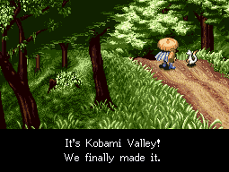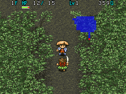

Table Mountain (also known as Kobami Valley) is the main story dungeon of Shiren 1. The dungeon is split into a number of areas, and there are overworld rest spots along the way. Backtracking is possible, but you can only go forward once you go past Cryptic Rock Valley.

This page mostly assumes you're attempting to clear the main story in 1 adventure from a new save file. If you're new to Shiren, or aren't up for the challenge, it's best to use backtracking to stock up on items and upgrade equipment at village blacksmiths to slowly work your way up instead.

<ul class="quickLinksUL">
  <li><a href="#overview">Overview</a></li>
  <li><a href="#strategy">Strategy</a></li>
  <li><a href="#floor-guide">Floor Guide</a></li>
  <li><a href="#monsters">Monsters</a></li>
  <li><a href="#items">Items</a></li>
  <li><a href="#traps">Traps</a></li>
</ul>

# Overview

<table class="dungeonOverview">
  <tr>
    <th>Unlock</th>
    <td class="highlightYellow">Clear Road to the Hamlet.</td>
  </tr>
  <tr>
    <th>Entrance</th>
    <td class="highlightYellow">Canyon Hamlet (East exit)</td>
  </tr>
</table>

<table class="dungeonTable">
  <tr>
    <th>Floors</th>
    <td>30F</td>
    <th>Alt. Name</th>
    <td>Kobami Valley</td>
  </tr>
  <tr>
    <th>Bring Items</th>
    <td>Yes</td>
    <th>Bring Gitan</th>
    <td>Yes</td>
  </tr>
  <tr>
    <th>Allies</th>
    <td>Yes</td>
    <th>Starting Item</th>
    <td>None</td>
  </tr>
  <tr>
    <th>Unidentified</th>
    <td colspan="3">Weapons, Shields, Armbands, Staves</td>
  </tr>
  <tr>
    <th>Shops</th>
    <td>Yes</td>
    <th>Monster Houses</th>
    <td>Yes</td>
  </tr>
  <tr>
    <th>Clear Icon</th>
    <td></td>
    <th>Reward</th>
    <td>None</td>
  </tr>
</table>

# Strategy

# Floor Guide

#### Old Cedar Road (1-2F)

#### Mountain Stream (3-4F)

#### Bamboo Village

#### Pegasus Ridge (5-6F)

#### Mountaintop Forest (7F)

#### Mountaintop Town

#### Old Mine at Mount Nebri (8-9F)

#### Janus Valley

#### Cavern in the Cliff (10-11F)

#### Cave of the Mountain Spirits (12-14F)

#### Cryptic Rock Valley

#### Waterfall Marsh (15-16F)

#### Table Mountain (17-21F)

#### Underground Stream Village

#### Table Mountain (22-25)

#### Ravine of Illusions (26F)

#### Phantom Trials (27F)

#### Dragoncry Trials (28F)

#### Final Trials (29F)

#### Golden City / Rainbow's End

#### Waterfall Cavern (30F)

# Monsters

See [Monsters](/system/monsters) for individual monster details.

- S - Shop is possible
- H - Monster House is possible
- G - Gitan Vault is possible

Numbers in parentheses are HP values. Spawn Rates: Low Medium High

<table class="monsterTable">
  <thead>
    <tr>
      <th>F</th>
      <th>S</th>
      <th>H</th>
      <th>G</th>
      <th colspan="5">Monsters</th>
    </tr>
  </thead>
  <tbody>
    <tr>
      <td class="">1</td>
      <td class=""></td>
      <td class=""></td>
      <td class=""></td>
      <td class="high"> Mamel (5)</td>
      <td class="high">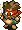 Mini Robber (5)</td>
      <td class="mid">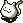 Chintala (8)</td>
      <td></td>
      <td></td>
    </tr>
    <tr>
      <td colspan="9" class="tableDivider"></td>
    </tr>
    <tr>
      <td class="">2</td>
      <td class=""></td>
      <td class=""></td>
      <td class=""></td>
      <td class="high"> Mamel (5)</td>
      <td class="high"> Mini Robber (5)</td>
      <td class="mid"> Chintala (8)</td>
      <td></td>
      <td></td>
    </tr>
    <tr>
      <td colspan="9" class="tableDivider"></td>
    </tr>
    <tr>
      <td class="">3</td>
      <td class=""></td>
      <td class=""></td>
      <td class=""></td>
      <td class="high">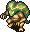 Snaky (17)</td>
      <td class="mid"> Mini Robber (5)</td>
      <td class="mid"> Chintala (8)</td>
      <td class="mid">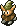 Bowboy (12)</td>
      <td></td>
    </tr>
    <tr>
      <td colspan="9" class="tableDivider"></td>
    </tr>
    <tr>
      <td class="">4</td>
      <td class=""></td>
      <td class=""></td>
      <td class=""></td>
      <td class="high"> Snaky (17)</td>
      <td class="low">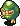 Pickpocket (10)</td>
      <td class="mid"> Chintala (8)</td>
      <td class="mid"> Bowboy (12)</td>
      <td></td>
    </tr>
    <tr>
      <td colspan="9" class="tableDivider"></td>
    </tr>
    <tr>
      <td class="monsterTableVillage"></td>
      <td colspan="3" class="monsterTableVillage"></td>
      <td colspan="5" class="monsterTableVillage">Bamboo Village</td>
    </tr>
    <tr>
      <td colspan="9" class="tableDivider"></td>
    </tr>
    <tr>
      <td rowspan="2" class="">5</td>
      <td rowspan="2" class=""></td>
      <td rowspan="2" class=""></td>
      <td rowspan="2" class=""></td>
      <td class="high">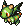 Firepuff (15)</td>
      <td class="low"> Pickpocket (10)</td>
      <td class="high">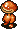 Rice Changer (23)</td>
      <td class="mid"> Bowboy (12)</td>
      <td class="mid">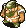 Field Bandit (18)</td>
    </tr>
    <tr>
      <td class="mid">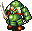 Evil Soldier (18)</td>
      <td class="low">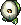 Egg Thing (5)</td>
      <td class=""></td>
      <td class=""></td>
      <td class=""></td>
    </tr>
    <tr>
      <td colspan="9" class="tableDivider"></td>
    </tr>
    <tr>
      <td rowspan="2" class="">6</td>
      <td rowspan="2" class=""></td>
      <td rowspan="2" class=""></td>
      <td rowspan="2" class=""></td>
      <td class="high"> Firepuff (15)</td>
      <td class="low"> Pickpocket (10)</td>
      <td class="high"> Rice Changer (23)</td>
      <td class=""></td>
      <td class="mid"> Field Bandit (18)</td>
    </tr>
    <tr>
      <td class="mid"> Evil Soldier (18)</td>
      <td class="low"> Egg Thing (5)</td>
      <td class=""></td>
      <td class=""></td>
      <td class=""></td>
    </tr>
    <tr>
      <td colspan="9" class="tableDivider"></td>
    </tr>
    <tr>
      <td rowspan="2" class="">7</td>
      <td rowspan="2" class=""></td>
      <td rowspan="2" class=""></td>
      <td rowspan="2" class=""></td>
      <td class="high"> Firepuff (15)</td>
      <td class="low"> Pickpocket (10)</td>
      <td class="high"> Rice Changer (23)</td>
      <td class="high">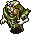 Skull Mage (21)</td>
      <td class="mid"> Field Bandit (18)</td>
    </tr>
    <tr>
      <td class="mid"> Evil Soldier (18)</td>
      <td class="low"> Egg Thing (5)</td>
      <td class=""></td>
      <td class=""></td>
      <td class=""></td>
    </tr>
    <tr>
      <td colspan="9" class="tableDivider"></td>
    </tr>
    <tr>
      <td class="monsterTableVillage"></td>
      <td colspan="3" class="monsterTableVillage"></td>
      <td colspan="5" class="monsterTableVillage">Mountaintop Town</td>
    </tr>
    <tr>
      <td colspan="9" class="tableDivider"></td>
    </tr>
    <tr>
      <td rowspan="2" class="">8</td>
      <td rowspan="2" class="highlightShop"></td>
      <td rowspan="2" class="highlightMH"></td>
      <td rowspan="2" class="highlightGitan"></td>
      <td class="high">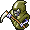 Death Reaper (23)</td>
      <td class="mid">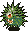 Spike Bomb (50)</td>
      <td class="low">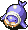 Thiefwalrus (45)</td>
      <td class="high"> Skull Mage (21)</td>
      <td class=""></td>
    </tr>
    <tr>
      <td class=""></td>
      <td class="low"> Egg Thing (5)</td>
      <td class=""></td>
      <td class=""></td>
      <td class=""></td>
    </tr>
    <tr>
      <td colspan="9" class="tableDivider"></td>
    </tr>
    <tr>
      <td rowspan="2" class="">9</td>
      <td rowspan="2" class="highlightShop"></td>
      <td rowspan="2" class="highlightMH"></td>
      <td rowspan="2" class="highlightGitan"></td>
      <td class="high"> Death Reaper (23)</td>
      <td class="mid"> Spike Bomb (50)</td>
      <td class="low"> Thiefwalrus (45)</td>
      <td class="high"> Skull Mage (21)</td>
      <td class="high">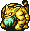 Tiger Uho (33)</td>
    </tr>
    <tr>
      <td class="mid">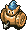 Baby Tank (25)</td>
      <td class="low"> Egg Thing (5)</td>
      <td class=""></td>
      <td class=""></td>
      <td class=""></td>
    </tr>
    <tr>
      <td colspan="9" class="tableDivider"></td>
    </tr>
    <tr>
      <td class="monsterTableVillage"></td>
      <td colspan="3" class="monsterTableVillage"></td>
      <td colspan="5" class="monsterTableVillage">Janus Valley</td>
    </tr>
    <tr>
      <td colspan="9" class="tableDivider"></td>
    </tr>
    <tr>
      <td rowspan="2" class="">10</td>
      <td rowspan="2" class="highlightShop"></td>
      <td rowspan="2" class="highlightMH"></td>
      <td rowspan="2" class="highlightGitan"></td>
      <td class="high"> Death Reaper (23)</td>
      <td class="high">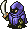 Hidden Eye (20)</td>
      <td class="low"> Thiefwalrus (45)</td>
      <td class="mid">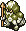 Soldier Ant (20)</td>
      <td class="high"> Tiger Uho (33)</td>
    </tr>
    <tr>
      <td class="mid"> Baby Tank (25)</td>
      <td class="mid">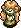 Curse Girl (25)</td>
      <td class="low">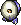 Running Egg (5)</td>
      <td class="low">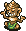 N'Duba (30)</td>
      <td class=""></td>
    </tr>
    <tr>
      <td colspan="9" class="tableDivider"></td>
    </tr>
    <tr>
      <td rowspan="2" class="">11</td>
      <td rowspan="2" class="highlightShop"></td>
      <td rowspan="2" class="highlightMH"></td>
      <td rowspan="2" class="highlightGitan"></td>
      <td class="high">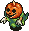 Pacorepkin (28)</td>
      <td class="high"> Hidden Eye (20)</td>
      <td class="low"> Thiefwalrus (45)</td>
      <td class="mid"> Soldier Ant (20)</td>
      <td class="high"> Tiger Uho (33)</td>
    </tr>
    <tr>
      <td class="high">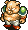 Piggy (34)</td>
      <td class="mid"> Curse Girl (25)</td>
      <td class="low"> Running Egg (5)</td>
      <td class="low"> N'Duba (30)</td>
      <td class=""></td>
    </tr>
    <tr>
      <td colspan="9" class="tableDivider"></td>
    </tr>
    <tr>
      <td rowspan="2" class="">12</td>
      <td rowspan="2" class="highlightShop"></td>
      <td rowspan="2" class="highlightMH"></td>
      <td rowspan="2" class="highlightGitan"></td>
      <td class="high"> Pacorepkin (28)</td>
      <td class="high">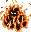 Inferno (35)</td>
      <td class="high">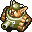 Popster Tank (36)</td>
      <td class="mid">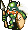 Kigny (40)</td>
      <td class="low">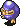 Thief (15)</td>
    </tr>
    <tr>
      <td class="high"> Piggy (34)</td>
      <td class="mid"> Curse Girl (25)</td>
      <td class="low"> Running Egg (5)</td>
      <td class="low"> N'Duba (30)</td>
      <td class=""></td>
    </tr>
    <tr>
      <td colspan="9" class="tableDivider"></td>
    </tr>
    <tr>
      <td rowspan="2" class="">13</td>
      <td rowspan="2" class="highlightShop"></td>
      <td rowspan="2" class="highlightMH"></td>
      <td rowspan="2" class="highlightGitan"></td>
      <td class="mid"> Pacorepkin (28)</td>
      <td class="high"> Inferno (35)</td>
      <td class="high"> Popster Tank (36)</td>
      <td class="mid"> Kigny (40)</td>
      <td class="low"> Thief (15)</td>
    </tr>
    <tr>
      <td class="high"> Piggy (34)</td>
      <td class=""></td>
      <td class="low"> Running Egg (5)</td>
      <td class="low"> N'Duba (30)</td>
      <td class=""></td>
    </tr>
    <tr>
      <td colspan="9" class="tableDivider"></td>
    </tr>
    <tr>
      <td rowspan="2" class="">14</td>
      <td rowspan="2" class="highlightShop"></td>
      <td rowspan="2" class="highlightMH"></td>
      <td rowspan="2" class="highlightGitan"></td>
      <td class="mid"> Pacorepkin (28)</td>
      <td class="high"> Inferno (35)</td>
      <td class="high"> Popster Tank (36)</td>
      <td class="mid"> Kigny (40)</td>
      <td class="low"> Thief (15)</td>
    </tr>
    <tr>
      <td class=""></td>
      <td class=""></td>
      <td class="low"> Running Egg (5)</td>
      <td class="low"> N'Duba (30)</td>
      <td class=""></td>
    </tr>
    <tr>
      <td colspan="9" class="tableDivider"></td>
    </tr>
    <tr>
      <td class="monsterTableVillage"></td>
      <td colspan="3" class="monsterTableVillage"></td>
      <td colspan="5" class="monsterTableVillage">Cryptic Rock Valley</td>
    </tr>
    <tr>
      <td colspan="9" class="tableDivider"></td>
    </tr>
    <tr>
      <td rowspan="2" class="">15</td>
      <td rowspan="2" class=""></td>
      <td rowspan="2" class=""></td>
      <td rowspan="2" class=""></td>
      <td class="high">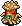 Leech Worm (23)</td>
      <td class="high">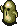 Twisty Hani (25)</td>
      <td class="high">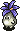 Daze Radish (30)</td>
      <td class="high">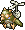 Flutter Fowl (30)</td>
      <td class="high">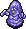 Purple Slime (40)</td>
    </tr>
    <tr>
      <td class="mid">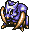 Sabregator (35)</td>
      <td class="mid">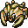 Gather (36)</td>
      <td class=""></td>
      <td class=""></td>
      <td class=""></td>
    </tr>
    <tr>
      <td colspan="9" class="tableDivider"></td>
    </tr>
    <tr>
      <td rowspan="2" class="">16</td>
      <td rowspan="2" class=""></td>
      <td rowspan="2" class=""></td>
      <td rowspan="2" class=""></td>
      <td class="high"> Leech Worm (23)</td>
      <td class="high"> Twisty Hani (25)</td>
      <td class="high"> Daze Radish (30)</td>
      <td class="high"> Flutter Fowl (30)</td>
      <td class="high"> Purple Slime (40)</td>
    </tr>
    <tr>
      <td class="mid"> Sabregator (35)</td>
      <td class="mid"> Gather (36)</td>
      <td class=""></td>
      <td class=""></td>
      <td class=""></td>
    </tr>
    <tr>
      <td colspan="9" class="tableDivider"></td>
    </tr>
    <tr>
      <td rowspan="2" class="">17</td>
      <td rowspan="2" class="highlightShop"></td>
      <td rowspan="2" class="highlightMH"></td>
      <td rowspan="2" class="highlightGitan"></td>
      <td class="high">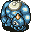 Chainhead (50)</td>
      <td class="high">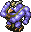 Master Hen (50)</td>
      <td class="low">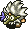 Young Tengu (25)</td>
      <td class="mid">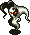 Air Devil (50)</td>
      <td class="low">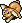 Fluffy Bunny (5)</td>
    </tr>
    <tr>
      <td class="low">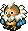 Ghost Owl (7)</td>
      <td class="low">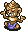 N'Dulu (35)</td>
      <td class="low"> Greenwalrus (58)</td>
      <td class=""></td>
      <td class=""></td>
    </tr>
    <tr>
      <td colspan="9" class="tableDivider"></td>
    </tr>
    <tr>
      <td rowspan="2" class="">18</td>
      <td rowspan="2" class="highlightShop"></td>
      <td rowspan="2" class="highlightMH"></td>
      <td rowspan="2" class="highlightGitan"></td>
      <td class="high"> Chainhead (50)</td>
      <td class="high"> Master Hen (50)</td>
      <td class="low"> Young Tengu (25)</td>
      <td class="mid"> Air Devil (50)</td>
      <td class="low"> Fluffy Bunny (5)</td>
    </tr>
    <tr>
      <td class="low"> Ghost Owl (7)</td>
      <td class="low"> N'Dulu (35)</td>
      <td class="low"> Greenwalrus (58)</td>
      <td class=""></td>
      <td class=""></td>
    </tr>
    <tr>
      <td colspan="9" class="tableDivider"></td>
    </tr>
    <tr>
      <td rowspan="2" class="">19</td>
      <td rowspan="2" class="highlightShop"></td>
      <td rowspan="2" class="highlightMH"></td>
      <td rowspan="2" class="highlightGitan"></td>
      <td class="high"> Chainhead (50)</td>
      <td class="high"> Master Hen (50)</td>
      <td class="low"> Young Tengu (25)</td>
      <td class="mid"> Air Devil (50)</td>
      <td class="low"> Fluffy Bunny (5)</td>
    </tr>
    <tr>
      <td class="low"> Ghost Owl (7)</td>
      <td class="low"> N'Dulu (35)</td>
      <td class="low"> Greenwalrus (58)</td>
      <td class=""></td>
      <td class=""></td>
    </tr>
    <tr>
      <td colspan="9" class="tableDivider"></td>
    </tr>
    <tr>
      <td rowspan="2" class="">20</td>
      <td rowspan="2" class="highlightShop"></td>
      <td rowspan="2" class="highlightMH"></td>
      <td rowspan="2" class="highlightGitan"></td>
      <td class="high"> Chainhead (50)</td>
      <td class="high">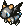 Blazepuff (40)</td>
      <td class="high">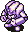 Mistonos (50)</td>
      <td class="mid"> Air Devil (50)</td>
      <td class="low"> Fluffy Bunny (5)</td>
    </tr>
    <tr>
      <td class="low"> Ghost Owl (7)</td>
      <td class="low"> N'Dulu (35)</td>
      <td class="low"> Greenwalrus (58)</td>
      <td class="high">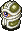 Super Gaze (51)</td>
      <td class=""></td>
    </tr>
    <tr>
      <td colspan="9" class="tableDivider"></td>
    </tr>
    <tr>
      <td rowspan="3" class="">21</td>
      <td rowspan="3" class="highlightShop"></td>
      <td rowspan="3" class="highlightMH"></td>
      <td rowspan="3" class="highlightGitan"></td>
      <td class="high">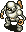 Mecharoid (60)</td>
      <td class="high"> Blazepuff (40)</td>
      <td class="high"> Mistonos (50)</td>
      <td class="mid"> Air Devil (50)</td>
      <td class="low"> Fluffy Bunny (5)</td>
    </tr>
    <tr>
      <td class="low"> Ghost Owl (7)</td>
      <td class="low"> N'Dulu (35)</td>
      <td class="low"> Greenwalrus (58)</td>
      <td class="high"> Super Gaze (51)</td>
      <td class="mid">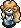 Curse Sis (33)</td>
    </tr>
    <tr>
      <td class="mid">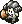 Schubell (15)</td>
      <td class="mid">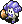 Menbell (25)</td>
      <td class=""></td>
      <td class=""></td>
      <td class=""></td>
    </tr>
    <tr>
      <td colspan="9" class="tableDivider"></td>
    </tr>
    <tr>
      <td class="monsterTableVillage"></td>
      <td colspan="3" class="monsterTableVillage"></td>
      <td colspan="5" class="monsterTableVillage">Stream Village</td>
    </tr>
    <tr>
      <td colspan="9" class="tableDivider"></td>
    </tr>
    <tr>
      <td rowspan="3" class="">22</td>
      <td rowspan="3" class="highlightShop"></td>
      <td rowspan="3" class="highlightMH"></td>
      <td rowspan="3" class="highlightGitan"></td>
      <td class="high"> Mecharoid (60)</td>
      <td class="high"> Blazepuff (40)</td>
      <td class="high"> Mistonos (50)</td>
      <td class="mid"> Air Devil (50)</td>
      <td class="low"> Fluffy Bunny (5)</td>
    </tr>
    <tr>
      <td class="low"> Ghost Owl (7)</td>
      <td class="low"> N'Dulu (35)</td>
      <td class="mid"> Pacorepkina (45)</td>
      <td class="high"> Super Gaze (51)</td>
      <td class="mid"> Curse Sis (33)</td>
    </tr>
    <tr>
      <td class="mid"> Schubell (15)</td>
      <td class="mid"> Menbell (25)</td>
      <td class="low"> Flying Egg (8)</td>
      <td class=""></td>
      <td class=""></td>
    </tr>
    <tr>
      <td colspan="9" class="tableDivider"></td>
    </tr>
    <tr>
      <td rowspan="3" class="">23</td>
      <td rowspan="3" class=""></td>
      <td rowspan="3" class="highlightMH"></td>
      <td rowspan="3" class=""></td>
      <td class="high"> Mecharoid (60)</td>
      <td class="high"> Haze Hermit (45)</td>
      <td class="high"> Minotaur (55)</td>
      <td class="mid"> Air Devil (50)</td>
      <td class="low"> Fluffy Bunny (5)</td>
    </tr>
    <tr>
      <td class="low"> Ghost Owl (7)</td>
      <td class="low"> N'Dulu (35)</td>
      <td class="mid"> Pacorepkina (45)</td>
      <td class="high"> Polygon Jive (60)</td>
      <td class="mid"> Curse Sis (33)</td>
    </tr>
    <tr>
      <td class="mid"> Schubell (15)</td>
      <td class="mid"> Menbell (25)</td>
      <td class="low"> Flying Egg (8)</td>
      <td class="mid"> Spike Blast (80)</td>
      <td class=""></td>
    </tr>
    <tr>
      <td colspan="9" class="tableDivider"></td>
    </tr>
    <tr>
      <td rowspan="3" class="">24</td>
      <td rowspan="3" class=""></td>
      <td rowspan="3" class="highlightMH"></td>
      <td rowspan="3" class=""></td>
      <td class="mid"> Hover Fowl (45)</td>
      <td class="high"> Haze Hermit (45)</td>
      <td class="high"> Minotaur (55)</td>
      <td class="mid"> Air Devil (50)</td>
      <td class="low"> Fluffy Bunny (5)</td>
    </tr>
    <tr>
      <td class="low"> Ghost Owl (7)</td>
      <td class="low"> N'Dulu (35)</td>
      <td class="mid"> Pacorepkina (45)</td>
      <td class="high"> Polygon Jive (60)</td>
      <td class=""></td>
    </tr>
    <tr>
      <td class="mid"> Schubell (15)</td>
      <td class="mid"> Menbell (25)</td>
      <td class="low"> Flying Egg (8)</td>
      <td class="mid"> Spike Blast (80)</td>
      <td class=""></td>
    </tr>
    <tr>
      <td colspan="9" class="tableDivider"></td>
    </tr>
    <tr>
      <td rowspan="3" class="">25</td>
      <td rowspan="3" class=""></td>
      <td rowspan="3" class="highlightMH"></td>
      <td rowspan="3" class=""></td>
      <td class="mid"> Hover Fowl (45)</td>
      <td class="high"> Haze Hermit (45)</td>
      <td class="high"> Minotaur (55)</td>
      <td class="mid"> Air Devil (50)</td>
      <td class="low"> Fluffy Bunny (5)</td>
    </tr>
    <tr>
      <td class="low"> Ghost Owl (7)</td>
      <td class="low"> N'Dulu (35)</td>
      <td class="mid"> Pacorepkina (45)</td>
      <td class="high"> Polygon Jive (60)</td>
      <td class=""></td>
    </tr>
    <tr>
      <td class="mid"> Schubell (15)</td>
      <td class="mid"> Menbell (25)</td>
      <td class="low"> Flying Egg (8)</td>
      <td class="mid"> Spike Blast (80)</td>
      <td class=""></td>
    </tr>
    <tr>
      <td colspan="9" class="tableDivider"></td>
    </tr>
    <tr>
      <td class="">26</td>
      <td class=""></td>
      <td class=""></td>
      <td class=""></td>
      <td class="mid"> Hover Fowl (45)</td>
      <td class="high"> Skull Wraith (60)</td>
      <td class="mid"> Death Angel (65)</td>
      <td class="mid"> Air Devil (50)</td>
      <td class="high"> Metal Armor (65)</td>
    </tr>
    <tr>
      <td colspan="9" class="tableDivider"></td>
    </tr>
    <tr>
      <td rowspan="2" class="">27</td>
      <td rowspan="2" class=""></td>
      <td rowspan="2" class="highlightMH"></td>
      <td rowspan="2" class=""></td>
      <td class="high"> Dragon Head (70)</td>
      <td class="high"> Skull Wraith (60)</td>
      <td class="mid"> Death Angel (65)</td>
      <td class="high"> Dragon (90)</td>
      <td class="high"> Metal Armor (65)</td>
    </tr>
    <tr>
      <td class="low"> Fluffy Bunny (5)</td>
      <td class="high"> Piggo (50)</td>
      <td class="high"> Madremlas (60)</td>
      <td class="high"> Tiger Uhoho (65)</td>
      <td class=""></td>
    </tr>
    <tr>
      <td colspan="9" class="tableDivider"></td>
    </tr>
    <tr>
      <td rowspan="2" class="">28</td>
      <td rowspan="2" class=""></td>
      <td rowspan="2" class="highlightMH"></td>
      <td rowspan="2" class=""></td>
      <td class="high"> Dragon Head (70)</td>
      <td class=""></td>
      <td class="mid"> Death Angel (65)</td>
      <td class="high"> Dragon (90)</td>
      <td class=""></td>
    </tr>
    <tr>
      <td class="low"> Fluffy Bunny (5)</td>
      <td class="high"> Piggo (50)</td>
      <td class="high"> Madremlas (60)</td>
      <td class="high"> Tiger Uhoho (65)</td>
      <td class=""></td>
    </tr>
    <tr>
      <td colspan="9" class="tableDivider"></td>
    </tr>
    <tr>
      <td rowspan="2" class="">29</td>
      <td rowspan="2" class=""></td>
      <td rowspan="2" class="highlightMH"></td>
      <td rowspan="2" class=""></td>
      <td class="high"> Dragon Head (70)</td>
      <td class=""></td>
      <td class="mid"> Death Angel (65)</td>
      <td class="high"> Dragon (90)</td>
      <td class=""></td>
    </tr>
    <tr>
      <td class="low"> Fluffy Bunny (5)</td>
      <td class="high"> Piggo (50)</td>
      <td class="high"> Madremlas (60)</td>
      <td class="high"> Tiger Uhoho (65)</td>
      <td class=""></td>
    </tr>
    <tr>
      <td colspan="9" class="tableDivider"></td>
    </tr>
    <tr>
      <td class="monsterTableVillage"></td>
      <td colspan="3" class="monsterTableVillage"></td>
      <td colspan="5" class="monsterTableVillage">Golden City / Rainbow's End</td>
    </tr>
    <tr>
      <td colspan="9" class="tableDivider"></td>
    </tr>
    <tr>
      <td class="">30</td>
      <td class=""></td>
      <td class=""></td>
      <td class=""></td>
      <td colspan="5" class="highlightOffense">Boss</td>
    </tr>
    <tr>
      <td colspan="9" class="tableDivider"></td>
    </tr>
  </tbody>
</table>

# Items

The values like "1-29" in columns represent the floor range where the item can appear. "X" in Shop column means the item can appear in any shop generated in the dungeon.

- F = Floor, Monster drop
- S = Shop
- M = Monster
- P = Jar of Change, Thiefwalrus drop

 

<table class="dungeonItemTable">
  <tr>
    <th colspan="5" class="highlightLightblue">Weapon</th>
    <th rowspan="68"></th>
    <th colspan="5" class="highlightLightblue">Grass</th>
  </tr>
  <tr>
    <th>Name</th>
    <th>F</th>
    <th>S</th>
    <th>M</th>
    <th>C</th>
    <th>Name</th>
    <th>F</th>
    <th>S</th>
    <th>M</th>
    <th>C</th>
  </tr>
  <tr>
    <td class="leftText">Katana</td>
    <td>1-29</td>
    <td>X</td>
    <td></td>
    <td>1-29</td>
    <td class="leftText">Big Belly Seed</td>
    <td>1-29</td>
    <td>X</td>
    <td></td>
    <td>1-29</td>
  </tr>
  <tr>
    <td class="leftText">Golden Blade</td>
    <td>1-29</td>
    <td>X</td>
    <td></td>
    <td>1-29</td>
    <td class="leftText">Herb of Life</td>
    <td>1-29</td>
    <td></td>
    <td></td>
    <td>1-29</td>
  </tr>
  <tr>
    <td class="leftText">Kabra's Blade</td>
    <td></td>
    <td></td>
    <td></td>
    <td>1-29</td>
    <td class="leftText">Restorative Herb</td>
    <td>1-29</td>
    <td>X</td>
    <td></td>
    <td>1-29</td>
  </tr>
  <tr>
    <td class="leftText">Cudgel</td>
    <td>1-29</td>
    <td>X</td>
    <td></td>
    <td>1-29</td>
    <td class="leftText">Herb of Confusion</td>
    <td></td>
    <td></td>
    <td>15-16</td>
    <td></td>
  </tr>
  <tr>
    <td class="leftText">Air Slayer</td>
    <td>8-29</td>
    <td>X</td>
    <td></td>
    <td>8-29</td>
    <td class="leftText">Weeds</td>
    <td></td>
    <td></td>
    <td>5-7</td>
    <td></td>
  </tr>
  <tr>
    <td class="leftText">Sickle Slayer</td>
    <td>1-29</td>
    <td>X</td>
    <td></td>
    <td>1-29</td>
    <td class="leftText">Herb of Strength</td>
    <td>1-29</td>
    <td>X</td>
    <td></td>
    <td>1-29</td>
  </tr>
  <tr>
    <td class="leftText">Fragile Edge</td>
    <td></td>
    <td>X</td>
    <td></td>
    <td></td>
    <td class="leftText">Antidote Herb</td>
    <td>1-29</td>
    <td>X</td>
    <td></td>
    <td>1-29</td>
  </tr>
  <tr>
    <td class="leftText">Pickaxe</td>
    <td>8-29</td>
    <td></td>
    <td></td>
    <td>8-29</td>
    <td class="leftText">Dragon Herb</td>
    <td>1-29</td>
    <td>X</td>
    <td></td>
    <td>1-29</td>
  </tr>
  <tr>
    <td class="leftText">Mastersword</td>
    <td>1-29</td>
    <td>X</td>
    <td></td>
    <td>1-29</td>
    <td class="leftText">Herb of Revival</td>
    <td></td>
    <td>X</td>
    <td></td>
    <td></td>
  </tr>
  <tr>
    <td class="leftText">Dragonkiller</td>
    <td></td>
    <td>X</td>
    <td></td>
    <td></td>
    <td class="leftText">Herb of Victory</td>
    <td></td>
    <td>X</td>
    <td></td>
    <td></td>
  </tr>
  <tr>
    <td class="leftText">Drain Buster</td>
    <td>1-29</td>
    <td></td>
    <td></td>
    <td>1-29</td>
    <td class="leftText">Herb of Sight</td>
    <td>1-29</td>
    <td>X</td>
    <td></td>
    <td>1-29</td>
  </tr>
  <tr>
    <td class="leftText">Polearm</td>
    <td>1-29</td>
    <td>X</td>
    <td></td>
    <td>1-29</td>
    <td class="leftText">Medicinal Herb</td>
    <td>1-29</td>
    <td>X</td>
    <td></td>
    <td>1-29</td>
  </tr>
  <tr>
    <td class="leftText">Cyclops Killer</td>
    <td></td>
    <td>X</td>
    <td></td>
    <td></td>
    <th colspan="5" class="highlightLightblue">Scroll</th>
  </tr>
  <tr>
    <td class="leftText">Crescent Arm</td>
    <td>8-29</td>
    <td>X</td>
    <td></td>
    <td>8-29</td>
    <th>Name</th>
    <th>F</th>
    <th>S</th>
    <th>M</th>
    <th>C</th>
  </tr>
  <tr>
    <td class="leftText">Minotaur's Axe</td>
    <td></td>
    <td></td>
    <td>23-25</td>
    <td></td>
    <td class="leftText">Scroll of Light</td>
    <td>1-29</td>
    <td>X</td>
    <td></td>
    <td>1-29</td>
  </tr>
  <tr>
    <td class="leftText">Razor Wind</td>
    <td>1-29</td>
    <td>X</td>
    <td></td>
    <td>1-29</td>
    <td class="leftText">Great Hall Scroll</td>
    <td>8-29</td>
    <td></td>
    <td></td>
    <td>8-29</td>
  </tr>
  <tr>
    <th colspan="5" class="highlightLightblue">Shield</th>
    <td class="leftText">Scroll of Blessing</td>
    <td>1-29</td>
    <td>X</td>
    <td></td>
    <td>1-29</td>
  </tr>
  <tr>
    <th>Name</th>
    <th>F</th>
    <th>S</th>
    <th>M</th>
    <th>C</th>
    <td class="leftText">Scroll of Confusion</td>
    <td>1-29</td>
    <td></td>
    <td></td>
    <td>1-29</td>
  </tr>
  <tr>
    <td class="leftText">Gold Shield</td>
    <td>1-29</td>
    <td>X</td>
    <td></td>
    <td>1-29</td>
    <td class="leftText">Scroll of Removal</td>
    <td></td>
    <td>X</td>
    <td></td>
    <td></td>
  </tr>
  <tr>
    <td class="leftText">Armor Ward</td>
    <td>1-29</td>
    <td>X</td>
    <td></td>
    <td>1-29</td>
    <td class="leftText">Scroll of Identity</td>
    <td>8-29</td>
    <td>X</td>
    <td></td>
    <td>8-29</td>
  </tr>
  <tr>
    <td class="leftText">Blast Shield</td>
    <td>1-29</td>
    <td>X</td>
    <td></td>
    <td>1-29</td>
    <td class="leftText">Blastwave Scroll</td>
    <td>1-29</td>
    <td></td>
    <td></td>
    <td>1-29</td>
  </tr>
  <tr>
    <td class="leftText">Bronzeward</td>
    <td>1-29</td>
    <td>X</td>
    <td></td>
    <td>1-29</td>
    <td class="leftText">Extraction Scroll</td>
    <td></td>
    <td>X</td>
    <td></td>
    <td></td>
  </tr>
  <tr>
    <td class="leftText">Fragile Shield</td>
    <td></td>
    <td>X</td>
    <td></td>
    <td></td>
    <td class="leftText">Earth Bless Scroll</td>
    <td>1-29</td>
    <td>X</td>
    <td></td>
    <td>1-29</td>
  </tr>
  <tr>
    <td class="leftText">Iron Shield</td>
    <td>1-29</td>
    <td>X</td>
    <td></td>
    <td>1-29</td>
    <td class="leftText">Air Bless Scroll</td>
    <td>1-29</td>
    <td>X</td>
    <td></td>
    <td>1-29</td>
  </tr>
  <tr>
    <td class="leftText">Walrus Shield</td>
    <td>1-29</td>
    <td>X</td>
    <td></td>
    <td>1-29</td>
    <td class="leftText">Blank Scroll</td>
    <td>17-29</td>
    <td>17-29</td>
    <td></td>
    <td>17-29</td>
  </tr>
  <tr>
    <td class="leftText">Dragonward</td>
    <td></td>
    <td>X</td>
    <td></td>
    <td></td>
    <td class="leftText">Scroll of Sleep</td>
    <td>1-29</td>
    <td></td>
    <td></td>
    <td>1-29</td>
  </tr>
  <tr>
    <td class="leftText">Spiked Ward</td>
    <td></td>
    <td>X</td>
    <td></td>
    <td></td>
    <td class="leftText">Power Up Scroll</td>
    <td>1-29</td>
    <td>X</td>
    <td></td>
    <td>1-29</td>
  </tr>
  <tr>
    <td class="leftText">Hide Shield</td>
    <td>1-29</td>
    <td>X</td>
    <td></td>
    <td>1-29</td>
    <td class="leftText">Plating Scroll</td>
    <td>1-29</td>
    <td>X</td>
    <td></td>
    <td>1-29</td>
  </tr>
  <tr>
    <td class="leftText">Windshield</td>
    <td></td>
    <td></td>
    <td></td>
    <td>1-29</td>
    <th colspan="5" class="highlightLightblue">Staff</th>
  </tr>
  <tr>
    <td class="leftText">Fancy Shield</td>
    <td></td>
    <td>X</td>
    <td></td>
    <td></td>
    <th>Name</th>
    <th>F</th>
    <th>S</th>
    <th>M</th>
    <th>C</th>
  </tr>
  <tr>
    <td class="leftText">Evasive Shield</td>
    <td></td>
    <td>X</td>
    <td></td>
    <td></td>
    <td class="leftText">Pain Sharing Staff</td>
    <td>1-29</td>
    <td>X</td>
    <td></td>
    <td>1-29</td>
  </tr>
  <tr>
    <td class="leftText">Wood Shield</td>
    <td>1-29</td>
    <td></td>
    <td></td>
    <td>1-29</td>
    <td class="leftText">Staff of Postpone</td>
    <td>1-29</td>
    <td>X</td>
    <td></td>
    <td>1-29</td>
  </tr>
  <tr>
    <th colspan="5" class="highlightLightblue">Armband</th>
    <td class="leftText">Skull Staff</td>
    <td></td>
    <td></td>
    <td>7-9 26-27</td>
    <td></td>
  </tr>
  <tr>
    <th>Name</th>
    <th>F</th>
    <th>S</th>
    <th>M</th>
    <th>C</th>
    <td class="leftText">Staff of Paralysis</td>
    <td>1-29</td>
    <td>X</td>
    <td></td>
    <td>1-29</td>
  </tr>
  <tr>
    <td class="leftText">Pitcher's Armband</td>
    <td>1-29</td>
    <td>X</td>
    <td></td>
    <td>1-29</td>
    <td class="leftText">Staff of Stability</td>
    <td>1-29</td>
    <td>X</td>
    <td></td>
    <td>1-29</td>
  </tr>
  <tr>
    <td class="leftText">Critical Armband</td>
    <td></td>
    <td>X</td>
    <td></td>
    <td></td>
    <td class="leftText">Staff of Sloth</td>
    <td>1-29</td>
    <td>X</td>
    <td></td>
    <td>1-29</td>
  </tr>
  <tr>
    <td class="leftText">Recovery Armband</td>
    <td></td>
    <td>X</td>
    <td></td>
    <td></td>
    <td class="leftText">Switching Staff</td>
    <td>1-29</td>
    <td>X</td>
    <td></td>
    <td>1-29</td>
  </tr>
  <tr>
    <td class="leftText">Armband of Calm</td>
    <td>1-29</td>
    <td>X</td>
    <td></td>
    <td>1-29</td>
    <td class="leftText">Knockback Staff</td>
    <td>1-29</td>
    <td>X</td>
    <td></td>
    <td>1-29</td>
  </tr>
  <tr>
    <td class="leftText">Rustless Armband</td>
    <td>1-29</td>
    <td>X</td>
    <td></td>
    <td>1-29</td>
    <td class="leftText">Bufu's Staff</td>
    <td></td>
    <td>X</td>
    <td></td>
    <td></td>
  </tr>
  <tr>
    <td class="leftText">Happy Armband</td>
    <td>1-29</td>
    <td>X</td>
    <td></td>
    <td>1-29</td>
    <td class="leftText">Doppelganger Staff</td>
    <td>1-29</td>
    <td>X</td>
    <td></td>
    <td>1-29</td>
  </tr>
  <tr>
    <td class="leftText">Armband of Sight</td>
    <td>1-29</td>
    <td>X</td>
    <td></td>
    <td>1-29</td>
    <td class="leftText">Lightning Staff</td>
    <td>1-29</td>
    <td>X</td>
    <td></td>
    <td>1-29</td>
  </tr>
  <tr>
    <td class="leftText">Antidote Armband</td>
    <td>1-29</td>
    <td>X</td>
    <td></td>
    <td>1-29</td>
    <th colspan="5" class="highlightLightblue">Meat</th>
  </tr>
  <tr>
    <td class="leftText">Antidrain Armband</td>
    <td>1-29</td>
    <td>X</td>
    <td></td>
    <td>1-29</td>
    <th>Name</th>
    <th>F</th>
    <th>S</th>
    <th>M</th>
    <th>C</th>
  </tr>
  <tr>
    <td class="leftText">Discount Armband</td>
    <td></td>
    <td></td>
    <td></td>
    <td>1-29</td>
    <td class="leftText">Fluffy Bunny</td>
    <td></td>
    <td>21-22</td>
    <td></td>
    <td></td>
  </tr>
  <tr>
    <td class="leftText">Sleepless Armband</td>
    <td>1-29</td>
    <td>X</td>
    <td></td>
    <td>1-29</td>
    <td class="leftText">Evil Soldier</td>
    <td></td>
    <td>8-11</td>
    <td></td>
    <td></td>
  </tr>
  <tr>
    <th colspan="5" class="highlightLightblue">Projectile</th>
    <td class="leftText">Leech Bug</td>
    <td></td>
    <td>17-20</td>
    <td></td>
    <td></td>
  </tr>
  <tr>
    <th>Name</th>
    <th>F</th>
    <th>S</th>
    <th>M</th>
    <th>C</th>
    <td class="leftText">Twisty Hani</td>
    <td></td>
    <td>17-20</td>
    <td></td>
    <td></td>
  </tr>
  <tr>
    <td class="leftText">Wooden Arrow</td>
    <td>1-29</td>
    <td></td>
    <td>3-5</td>
    <td>1-29</td>
    <td class="leftText">Purple Slime</td>
    <td></td>
    <td>17-20</td>
    <td></td>
    <td></td>
  </tr>
  <tr>
    <td class="leftText">Silver Arrow</td>
    <td></td>
    <td></td>
    <td></td>
    <td>1-29</td>
    <td class="leftText">Baby Tank</td>
    <td></td>
    <td>12-14</td>
    <td></td>
    <td></td>
  </tr>
  <tr>
    <td class="leftText">Iron Arrow</td>
    <td></td>
    <td></td>
    <td>9-10</td>
    <td></td>
    <td class="leftText">Sabregator</td>
    <td></td>
    <td>17-20</td>
    <td></td>
    <td></td>
  </tr>
  <tr>
    <th colspan="5" class="highlightLightblue">Food</th>
    <td class="leftText">Death Reaper</td>
    <td></td>
    <td>12-14</td>
    <td></td>
    <td></td>
  </tr>
  <tr>
    <th>Name</th>
    <th>F</th>
    <th>S</th>
    <th>M</th>
    <th>C</th>
    <td class="leftText">Tiger Uho</td>
    <td></td>
    <td>12-14</td>
    <td></td>
    <td></td>
  </tr>
  <tr>
    <td class="leftText">Big Riceball</td>
    <td>1-29</td>
    <td>X</td>
    <td>10-14</td>
    <td>1-29</td>
    <td class="leftText">Chainhead</td>
    <td></td>
    <td>21-22</td>
    <td></td>
    <td></td>
  </tr>
  <tr>
    <td class="leftText">Riceball</td>
    <td>1-29</td>
    <td>X</td>
    <td>5-9</td>
    <td>1-29</td>
    <td class="leftText">Thiefwalrus</td>
    <td></td>
    <td>12-14</td>
    <td></td>
    <td></td>
  </tr>
  <tr>
    <td class="leftText">Giant Riceball</td>
    <td></td>
    <td>X</td>
    <td></td>
    <td></td>
    <td class="leftText">Egg Thing</td>
    <td></td>
    <td>8-11</td>
    <td></td>
    <td></td>
  </tr>
  <tr>
    <td class="leftText">Rotten Riceball</td>
    <td>1-29</td>
    <td></td>
    <td></td>
    <td>1-29</td>
    <td class="leftText">Firepuff</td>
    <td></td>
    <td>8-11</td>
    <td></td>
    <td></td>
  </tr>
  <tr>
    <td class="leftText">Special Riceball</td>
    <td></td>
    <td>X</td>
    <td></td>
    <td></td>
    <td class="leftText">Greenwalrus</td>
    <td></td>
    <td>21-22</td>
    <td></td>
    <td></td>
  </tr>
  <tr>
    <th colspan="5" class="highlightLightblue">Jar</th>
    <td class="leftText">Daze Radish</td>
    <td></td>
    <td>17-20</td>
    <td></td>
    <td></td>
  </tr>
  <tr>
    <th>Name</th>
    <th>F</th>
    <th>S</th>
    <th>M</th>
    <th>C</th>
    <td class="leftText">Dark Eye</td>
    <td></td>
    <td>12-14</td>
    <td></td>
    <td></td>
  </tr>
  <tr>
    <td class="leftText">Melding Jar</td>
    <td>8-29</td>
    <td>X</td>
    <td></td>
    <td>8-29</td>
    <td class="leftText">Rice Changer</td>
    <td></td>
    <td>21-22</td>
    <td></td>
    <td></td>
  </tr>
  <tr>
    <td class="leftText">Chiropractic Jar</td>
    <td>5-29</td>
    <td>X</td>
    <td></td>
    <td>5-29</td>
    <td class="leftText">Ghost Owl</td>
    <td></td>
    <td>21-22</td>
    <td></td>
    <td></td>
  </tr>
  <tr>
    <td class="leftText">Storehouse Jar</td>
    <td>8-29</td>
    <td></td>
    <td></td>
    <td>8-29</td>
    <td rowspan="5" colspan="5"></td>
  </tr>
  <tr>
    <td class="leftText">Walrus Jar</td>
    <td>5-29</td>
    <td></td>
    <td></td>
    <td>5-29</td>
  </tr>
  <tr>
    <td class="leftText">Jar of Change</td>
    <td>5-29</td>
    <td>X</td>
    <td></td>
    <td>5-29</td>
  </tr>
  <tr>
    <td class="leftText">Jar of Holding</td>
    <td>5-29</td>
    <td>X</td>
    <td></td>
    <td>5-29</td>
  </tr>
  <tr>
    <td class="leftText">Jar of Hiding</td>
    <td>8-29</td>
    <td></td>
    <td></td>
    <td>8-29</td>
  </tr>
</table>

# Traps

See [Traps](/system/traps) for details.

<table class="sealTable">
  <thead>
    <tr>
      <th>Floor</th>
      <th>Traps</th>
    </tr>
  </thead>
  <tbody>
    <tr>
      <td>1-2</td>
      <td></td>
    </tr>
  </tbody>
</table>
