

Dungeon you can enter by talking to a foreign wanderer and revisiting Golden City after clearing the main story. It's a direct continuation of Table Mountain, so you're expected to bring items and the dungeon begins on 31F.

There's a single room Monster House featuring a Tainted Soldier every 10 floors, and a final boss on 99F. Once you defeat the final boss, fixed Monster Houses and boss monsters will no longer be generated. ※ The final boss drops a Kabra's Blade as a one-time reward.

<ul class="quickLinksUL">
  <li><a href="#overview">Overview</a></li>
  <li><a href="#strategy">Strategy</a></li>
  <li><a href="#floor-guide">Floor Guide</a></li>
  <li><a href="#monsters">Monsters</a></li>
  <li><a href="#items">Items</a></li>
  <li><a href="#traps">Traps</a></li>
</ul>

# Overview

<table class="dungeonOverview">
  <tr>
    <th>Unlock</th>
    <td class="highlightYellow">1. Clear the main story. 2. </td>
  </tr>
  <tr>
    <th>Entrance</th>
    <td class="highlightYellow">Golden City (Building with condor mural)</td>
  </tr>
</table>

<table class="dungeonTable">
  <tr>
    <th>Floors</th>
    <td colspan="3">99F (Start from 31F)</td>
  </tr>
  <tr>
    <th>Bring Items</th>
    <td>Yes</td>
    <th>Allies</th>
    <td></td>
  </tr>
  <tr>
    <th>Bring Gitan</th>
    <td>Yes</td>
    <th>Bring Level Ups</th>
    <td>Yes</td>
  </tr>
  <tr>
    <th>Starting Item</th>
    <td colspan="3">None</td>
  </tr>
  <tr>
    <th>Unidentified</th>
    <td colspan="3"></td>
  </tr>
  <tr>
    <th>Shops</th>
    <td>Yes</td>
    <th>Monster Houses</th>
    <td>Yes</td>
  </tr>
  <tr>
    <th>Clear Icon</th>
    <td></td>
    <th>Reward</th>
    <td>Kabra's Blade (Tainted Queen)</td>
  </tr>
</table>

# Strategy

# Floor Guide

# Monsters

See [Monsters](/system/monsters) for individual monster details.

- F - Tainted Soldier Monster House
- S - Shop is possible
- H - Monster House is possible
- G - Gitan Vault is possible

Numbers in parentheses are HP values. Spawn Rates: Low Medium High

<table class="monsterTable">
  <thead>
    <tr>
      <th>F</th>
      <th>S</th>
      <th>H</th>
      <th>G</th>
      <th colspan="5">Monsters</th>
    </tr>
  </thead>
  <tbody>
    <tr>
      <td rowspan="2">31</td>
      <td rowspan="2" class="highlightShop"></td>
      <td rowspan="2" class="highlightMH"></td>
      <td rowspan="2" class="highlightGitan"></td>
      <td class="high"> Floppy Hani (40)</td>
      <td class="high">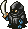 Shadow Eye (40)</td>
      <td class="high"> Skull Wraith (60)</td>
      <td class="high"> Inferno3 (65)</td>
      <td class="mid"> Evil General (30)</td>
    </tr>
    <tr>
      <td class="mid"> Item Bandit (35)</td>
      <td class="low">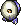 Running Egg (5)</td>
      <td class="low"> Ironwalrus (70)</td>
      <td></td>
      <td></td>
    </tr>
    <tr>
      <td colspan="9" class="tableDivider"></td>
    </tr>
    <tr>
      <td rowspan="2">32</td>
      <td rowspan="2" class="highlightShop"></td>
      <td rowspan="2" class="highlightMH"></td>
      <td rowspan="2" class="highlightGitan"></td>
      <td class="high"> Floppy Hani (40)</td>
      <td class="high"> Shadow Eye (40)</td>
      <td class="high"> Skull Wraith (60)</td>
      <td class="high"> Inferno3 (65)</td>
      <td class="mid"> Evil General (30)</td>
    </tr>
    <tr>
      <td class="mid"> Item Bandit (35)</td>
      <td class="low"> Running Egg (5)</td>
      <td class="low"> Ironwalrus (70)</td>
      <td></td>
      <td></td>
    </tr>
    <tr>
      <td colspan="9" class="tableDivider"></td>
    </tr>
    <tr>
      <td rowspan="2">33</td>
      <td rowspan="2" class="highlightShop"></td>
      <td rowspan="2" class="highlightMH"></td>
      <td rowspan="2" class="highlightGitan"></td>
      <td class="high"> Floppy Hani (40)</td>
      <td class="high"> Shadow Eye (40)</td>
      <td class="high"> Skull Wraith (60)</td>
      <td class="high"> Inferno3 (65)</td>
      <td class="mid"> Evil General (30)</td>
    </tr>
    <tr>
      <td class="mid"> Item Bandit (35)</td>
      <td class="low"> Running Egg (5)</td>
      <td class="low"> Ironwalrus (70)</td>
      <td></td>
      <td></td>
    </tr>
    <tr>
      <td colspan="9" class="tableDivider"></td>
    </tr>
    <tr>
      <td rowspan="2">34</td>
      <td rowspan="2" class="highlightShop"></td>
      <td rowspan="2" class="highlightMH"></td>
      <td rowspan="2" class="highlightGitan"></td>
      <td class="high">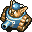 Dadster Tank (40)</td>
      <td class="high"> Shadow Eye (40)</td>
      <td class="high"> Skull Wraith (60)</td>
      <td class="high"> Inferno3 (65)</td>
      <td class="mid"> Evil General (30)</td>
    </tr>
    <tr>
      <td class="mid"> Item Bandit (35)</td>
      <td class="low"> Running Egg (5)</td>
      <td class="low"> Ironwalrus (70)</td>
      <td></td>
      <td></td>
    </tr>
    <tr>
      <td colspan="9" class="tableDivider"></td>
    </tr>
    <tr>
      <td rowspan="2">35</td>
      <td rowspan="2" class="highlightShop"></td>
      <td rowspan="2" class="highlightMH"></td>
      <td rowspan="2" class="highlightGitan"></td>
      <td class="high"> Dadster Tank (40)</td>
      <td class="high"> Shadow Eye (40)</td>
      <td class="high"> Skull Wraith (60)</td>
      <td class="high"> Inferno3 (65)</td>
      <td class="mid"> Evil General (30)</td>
    </tr>
    <tr>
      <td class="mid"> Item Bandit (35)</td>
      <td class="low"> Running Egg (5)</td>
      <td class="low"> Ironwalrus (70)</td>
      <td></td>
      <td></td>
    </tr>
    <tr>
      <td colspan="9" class="tableDivider"></td>
    </tr>
    <tr>
      <td rowspan="2">36</td>
      <td rowspan="2" class="highlightShop"></td>
      <td rowspan="2" class="highlightMH"></td>
      <td rowspan="2" class="highlightGitan"></td>
      <td class="high"> Dadster Tank (40)</td>
      <td class="high"> Cave Mamel (5)</td>
      <td class="mid">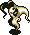 Wraith Devil (50)</td>
      <td class="high"> Inferno3 (65)</td>
      <td class="mid"> Evil General (30)</td>
    </tr>
    <tr>
      <td class="high"> Leech Bug (32)</td>
      <td class="low"> Running Egg (5)</td>
      <td class="low"> Ironwalrus (70)</td>
      <td></td>
      <td></td>
    </tr>
    <tr>
      <td colspan="9" class="tableDivider"></td>
    </tr>
    <tr>
      <td rowspan="2">37</td>
      <td rowspan="2" class="highlightShop"></td>
      <td rowspan="2" class="highlightMH"></td>
      <td rowspan="2" class="highlightGitan"></td>
      <td class="high"> Dadster Tank (40)</td>
      <td class="high"> Cave Mamel (5)</td>
      <td class="mid"> Wraith Devil (50)</td>
      <td class="high"> Inferno3 (65)</td>
      <td class="mid"> Evil General (30)</td>
    </tr>
    <tr>
      <td class="high"> Leech Bug (32)</td>
      <td class="low"> Running Egg (5)</td>
      <td class="low"> Ironwalrus (70)</td>
      <td></td>
      <td></td>
    </tr>
    <tr>
      <td colspan="9" class="tableDivider"></td>
    </tr>
    <tr>
      <td rowspan="2">38</td>
      <td rowspan="2" class="highlightShop"></td>
      <td rowspan="2" class="highlightMH"></td>
      <td rowspan="2" class="highlightGitan"></td>
      <td class="high"> Rice Boss (38)</td>
      <td class="high"> Cave Mamel (5)</td>
      <td class="mid"> Wraith Devil (50)</td>
      <td class="high"> Pythy (70)</td>
      <td class="mid"> Captain Ant (50)</td>
    </tr>
    <tr>
      <td class="high"> Leech Bug (32)</td>
      <td class="low"> Running Egg (5)</td>
      <td class="low"> Ironwalrus (70)</td>
      <td></td>
      <td></td>
    </tr>
    <tr>
      <td colspan="9" class="tableDivider"></td>
    </tr>
    <tr>
      <td rowspan="2">39</td>
      <td rowspan="2" class="highlightShop"></td>
      <td rowspan="2" class="highlightMH"></td>
      <td rowspan="2" class="highlightGitan"></td>
      <td class="high"> Rice Boss (38)</td>
      <td class="high"> Cave Mamel (5)</td>
      <td class="mid"> Wraith Devil (50)</td>
      <td class="high"> Pythy (70)</td>
      <td class="mid"> Captain Ant (50)</td>
    </tr>
    <tr>
      <td class="high"> Leech Bug (32)</td>
      <td class="low"> Running Egg (5)</td>
      <td class="low"> Ironwalrus (70)</td>
      <td></td>
      <td></td>
    </tr>
    <tr>
      <td colspan="9" class="tableDivider"></td>
    </tr>
    <tr>
      <td rowspan="2" class="highlightOffense">40</td>
      <td rowspan="2" class="highlightShop"></td>
      <td rowspan="2" class="highlightMH"></td>
      <td rowspan="2" class="highlightGitan"></td>
      <td class="high"> Rice Boss (38)</td>
      <td class="high"> Cave Mamel (5)</td>
      <td class="mid"> Wraith Devil (50)</td>
      <td class="high"> Pythy (70)</td>
      <td class="mid"> Captain Ant (50)</td>
    </tr>
    <tr>
      <td class="high"> Leech Bug (32)</td>
      <td class="low"> Running Egg (5)</td>
      <td class="low"> Ironwalrus (70)</td>
      <td></td>
      <td></td>
    </tr>
    <tr>
      <td colspan="9" class="tableDivider"></td>
    </tr>
    <tr>
      <td rowspan="2">41</td>
      <td rowspan="2" class="highlightShop"></td>
      <td rowspan="2" class="highlightMH"></td>
      <td rowspan="2" class="highlightGitan"></td>
      <td class="high"> Rice Boss (38)</td>
      <td class="high">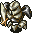 Steel Armor (80)</td>
      <td class="mid"> Wraith Devil (50)</td>
      <td class="high"> Pythy (70)</td>
      <td class="mid"> Captain Ant (50)</td>
    </tr>
    <tr>
      <td class="mid"> Killer Gather (60)</td>
      <td class="low"> Running Egg (5)</td>
      <td class="low"> Dusk Owl (10)</td>
      <td class="low">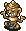 N'Bama (40)</td>
      <td></td>
    </tr>
    <tr>
      <td colspan="9" class="tableDivider"></td>
    </tr>
    <tr>
      <td rowspan="2">42</td>
      <td rowspan="2" class="highlightShop"></td>
      <td rowspan="2" class="highlightMH"></td>
      <td rowspan="2" class="highlightGitan"></td>
      <td class="high"> Rice Boss (38)</td>
      <td class="high"> Steel Armor (80)</td>
      <td class="mid"> Wraith Devil (50)</td>
      <td class="high"> Pythy (70)</td>
      <td class="mid"> Captain Ant (50)</td>
    </tr>
    <tr>
      <td class="mid"> Killer Gather (60)</td>
      <td class="low"> Running Egg (5)</td>
      <td class="low"> Dusk Owl (10)</td>
      <td class="low"> N'Bama (40)</td>
      <td></td>
    </tr>
    <tr>
      <td colspan="9" class="tableDivider"></td>
    </tr>
    <tr>
      <td rowspan="2">43</td>
      <td rowspan="2" class="highlightShop"></td>
      <td rowspan="2" class="highlightMH"></td>
      <td rowspan="2" class="highlightGitan"></td>
      <td class="high"> Rice Boss (38)</td>
      <td class="high"> Steel Armor (80)</td>
      <td class="mid"> Wraith Devil (50)</td>
      <td class="high"> Verginos (70)</td>
      <td class="mid">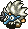 Tengu Chief (40)</td>
    </tr>
    <tr>
      <td class="mid"> Killer Gather (60)</td>
      <td class="low"> Running Egg (5)</td>
      <td class="low"> Dusk Owl (10)</td>
      <td class="low"> N'Bama (40)</td>
      <td></td>
    </tr>
    <tr>
      <td colspan="9" class="tableDivider"></td>
    </tr>
    <tr>
      <td rowspan="2">44</td>
      <td rowspan="2" class="highlightShop"></td>
      <td rowspan="2" class="highlightMH"></td>
      <td rowspan="2" class="highlightGitan"></td>
      <td class="high"> Polygon Song (80)</td>
      <td class="high"> Steel Armor (80)</td>
      <td class="mid"> Wraith Devil (50)</td>
      <td class="high"> Verginos (70)</td>
      <td class="mid"> Tengu Chief (40)</td>
    </tr>
    <tr>
      <td class="mid"> Killer Gather (60)</td>
      <td class="low"> Running Egg (5)</td>
      <td class="low"> Dusk Owl (10)</td>
      <td class="low"> N'Bama (40)</td>
      <td></td>
    </tr>
    <tr>
      <td colspan="9" class="tableDivider"></td>
    </tr>
    <tr>
      <td rowspan="2">45</td>
      <td rowspan="2" class="highlightShop"></td>
      <td rowspan="2" class="highlightMH"></td>
      <td rowspan="2" class="highlightGitan"></td>
      <td class="high"> Polygon Song (80)</td>
      <td class="high"> Steel Armor (80)</td>
      <td class="mid"> Wraith Devil (50)</td>
      <td class="high"> Verginos (70)</td>
      <td class="mid"> Tengu Chief (40)</td>
    </tr>
    <tr>
      <td class="mid"> Killer Gather (60)</td>
      <td class="low"> Running Egg (5)</td>
      <td class="low"> Dusk Owl (10)</td>
      <td class="low"> N'Bama (40)</td>
      <td class="high"> Gigahead (70)</td>
    </tr>
    <tr>
      <td colspan="9" class="tableDivider"></td>
    </tr>
    <tr>
      <td rowspan="3">46</td>
      <td rowspan="3" class="highlightShop"></td>
      <td rowspan="3" class="highlightMH"></td>
      <td rowspan="3" class="highlightGitan"></td>
      <td class="high"> Polygon Song (80)</td>
      <td class="high"> Steel Armor (80)</td>
      <td class="mid"> Wraith Devil (50)</td>
      <td class="high"> Verginos (70)</td>
      <td class="mid"> Tengu Chief (40)</td>
    </tr>
    <tr>
      <td class="mid"> Killer Gather (60)</td>
      <td class="low"> Running Egg (5)</td>
      <td class="low"> Dusk Owl (10)</td>
      <td class="low"> N'Bama (40)</td>
      <td class="high"> Gigahead (70)</td>
    </tr>
    <tr>
      <td class="mid">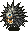 Spike Fire (120)</td>
      <td></td>
      <td></td>
      <td></td>
      <td></td>
    </tr>
    <tr>
      <td colspan="9" class="tableDivider"></td>
    </tr>
    <tr>
      <td rowspan="3">47</td>
      <td rowspan="3" class="highlightShop"></td>
      <td rowspan="3" class="highlightMH"></td>
      <td rowspan="3" class="highlightGitan"></td>
      <td class="high"> Polygon Song (80)</td>
      <td class="high"> Steamroid (65)</td>
      <td class="mid"> Wraith Devil (50)</td>
      <td class="high"> Verginos (70)</td>
      <td class="mid"> Tengu Chief (40)</td>
    </tr>
    <tr>
      <td class="mid"> Curse Mom (56)</td>
      <td class="low"> Running Egg (5)</td>
      <td class="low"> Dusk Owl (10)</td>
      <td class="low"> N'Bama (40)</td>
      <td class="high"> Gigahead (70)</td>
    </tr>
    <tr>
      <td class="mid"> Spike Fire (120)</td>
      <td></td>
      <td></td>
      <td></td>
      <td></td>
    </tr>
    <tr>
      <td colspan="9" class="tableDivider"></td>
    </tr>
    <tr>
      <td rowspan="3">48</td>
      <td rowspan="3" class="highlightShop"></td>
      <td rowspan="3" class="highlightMH"></td>
      <td rowspan="3" class="highlightGitan"></td>
      <td class="high"> Polygon Song (80)</td>
      <td class="high"> Steamroid (65)</td>
      <td class="mid"> Wraith Devil (50)</td>
      <td></td>
      <td class="mid"> Tengu Chief (40)</td>
    </tr>
    <tr>
      <td class="mid"> Curse Mom (56)</td>
      <td class="low"> Running Egg (5)</td>
      <td class="low"> Dusk Owl (10)</td>
      <td class="low"> N'Bama (40)</td>
      <td class="high"> Gigahead (70)</td>
    </tr>
    <tr>
      <td class="mid"> Spike Fire (120)</td>
      <td></td>
      <td></td>
      <td></td>
      <td></td>
    </tr>
    <tr>
      <td colspan="9" class="tableDivider"></td>
    </tr>
    <tr>
      <td rowspan="3">49</td>
      <td rowspan="3" class="highlightShop"></td>
      <td rowspan="3" class="highlightMH"></td>
      <td rowspan="3" class="highlightGitan"></td>
      <td class="high"> Polygon Song (80)</td>
      <td class="high"> Steamroid (65)</td>
      <td class="mid"> Wraith Devil (50)</td>
      <td class="high"> Sleep Radish (55)</td>
      <td></td>
    </tr>
    <tr>
      <td class="mid"> Curse Mom (56)</td>
      <td class="low"> Running Egg (5)</td>
      <td class="low"> Dusk Owl (10)</td>
      <td class="low"> N'Bama (40)</td>
      <td class="high"> Gigahead (70)</td>
    </tr>
    <tr>
      <td class="mid"> Spike Fire (120)</td>
      <td></td>
      <td></td>
      <td></td>
      <td></td>
    </tr>
    <tr>
      <td colspan="9" class="tableDivider"></td>
    </tr>
    <tr>
      <td rowspan="3" class="highlightOffense">50</td>
      <td rowspan="3" class="highlightShop"></td>
      <td rowspan="3" class="highlightMH"></td>
      <td rowspan="3" class="highlightGitan"></td>
      <td class="high"> Mist Hermit (60)</td>
      <td class="high"> Steamroid (65)</td>
      <td class="mid"> Wraith Devil (50)</td>
      <td class="high"> Sleep Radish (55)</td>
      <td class="high">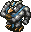 Great Hen (60)</td>
    </tr>
    <tr>
      <td class="mid"> Curse Mom (56)</td>
      <td class="low"> Running Egg (5)</td>
      <td class="high"> Dirt Dragon (80)</td>
      <td class="low"> N'Bama (40)</td>
      <td class="high"> Gigahead (70)</td>
    </tr>
    <tr>
      <td class="high"> Grey Slime (70)</td>
      <td></td>
      <td></td>
      <td></td>
      <td></td>
    </tr>
    <tr>
      <td colspan="9" class="tableDivider"></td>
    </tr>
    <tr>
      <td rowspan="3">51</td>
      <td rowspan="3" class="highlightShop"></td>
      <td rowspan="3" class="highlightMH"></td>
      <td rowspan="3" class="highlightGitan"></td>
      <td class="high"> Mist Hermit (60)</td>
      <td class="high"> Steamroid (65)</td>
      <td class="low"> Fluffy Bunny (5)</td>
      <td class="high"> Sleep Radish (55)</td>
      <td class="high"> Great Hen (60)</td>
    </tr>
    <tr>
      <td class="mid"> Curse Mom (56)</td>
      <td class="low"> Flying Egg (8)</td>
      <td class="high"> Dirt Dragon (80)</td>
      <td class="low"> N'Bama (40)</td>
      <td class="low"> Burglar (25)</td>
    </tr>
    <tr>
      <td class="high"> Grey Slime (70)</td>
      <td></td>
      <td></td>
      <td></td>
      <td></td>
    </tr>
    <tr>
      <td colspan="9" class="tableDivider"></td>
    </tr>
    <tr>
      <td rowspan="3">52</td>
      <td rowspan="3" class="highlightShop"></td>
      <td rowspan="3" class="highlightMH"></td>
      <td rowspan="3" class="highlightGitan"></td>
      <td class="high"> Mist Hermit (60)</td>
      <td class="high"> Steamroid (65)</td>
      <td class="low"> Fluffy Bunny (5)</td>
      <td class="high"> Sleep Radish (55)</td>
      <td class="high"> Great Hen (60)</td>
    </tr>
    <tr>
      <td class="mid"> Curse Mom (56)</td>
      <td class="low"> Flying Egg (8)</td>
      <td class="high"> Dirt Dragon (80)</td>
      <td class="low"> N'Bama (40)</td>
      <td class="low"> Burglar (25)</td>
    </tr>
    <tr>
      <td class="high"> Grey Slime (70)</td>
      <td></td>
      <td></td>
      <td></td>
      <td></td>
    </tr>
    <tr>
      <td colspan="9" class="tableDivider"></td>
    </tr>
    <tr>
      <td rowspan="3">53</td>
      <td rowspan="3" class="highlightShop"></td>
      <td rowspan="3" class="highlightMH"></td>
      <td rowspan="3" class="highlightGitan"></td>
      <td class="high"> Mist Hermit (60)</td>
      <td class="high"> Steamroid (65)</td>
      <td class="low"> Fluffy Bunny (5)</td>
      <td class="high"> Sleep Radish (55)</td>
      <td class="high"> Great Hen (60)</td>
    </tr>
    <tr>
      <td class="mid"> Curse Mom (56)</td>
      <td class="low"> Flying Egg (8)</td>
      <td class="high"> Dirt Dragon (80)</td>
      <td class="low"> N'Bama (40)</td>
      <td class="low"> Burglar (25)</td>
    </tr>
    <tr>
      <td class="high"> Grey Slime (70)</td>
      <td class="high">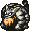 Tiger Uhon (80)</td>
      <td></td>
      <td></td>
      <td></td>
    </tr>
    <tr>
      <td colspan="9" class="tableDivider"></td>
    </tr>
    <tr>
      <td rowspan="3">54</td>
      <td rowspan="3" class="highlightShop"></td>
      <td rowspan="3" class="highlightMH"></td>
      <td rowspan="3" class="highlightGitan"></td>
      <td class="high"> Mist Hermit (60)</td>
      <td class="high"> Steamroid (65)</td>
      <td class="low"> Fluffy Bunny (5)</td>
      <td class="high"> Sleep Radish (55)</td>
      <td class="high"> Great Hen (60)</td>
    </tr>
    <tr>
      <td></td>
      <td class="low"> Flying Egg (8)</td>
      <td class="high"> Dirt Dragon (80)</td>
      <td class="low"> N'Bama (40)</td>
      <td class="low"> Burglar (25)</td>
    </tr>
    <tr>
      <td class="high"> Grey Slime (70)</td>
      <td class="high"> Tiger Uhon (80)</td>
      <td></td>
      <td></td>
      <td></td>
    </tr>
    <tr>
      <td colspan="9" class="tableDivider"></td>
    </tr>
    <tr>
      <td rowspan="3">55</td>
      <td rowspan="3" class="highlightShop"></td>
      <td rowspan="3" class="highlightMH"></td>
      <td rowspan="3" class="highlightGitan"></td>
      <td class="high"> Mist Hermit (60)</td>
      <td class="high"> Steamroid (65)</td>
      <td class="low"> Fluffy Bunny (5)</td>
      <td class="high"> Pacorepking (60)</td>
      <td class="high"> Great Hen (60)</td>
    </tr>
    <tr>
      <td class="high"> Hyper Gaze (70)</td>
      <td class="low"> Flying Egg (8)</td>
      <td class="high"> Dirt Dragon (80)</td>
      <td class="low"> N'Bama (40)</td>
      <td class="low"> Burglar (25)</td>
    </tr>
    <tr>
      <td></td>
      <td class="high"> Tiger Uhon (80)</td>
      <td></td>
      <td></td>
      <td></td>
    </tr>
    <tr>
      <td colspan="9" class="tableDivider"></td>
    </tr>
    <tr>
      <td rowspan="3">56</td>
      <td rowspan="3" class="highlightShop"></td>
      <td rowspan="3" class="highlightMH"></td>
      <td rowspan="3" class="highlightGitan"></td>
      <td class="high"> Mist Hermit (60)</td>
      <td class="high"> Bladegator (70)</td>
      <td class="low"> Fluffy Bunny (5)</td>
      <td class="high"> Pacorepking (60)</td>
      <td class="high">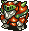 Hardremlas (130)</td>
    </tr>
    <tr>
      <td class="high"> Hyper Gaze (70)</td>
      <td class="low"> Flying Egg (8)</td>
      <td></td>
      <td class="low"> N'Bama (40)</td>
      <td></td>
    </tr>
    <tr>
      <td></td>
      <td class="high"> Tiger Uhon (80)</td>
      <td></td>
      <td></td>
      <td></td>
    </tr>
    <tr>
      <td colspan="9" class="tableDivider"></td>
    </tr>
    <tr>
      <td rowspan="3">57</td>
      <td rowspan="3" class="highlightShop"></td>
      <td rowspan="3" class="highlightMH"></td>
      <td rowspan="3" class="highlightGitan"></td>
      <td class="high"> Mist Hermit (60)</td>
      <td class="high"> Bladegator (70)</td>
      <td class="low"> Fluffy Bunny (5)</td>
      <td class="high"> Pacorepking (60)</td>
      <td class="high"> Hardremlas (130)</td>
    </tr>
    <tr>
      <td class="high"> Hyper Gaze (70)</td>
      <td class="low"> Flying Egg (8)</td>
      <td></td>
      <td class="low"> N'Bama (40)</td>
      <td></td>
    </tr>
    <tr>
      <td></td>
      <td class="high"> Tiger Uhon (80)</td>
      <td></td>
      <td></td>
      <td></td>
    </tr>
    <tr>
      <td colspan="9" class="tableDivider"></td>
    </tr>
    <tr>
      <td rowspan="3">58</td>
      <td rowspan="3" class="highlightShop"></td>
      <td rowspan="3" class="highlightMH"></td>
      <td rowspan="3" class="highlightGitan"></td>
      <td class="high"> Mist Hermit (60)</td>
      <td class="high"> Bladegator (70)</td>
      <td class="low"> Fluffy Bunny (5)</td>
      <td class="high"> Pacorepking (60)</td>
      <td class="high"> Hardremlas (130)</td>
    </tr>
    <tr>
      <td class="high"> Hyper Gaze (70)</td>
      <td class="low"> Flying Egg (8)</td>
      <td class="high">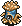 Leech Fly (41)</td>
      <td class="low"> N'Bama (40)</td>
      <td class="mid"> Bellthoven (40)</td>
    </tr>
    <tr>
      <td></td>
      <td class="high"> Tiger Uhon (80)</td>
      <td></td>
      <td></td>
      <td></td>
    </tr>
    <tr>
      <td colspan="9" class="tableDivider"></td>
    </tr>
    <tr>
      <td rowspan="3">59</td>
      <td rowspan="3" class="highlightShop"></td>
      <td rowspan="3" class="highlightMH"></td>
      <td rowspan="3" class="highlightGitan"></td>
      <td class="high"> Mist Hermit (60)</td>
      <td class="high"> Bladegator (70)</td>
      <td class="low"> Fluffy Bunny (5)</td>
      <td class="high"> Pacorepking (60)</td>
      <td class="high"> Hardremlas (130)</td>
    </tr>
    <tr>
      <td class="high"> Hyper Gaze (70)</td>
      <td class="low"> Flying Egg (8)</td>
      <td class="high"> Leech Fly (41)</td>
      <td class="low"> N'Bama (40)</td>
      <td class="mid"> Bellthoven (40)</td>
    </tr>
    <tr>
      <td></td>
      <td class="high"> Tiger Uhon (80)</td>
      <td></td>
      <td></td>
      <td></td>
    </tr>
    <tr>
      <td colspan="9" class="tableDivider"></td>
    </tr>
    <tr>
      <td rowspan="3" class="highlightOffense">60</td>
      <td rowspan="3" class="highlightShop"></td>
      <td rowspan="3" class="highlightMH"></td>
      <td rowspan="3" class="highlightGitan"></td>
      <td class="high"> Sky Dragon (100)</td>
      <td class="high"> Bladegator (70)</td>
      <td></td>
      <td></td>
      <td class="high"> Hardremlas (130)</td>
    </tr>
    <tr>
      <td class="high"> Hyper Gaze (70)</td>
      <td class="low"> Flying Egg (8)</td>
      <td class="high"> Leech Fly (41)</td>
      <td class="low"> N'Bama (40)</td>
      <td class="mid"> Bellthoven (40)</td>
    </tr>
    <tr>
      <td></td>
      <td class="high"> Tiger Uhon (80)</td>
      <td></td>
      <td></td>
      <td></td>
    </tr>
    <tr>
      <td colspan="9" class="tableDivider"></td>
    </tr>
    <tr>
      <td rowspan="2">61</td>
      <td rowspan="2" class="highlightShop"></td>
      <td rowspan="2" class="highlightMH"></td>
      <td rowspan="2" class="highlightGitan"></td>
      <td class="high"> Sky Dragon (100)</td>
      <td class="high"> Bladegator (70)</td>
      <td class="high">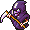 Death Master (77)</td>
      <td class="high"> Inferno4 (80)</td>
      <td class="high"> Hardremlas (130)</td>
    </tr>
    <tr>
      <td class="low"> Gitan Mamel (6)</td>
      <td class="low"> Chaos Owl (15)</td>
      <td class="high"> Leech Fly (41)</td>
      <td class="low"> N'Bama (40)</td>
      <td class="mid"> Bellthoven (40)</td>
    </tr>
    <tr>
      <td colspan="9" class="tableDivider"></td>
    </tr>
    <tr>
      <td rowspan="2">62</td>
      <td rowspan="2" class="highlightShop"></td>
      <td rowspan="2" class="highlightMH"></td>
      <td rowspan="2" class="highlightGitan"></td>
      <td class="high"> Sky Dragon (100)</td>
      <td class="high"> Bladegator (70)</td>
      <td class="high"> Death Master (77)</td>
      <td class="high"> Inferno4 (80)</td>
      <td class="high"> Hardremlas (130)</td>
    </tr>
    <tr>
      <td class="low"> Gitan Mamel (6)</td>
      <td class="low"> Chaos Owl (15)</td>
      <td class="high"> Leech Fly (41)</td>
      <td class="low"> N'Bama (40)</td>
      <td class="mid"> Bellthoven (40)</td>
    </tr>
    <tr>
      <td colspan="9" class="tableDivider"></td>
    </tr>
    <tr>
      <td rowspan="2">63</td>
      <td rowspan="2" class="highlightShop"></td>
      <td rowspan="2" class="highlightMH"></td>
      <td rowspan="2" class="highlightGitan"></td>
      <td class="high"> Sky Dragon (100)</td>
      <td class="high"> Skull Demon (75)</td>
      <td class="high"> Death Master (77)</td>
      <td class="high"> Inferno4 (80)</td>
      <td class="high"> Droopy Hani (55)</td>
    </tr>
    <tr>
      <td class="low"> Gitan Mamel (6)</td>
      <td class="low"> Chaos Owl (15)</td>
      <td class="high"> Megataur (90)</td>
      <td class="low"> N'Bama (40)</td>
      <td></td>
    </tr>
    <tr>
      <td colspan="9" class="tableDivider"></td>
    </tr>
    <tr>
      <td rowspan="2">64</td>
      <td rowspan="2" class="highlightShop"></td>
      <td rowspan="2" class="highlightMH"></td>
      <td rowspan="2" class="highlightGitan"></td>
      <td class="high"> Sky Dragon (100)</td>
      <td class="high"> Skull Demon (75)</td>
      <td class="high"> Death Master (77)</td>
      <td class="high"> Inferno4 (80)</td>
      <td class="high"> Droopy Hani (55)</td>
    </tr>
    <tr>
      <td class="low"> Gitan Mamel (6)</td>
      <td class="low"> Chaos Owl (15)</td>
      <td class="high"> Megataur (90)</td>
      <td class="low"> N'Bama (40)</td>
      <td></td>
    </tr>
    <tr>
      <td colspan="9" class="tableDivider"></td>
    </tr>
    <tr>
      <td rowspan="2">65</td>
      <td rowspan="2" class="highlightShop"></td>
      <td rowspan="2" class="highlightMH"></td>
      <td rowspan="2" class="highlightGitan"></td>
      <td class="high"> Sky Dragon (100)</td>
      <td class="high"> Skull Demon (75)</td>
      <td class="high"> Death Master (77)</td>
      <td class="high"> Inferno4 (80)</td>
      <td class="high"> Droopy Hani (55)</td>
    </tr>
    <tr>
      <td class="low"> Gitan Mamel (6)</td>
      <td class="low"> Chaos Owl (15)</td>
      <td class="high"> Megataur (90)</td>
      <td class="low"> N'Bama (40)</td>
      <td></td>
    </tr>
    <tr>
      <td colspan="9" class="tableDivider"></td>
    </tr>
    <tr>
      <td rowspan="3">66</td>
      <td rowspan="3" class="highlightShop"></td>
      <td rowspan="3" class="highlightMH"></td>
      <td rowspan="3" class="highlightGitan"></td>
      <td class="high"> Sky Dragon (100)</td>
      <td class="high"> Skull Demon (75)</td>
      <td class="high"> Death Master (77)</td>
      <td class="high">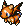 Infernopuff (80)</td>
      <td class="high"> Droopy Hani (55)</td>
    </tr>
    <tr>
      <td class="low"> Gitan Mamel (6)</td>
      <td class="low"> Chaos Owl (15)</td>
      <td class="high"> Megataur (90)</td>
      <td class="low"> N'Bama (40)</td>
      <td class="mid"> Piggora (70)</td>
    </tr>
    <tr>
      <td class="high">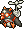 Jet Fowl (80)</td>
      <td></td>
      <td></td>
      <td></td>
      <td></td>
    </tr>
    <tr>
      <td colspan="9" class="tableDivider"></td>
    </tr>
    <tr>
      <td rowspan="3">67</td>
      <td rowspan="3" class="highlightShop"></td>
      <td rowspan="3" class="highlightMH"></td>
      <td rowspan="3" class="highlightGitan"></td>
      <td></td>
      <td class="high"> Skull Demon (75)</td>
      <td></td>
      <td class="high"> Infernopuff (80)</td>
      <td class="high"> Droopy Hani (55)</td>
    </tr>
    <tr>
      <td class="low"> Gitan Mamel (6)</td>
      <td class="low"> Chaos Owl (15)</td>
      <td class="high"> Megataur (90)</td>
      <td class="low"> N'Bama (40)</td>
      <td class="mid"> Piggora (70)</td>
    </tr>
    <tr>
      <td class="high"> Jet Fowl (80)</td>
      <td></td>
      <td></td>
      <td></td>
      <td></td>
    </tr>
    <tr>
      <td colspan="9" class="tableDivider"></td>
    </tr>
    <tr>
      <td rowspan="3">68</td>
      <td rowspan="3" class="highlightShop"></td>
      <td rowspan="3" class="highlightMH"></td>
      <td rowspan="3" class="highlightGitan"></td>
      <td class="mid">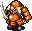 Evil Shogun (50)</td>
      <td class="high"> Skull Demon (75)</td>
      <td></td>
      <td class="high"> Infernopuff (80)</td>
      <td class="high"> Droopy Hani (55)</td>
    </tr>
    <tr>
      <td class="low"> Gitan Mamel (6)</td>
      <td class="low"> Chaos Owl (15)</td>
      <td class="high"> Megataur (90)</td>
      <td class="low"> N'Bama (40)</td>
      <td class="mid"> Piggora (70)</td>
    </tr>
    <tr>
      <td class="high"> Jet Fowl (80)</td>
      <td></td>
      <td></td>
      <td></td>
      <td></td>
    </tr>
    <tr>
      <td colspan="9" class="tableDivider"></td>
    </tr>
    <tr>
      <td rowspan="3">69</td>
      <td rowspan="3" class="highlightShop"></td>
      <td rowspan="3" class="highlightMH"></td>
      <td rowspan="3" class="highlightGitan"></td>
      <td class="mid"> Evil Shogun (50)</td>
      <td class="high"> Skull Demon (75)</td>
      <td></td>
      <td class="high"> Infernopuff (80)</td>
      <td class="high"> Droopy Hani (55)</td>
    </tr>
    <tr>
      <td class="low"> Gitan Mamel (6)</td>
      <td class="low"> Chaos Owl (15)</td>
      <td class="high"> Megataur (90)</td>
      <td class="low"> N'Bama (40)</td>
      <td class="mid"> Piggora (70)</td>
    </tr>
    <tr>
      <td class="high"> Jet Fowl (80)</td>
      <td></td>
      <td></td>
      <td></td>
      <td></td>
    </tr>
    <tr>
      <td colspan="9" class="tableDivider"></td>
    </tr>
    <tr>
      <td rowspan="3" class="highlightOffense">70</td>
      <td rowspan="3" class="highlightShop"></td>
      <td rowspan="3" class="highlightMH"></td>
      <td rowspan="3" class="highlightGitan"></td>
      <td class="mid"> Evil Shogun (50)</td>
      <td class="high"> Skull Demon (75)</td>
      <td class="high"> Electroid (70)</td>
      <td class="high"> Infernopuff (80)</td>
      <td></td>
    </tr>
    <tr>
      <td class="low"> Gitan Mamel (6)</td>
      <td></td>
      <td class="high"> Megataur (90)</td>
      <td class="low"> N'Bama (40)</td>
      <td class="mid"> Piggora (70)</td>
    </tr>
    <tr>
      <td class="high"> Jet Fowl (80)</td>
      <td></td>
      <td></td>
      <td></td>
      <td></td>
    </tr>
    <tr>
      <td colspan="9" class="tableDivider"></td>
    </tr>
    <tr>
      <td rowspan="3">71</td>
      <td rowspan="3" class="highlightShop"></td>
      <td rowspan="3" class="highlightMH"></td>
      <td rowspan="3" class="highlightGitan"></td>
      <td class="mid"> Evil Shogun (50)</td>
      <td class="high"> Oldster Tank (50)</td>
      <td class="high"> Electroid (70)</td>
      <td class="high"> Infernopuff (80)</td>
      <td class="low">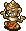 N'Balun (50)</td>
    </tr>
    <tr>
      <td class="high">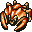 Hell Gather (90)</td>
      <td></td>
      <td class="high"> Megataur (90)</td>
      <td></td>
      <td class="mid"> Piggora (70)</td>
    </tr>
    <tr>
      <td class="high"> Jet Fowl (80)</td>
      <td></td>
      <td></td>
      <td></td>
      <td></td>
    </tr>
    <tr>
      <td colspan="9" class="tableDivider"></td>
    </tr>
    <tr>
      <td rowspan="3">72</td>
      <td rowspan="3" class="highlightShop"></td>
      <td rowspan="3" class="highlightMH"></td>
      <td rowspan="3" class="highlightGitan"></td>
      <td class="mid"> Evil Shogun (50)</td>
      <td class="high"> Oldster Tank (50)</td>
      <td class="high"> Electroid (70)</td>
      <td class="high"> Infernopuff (80)</td>
      <td class="low"> N'Balun (50)</td>
    </tr>
    <tr>
      <td class="high"> Hell Gather (90)</td>
      <td></td>
      <td class="high"> Megataur (90)</td>
      <td></td>
      <td class="mid"> Piggora (70)</td>
    </tr>
    <tr>
      <td class="high"> Jet Fowl (80)</td>
      <td></td>
      <td></td>
      <td></td>
      <td></td>
    </tr>
    <tr>
      <td colspan="9" class="tableDivider"></td>
    </tr>
    <tr>
      <td rowspan="3">73</td>
      <td rowspan="3" class="highlightShop"></td>
      <td rowspan="3" class="highlightMH"></td>
      <td rowspan="3" class="highlightGitan"></td>
      <td class="mid"> Evil Shogun (50)</td>
      <td class="high"> Oldster Tank (50)</td>
      <td class="high"> Electroid (70)</td>
      <td class="high"> Infernopuff (80)</td>
      <td class="low"> N'Balun (50)</td>
    </tr>
    <tr>
      <td class="high"> Hell Gather (90)</td>
      <td></td>
      <td class="high"> Megataur (90)</td>
      <td></td>
      <td class="mid"> Piggora (70)</td>
    </tr>
    <tr>
      <td class="high"> Jet Fowl (80)</td>
      <td></td>
      <td></td>
      <td></td>
      <td></td>
    </tr>
    <tr>
      <td colspan="9" class="tableDivider"></td>
    </tr>
    <tr>
      <td rowspan="3">74</td>
      <td rowspan="3" class="highlightShop"></td>
      <td rowspan="3" class="highlightMH"></td>
      <td rowspan="3" class="highlightGitan"></td>
      <td class="mid"> Evil Shogun (50)</td>
      <td class="high"> Oldster Tank (50)</td>
      <td class="high"> Electroid (70)</td>
      <td class="high"> Infernopuff (80)</td>
      <td class="low"> N'Balun (50)</td>
    </tr>
    <tr>
      <td class="high"> Hell Gather (90)</td>
      <td></td>
      <td class="high"> Megataur (90)</td>
      <td></td>
      <td class="mid"> Piggora (70)</td>
    </tr>
    <tr>
      <td class="high"> Jet Fowl (80)</td>
      <td></td>
      <td></td>
      <td></td>
      <td></td>
    </tr>
    <tr>
      <td colspan="9" class="tableDivider"></td>
    </tr>
    <tr>
      <td rowspan="3">75</td>
      <td rowspan="3" class="highlightShop"></td>
      <td rowspan="3" class="highlightMH"></td>
      <td rowspan="3" class="highlightGitan"></td>
      <td class="mid"> Evil Shogun (50)</td>
      <td class="high"> Oldster Tank (50)</td>
      <td class="high"> Electroid (70)</td>
      <td class="high"> Infernopuff (80)</td>
      <td class="low"> N'Balun (50)</td>
    </tr>
    <tr>
      <td class="high"> Hell Gather (90)</td>
      <td class="high"> Alloy Armor (100)</td>
      <td class="high"> Megataur (90)</td>
      <td></td>
      <td class="mid"> Piggora (70)</td>
    </tr>
    <tr>
      <td class="high"> Jet Fowl (80)</td>
      <td></td>
      <td></td>
      <td></td>
      <td></td>
    </tr>
    <tr>
      <td colspan="9" class="tableDivider"></td>
    </tr>
    <tr>
      <td rowspan="2">76</td>
      <td rowspan="2" class="highlightShop"></td>
      <td rowspan="2" class="highlightMH"></td>
      <td rowspan="2" class="highlightGitan"></td>
      <td class="mid"> Evil Shogun (50)</td>
      <td class="high"> Oldster Tank (50)</td>
      <td class="high"> Electroid (70)</td>
      <td class="mid"> Mirage Devil (50)</td>
      <td class="low"> N'Balun (50)</td>
    </tr>
    <tr>
      <td class="high"> Hell Gather (90)</td>
      <td class="high"> Alloy Armor (100)</td>
      <td class="high"> Megataur (90)</td>
      <td class="mid">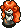 Curse Gran (72)</td>
      <td class="mid"> Piggora (70)</td>
    </tr>
    <tr>
      <td colspan="9" class="tableDivider"></td>
    </tr>
    <tr>
      <td rowspan="2">77</td>
      <td rowspan="2" class="highlightShop"></td>
      <td rowspan="2" class="highlightMH"></td>
      <td rowspan="2" class="highlightGitan"></td>
      <td class="high">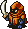 Fear Eye (60)</td>
      <td class="high"> Oldster Tank (50)</td>
      <td class="high"> Electroid (70)</td>
      <td class="mid"> Mirage Devil (50)</td>
      <td class="low"> N'Balun (50)</td>
    </tr>
    <tr>
      <td class="high"> Hell Gather (90)</td>
      <td class="high"> Alloy Armor (100)</td>
      <td class="high"> Megataur (90)</td>
      <td class="mid"> Curse Gran (72)</td>
      <td class="mid"> Piggora (70)</td>
    </tr>
    <tr>
      <td colspan="9" class="tableDivider"></td>
    </tr>
    <tr>
      <td rowspan="2">78</td>
      <td rowspan="2" class="highlightShop"></td>
      <td rowspan="2" class="highlightMH"></td>
      <td rowspan="2" class="highlightGitan"></td>
      <td class="high"> Fear Eye (60)</td>
      <td class="high"> Oldster Tank (50)</td>
      <td class="high"> Electroid (70)</td>
      <td class="mid"> Mirage Devil (50)</td>
      <td class="low"> N'Balun (50)</td>
    </tr>
    <tr>
      <td class="high"> Hell Gather (90)</td>
      <td class="high"> Alloy Armor (100)</td>
      <td></td>
      <td class="mid"> Curse Gran (72)</td>
      <td class="mid"> Piggora (70)</td>
    </tr>
    <tr>
      <td colspan="9" class="tableDivider"></td>
    </tr>
    <tr>
      <td rowspan="2">79</td>
      <td rowspan="2" class="highlightShop"></td>
      <td rowspan="2" class="highlightMH"></td>
      <td rowspan="2" class="highlightGitan"></td>
      <td class="high"> Fear Eye (60)</td>
      <td class="high"> Oldster Tank (50)</td>
      <td class="high"> Electroid (70)</td>
      <td class="mid"> Mirage Devil (50)</td>
      <td class="low"> N'Balun (50)</td>
    </tr>
    <tr>
      <td class="high"> Hell Gather (90)</td>
      <td class="high"> Alloy Armor (100)</td>
      <td></td>
      <td class="mid"> Curse Gran (72)</td>
      <td class="mid"> Piggora (70)</td>
    </tr>
    <tr>
      <td colspan="9" class="tableDivider"></td>
    </tr>
    <tr>
      <td rowspan="2" class="highlightOffense">80</td>
      <td rowspan="2" class="highlightShop"></td>
      <td rowspan="2" class="highlightMH"></td>
      <td rowspan="2" class="highlightGitan"></td>
      <td class="high"> Fear Eye (60)</td>
      <td class="high"> Cloud Hermit (70)</td>
      <td class="high"> Electroid (70)</td>
      <td class="mid"> Mirage Devil (50)</td>
      <td class="low"> N'Balun (50)</td>
    </tr>
    <tr>
      <td class="high"> Hell Gather (90)</td>
      <td class="high"> Alloy Armor (100)</td>
      <td class="high">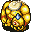 Deathhead (100)</td>
      <td class="mid"> Curse Gran (72)</td>
      <td class="mid"> Piggora (70)</td>
    </tr>
    <tr>
      <td colspan="9" class="tableDivider"></td>
    </tr>
    <tr>
      <td rowspan="3">81</td>
      <td rowspan="3" class="highlightShop"></td>
      <td rowspan="3" class="highlightMH"></td>
      <td rowspan="3" class="highlightGitan"></td>
      <td class="high"> Fear Eye (60)</td>
      <td class="high"> Cloud Hermit (70)</td>
      <td class="high"> Miracle Hen (80)</td>
      <td class="mid"> Mirage Devil (50)</td>
      <td class="low"> N'Balun (50)</td>
    </tr>
    <tr>
      <td class="low"> Kleptomaniac (35)</td>
      <td class="high"> Alloy Armor (100)</td>
      <td class="high"> Deathhead (100)</td>
      <td class="mid"> Curse Gran (72)</td>
      <td class="low"> Hiding Egg (10)</td>
    </tr>
    <tr>
      <td class="low"> Fluffy Bunny (5)</td>
      <td class="low"> Chaos Owl (15)</td>
      <td></td>
      <td></td>
      <td></td>
    </tr>
    <tr>
      <td colspan="9" class="tableDivider"></td>
    </tr>
    <tr>
      <td rowspan="3">82</td>
      <td rowspan="3" class="highlightShop"></td>
      <td rowspan="3" class="highlightMH"></td>
      <td rowspan="3" class="highlightGitan"></td>
      <td class="high"> Fear Eye (60)</td>
      <td class="high"> Cloud Hermit (70)</td>
      <td class="high"> Miracle Hen (80)</td>
      <td class="mid"> Mirage Devil (50)</td>
      <td class="low"> N'Balun (50)</td>
    </tr>
    <tr>
      <td class="low"> Kleptomaniac (35)</td>
      <td class="high"> Alloy Armor (100)</td>
      <td class="high"> Deathhead (100)</td>
      <td class="mid"> Curse Gran (72)</td>
      <td class="low"> Hiding Egg (10)</td>
    </tr>
    <tr>
      <td class="low"> Fluffy Bunny (5)</td>
      <td class="low"> Chaos Owl (15)</td>
      <td></td>
      <td></td>
      <td></td>
    </tr>
    <tr>
      <td colspan="9" class="tableDivider"></td>
    </tr>
    <tr>
      <td rowspan="3">83</td>
      <td rowspan="3" class="highlightShop"></td>
      <td rowspan="3" class="highlightMH"></td>
      <td rowspan="3" class="highlightGitan"></td>
      <td class="high"> Fear Eye (60)</td>
      <td class="high"> Cloud Hermit (70)</td>
      <td class="high"> Miracle Hen (80)</td>
      <td class="mid"> Mirage Devil (50)</td>
      <td class="low"> N'Balun (50)</td>
    </tr>
    <tr>
      <td class="low"> Kleptomaniac (35)</td>
      <td class="high"> Alloy Armor (100)</td>
      <td class="high"> Deathhead (100)</td>
      <td class="mid"> Curse Gran (72)</td>
      <td class="low"> Hiding Egg (10)</td>
    </tr>
    <tr>
      <td class="low"> Fluffy Bunny (5)</td>
      <td class="low"> Chaos Owl (15)</td>
      <td></td>
      <td></td>
      <td></td>
    </tr>
    <tr>
      <td colspan="9" class="tableDivider"></td>
    </tr>
    <tr>
      <td rowspan="3">84</td>
      <td rowspan="3" class="highlightShop"></td>
      <td rowspan="3" class="highlightMH"></td>
      <td rowspan="3" class="highlightGitan"></td>
      <td class="high"> Fear Eye (60)</td>
      <td class="high"> Cloud Hermit (70)</td>
      <td class="high"> Miracle Hen (80)</td>
      <td class="mid"> Mirage Devil (50)</td>
      <td class="low"> N'Balun (50)</td>
    </tr>
    <tr>
      <td class="low"> Kleptomaniac (35)</td>
      <td class="high"> Alloy Armor (100)</td>
      <td class="high"> Deathhead (100)</td>
      <td class="mid"> Curse Gran (72)</td>
      <td class="low"> Hiding Egg (10)</td>
    </tr>
    <tr>
      <td class="low"> Fluffy Bunny (5)</td>
      <td class="low"> Chaos Owl (15)</td>
      <td></td>
      <td></td>
      <td></td>
    </tr>
    <tr>
      <td colspan="9" class="tableDivider"></td>
    </tr>
    <tr>
      <td rowspan="3">85</td>
      <td rowspan="3" class="highlightShop"></td>
      <td rowspan="3" class="highlightMH"></td>
      <td rowspan="3" class="highlightGitan"></td>
      <td class="high"> Fear Eye (60)</td>
      <td class="high"> Cloud Hermit (70)</td>
      <td class="high"> Miracle Hen (80)</td>
      <td class="mid"> Mirage Devil (50)</td>
      <td class="low"> N'Balun (50)</td>
    </tr>
    <tr>
      <td class="low"> Kleptomaniac (35)</td>
      <td class="high"> Alloy Armor (100)</td>
      <td class="high"> Deathhead (100)</td>
      <td class="mid"> Curse Gran (72)</td>
      <td class="low"> Hiding Egg (10)</td>
    </tr>
    <tr>
      <td class="low"> Fluffy Bunny (5)</td>
      <td class="low"> Chaos Owl (15)</td>
      <td></td>
      <td></td>
      <td></td>
    </tr>
    <tr>
      <td colspan="9" class="tableDivider"></td>
    </tr>
    <tr>
      <td rowspan="3">86</td>
      <td rowspan="3" class="highlightShop"></td>
      <td rowspan="3" class="highlightMH"></td>
      <td rowspan="3" class="highlightGitan"></td>
      <td class="high"> Fear Eye (60)</td>
      <td class="high"> Cloud Hermit (70)</td>
      <td class="high"> Miracle Hen (80)</td>
      <td class="mid"> Mirage Devil (50)</td>
      <td class="low"> N'Balun (50)</td>
    </tr>
    <tr>
      <td class="low"> Kleptomaniac (35)</td>
      <td class="high"> Earth Dragon (110)</td>
      <td class="high"> Deathhead (100)</td>
      <td></td>
      <td class="low"> Hiding Egg (10)</td>
    </tr>
    <tr>
      <td class="low"> Fluffy Bunny (5)</td>
      <td class="low"> Chaos Owl (15)</td>
      <td></td>
      <td></td>
      <td></td>
    </tr>
    <tr>
      <td colspan="9" class="tableDivider"></td>
    </tr>
    <tr>
      <td rowspan="3">87</td>
      <td rowspan="3" class="highlightShop"></td>
      <td rowspan="3" class="highlightMH"></td>
      <td rowspan="3" class="highlightGitan"></td>
      <td class="high"> Fear Eye (60)</td>
      <td class="high"> Cloud Hermit (70)</td>
      <td class="high"> Miracle Hen (80)</td>
      <td class="mid"> Mirage Devil (50)</td>
      <td class="low"> N'Balun (50)</td>
    </tr>
    <tr>
      <td class="low"> Kleptomaniac (35)</td>
      <td class="high"> Earth Dragon (110)</td>
      <td class="high"> Deathhead (100)</td>
      <td></td>
      <td class="low"> Hiding Egg (10)</td>
    </tr>
    <tr>
      <td class="low"> Fluffy Bunny (5)</td>
      <td class="low"> Chaos Owl (15)</td>
      <td></td>
      <td></td>
      <td></td>
    </tr>
    <tr>
      <td colspan="9" class="tableDivider"></td>
    </tr>
    <tr>
      <td rowspan="3">88</td>
      <td rowspan="3" class="highlightShop"></td>
      <td rowspan="3" class="highlightMH"></td>
      <td rowspan="3" class="highlightGitan"></td>
      <td class="high"> Fear Eye (60)</td>
      <td class="high"> Cloud Hermit (70)</td>
      <td class="high"> Miracle Hen (80)</td>
      <td class="mid"> Mirage Devil (50)</td>
      <td class="low"> N'Balun (50)</td>
    </tr>
    <tr>
      <td class="low"> Kleptomaniac (35)</td>
      <td class="high"> Earth Dragon (110)</td>
      <td class="high"> Deathhead (100)</td>
      <td></td>
      <td class="low"> Hiding Egg (10)</td>
    </tr>
    <tr>
      <td class="low"> Fluffy Bunny (5)</td>
      <td class="low"> Chaos Owl (15)</td>
      <td></td>
      <td></td>
      <td></td>
    </tr>
    <tr>
      <td colspan="9" class="tableDivider"></td>
    </tr>
    <tr>
      <td rowspan="3">89</td>
      <td rowspan="3" class="highlightShop"></td>
      <td rowspan="3" class="highlightMH"></td>
      <td rowspan="3" class="highlightGitan"></td>
      <td class="high"> Fear Eye (60)</td>
      <td class="high"> Cloud Hermit (70)</td>
      <td class="high"> Miracle Hen (80)</td>
      <td class="mid"> Mirage Devil (50)</td>
      <td class="low"> N'Balun (50)</td>
    </tr>
    <tr>
      <td class="low"> Kleptomaniac (35)</td>
      <td class="high"> Earth Dragon (110)</td>
      <td class="high"> Deathhead (100)</td>
      <td></td>
      <td class="low"> Hiding Egg (10)</td>
    </tr>
    <tr>
      <td class="low"> Fluffy Bunny (5)</td>
      <td class="low"> Chaos Owl (15)</td>
      <td></td>
      <td></td>
      <td></td>
    </tr>
    <tr>
      <td colspan="9" class="tableDivider"></td>
    </tr>
    <tr>
      <td rowspan="3" class="highlightOffense">90</td>
      <td rowspan="3" class="highlightShop"></td>
      <td rowspan="3" class="highlightMH"></td>
      <td rowspan="3" class="highlightGitan"></td>
      <td class="high"> Ark Dragon (120)</td>
      <td class="high"> Cloud Hermit (70)</td>
      <td class="high"> Miracle Hen (80)</td>
      <td class="mid"> Mirage Devil (50)</td>
      <td class="low"> N'Balun (50)</td>
    </tr>
    <tr>
      <td class="low"> Kleptomaniac (35)</td>
      <td class="high"> Earth Dragon (110)</td>
      <td class="high"> Deathhead (100)</td>
      <td class="high"> Tiger Uboho (100)</td>
      <td class="low"> Hiding Egg (10)</td>
    </tr>
    <tr>
      <td class="low"> Showpin (60)</td>
      <td></td>
      <td></td>
      <td></td>
      <td></td>
    </tr>
    <tr>
      <td colspan="9" class="tableDivider"></td>
    </tr>
    <tr>
      <td rowspan="2">91</td>
      <td rowspan="2" class="highlightShop"></td>
      <td rowspan="2" class="highlightMH"></td>
      <td rowspan="2" class="highlightGitan"></td>
      <td class="high"> Ark Dragon (120)</td>
      <td class="high"> Cloud Hermit (70)</td>
      <td class="high"> Miracle Hen (80)</td>
      <td class="mid"> Mirage Devil (50)</td>
      <td class="low"> N'Balun (50)</td>
    </tr>
    <tr>
      <td class="low"> Showpin (60)</td>
      <td class="high"> Earth Dragon (110)</td>
      <td class="high"> Deathhead (100)</td>
      <td class="high"> Tiger Uboho (100)</td>
      <td class="low"> Roguewalrus (100)</td>
    </tr>
    <tr>
      <td colspan="9" class="tableDivider"></td>
    </tr>
    <tr>
      <td rowspan="2">92</td>
      <td rowspan="2" class="highlightShop"></td>
      <td rowspan="2" class="highlightMH"></td>
      <td rowspan="2" class="highlightGitan"></td>
      <td class="high"> Ark Dragon (120)</td>
      <td class="high"> Cloud Hermit (70)</td>
      <td class="high"> Miracle Hen (80)</td>
      <td class="mid"> Mirage Devil (50)</td>
      <td class="low"> N'Balun (50)</td>
    </tr>
    <tr>
      <td class="low"> Showpin (60)</td>
      <td class="high"> Earth Dragon (110)</td>
      <td class="high"> Deathhead (100)</td>
      <td class="high"> Tiger Uboho (100)</td>
      <td class="low"> Roguewalrus (100)</td>
    </tr>
    <tr>
      <td colspan="9" class="tableDivider"></td>
    </tr>
    <tr>
      <td rowspan="2">93</td>
      <td rowspan="2" class="highlightShop"></td>
      <td rowspan="2" class="highlightMH"></td>
      <td rowspan="2" class="highlightGitan"></td>
      <td class="high"> Ark Dragon (120)</td>
      <td class="high"> Cloud Hermit (70)</td>
      <td class="high"> Miracle Hen (80)</td>
      <td class="mid"> Mirage Devil (50)</td>
      <td class="low"> N'Balun (50)</td>
    </tr>
    <tr>
      <td class="low"> Showpin (60)</td>
      <td class="high"> Earth Dragon (110)</td>
      <td class="high"> Deathhead (100)</td>
      <td class="high"> Tiger Uboho (100)</td>
      <td class="low"> Roguewalrus (100)</td>
    </tr>
    <tr>
      <td colspan="9" class="tableDivider"></td>
    </tr>
    <tr>
      <td rowspan="2">94</td>
      <td rowspan="2" class="highlightShop"></td>
      <td rowspan="2" class="highlightMH"></td>
      <td rowspan="2" class="highlightGitan"></td>
      <td class="high"> Ark Dragon (120)</td>
      <td class="high"> Cloud Hermit (70)</td>
      <td class="high"> Miracle Hen (80)</td>
      <td class="mid"> Mirage Devil (50)</td>
      <td class="low"> N'Balun (50)</td>
    </tr>
    <tr>
      <td class="low"> Showpin (60)</td>
      <td class="high"> Earth Dragon (110)</td>
      <td class="high"> Deathhead (100)</td>
      <td class="high"> Tiger Uboho (100)</td>
      <td class="low"> Roguewalrus (100)</td>
    </tr>
    <tr>
      <td colspan="9" class="tableDivider"></td>
    </tr>
    <tr>
      <td rowspan="2">95</td>
      <td rowspan="2" class="highlightShop"></td>
      <td rowspan="2" class="highlightMH"></td>
      <td rowspan="2" class="highlightGitan"></td>
      <td class="high"> Ark Dragon (120)</td>
      <td class="high"> Cloud Hermit (70)</td>
      <td class="high"> Miracle Hen (80)</td>
      <td class="mid"> Mirage Devil (50)</td>
      <td class="low"> N'Balun (50)</td>
    </tr>
    <tr>
      <td class="low"> Showpin (60)</td>
      <td class="high"> Earth Dragon (110)</td>
      <td class="high"> Deathhead (100)</td>
      <td class="high"> Tiger Uboho (100)</td>
      <td class="low"> Roguewalrus (100)</td>
    </tr>
    <tr>
      <td colspan="9" class="tableDivider"></td>
    </tr>
    <tr>
      <td rowspan="2">96</td>
      <td rowspan="2" class="highlightShop"></td>
      <td rowspan="2" class="highlightMH"></td>
      <td rowspan="2" class="highlightGitan"></td>
      <td class="high"> Ark Dragon (120)</td>
      <td class="high"> Cloud Hermit (70)</td>
      <td class="high"> Miracle Hen (80)</td>
      <td class="mid"> Mirage Devil (50)</td>
      <td class="low"> N'Balun (50)</td>
    </tr>
    <tr>
      <td class="low"> Showpin (60)</td>
      <td class="high"> Earth Dragon (110)</td>
      <td class="high"> Deathhead (100)</td>
      <td class="high"> Tiger Uboho (100)</td>
      <td class="low"> Roguewalrus (100)</td>
    </tr>
    <tr>
      <td colspan="9" class="tableDivider"></td>
    </tr>
    <tr>
      <td rowspan="2">97</td>
      <td rowspan="2" class="highlightShop"></td>
      <td rowspan="2" class="highlightMH"></td>
      <td rowspan="2" class="highlightGitan"></td>
      <td class="high"> Ark Dragon (120)</td>
      <td class="high"> Cloud Hermit (70)</td>
      <td class="high"> Miracle Hen (80)</td>
      <td class="mid"> Mirage Devil (50)</td>
      <td class="low"> N'Balun (50)</td>
    </tr>
    <tr>
      <td class="low"> Showpin (60)</td>
      <td class="high"> Earth Dragon (110)</td>
      <td class="high"> Deathhead (100)</td>
      <td class="high"> Tiger Uboho (100)</td>
      <td class="low"> Roguewalrus (100)</td>
    </tr>
    <tr>
      <td colspan="9" class="tableDivider"></td>
    </tr>
    <tr>
      <td rowspan="2">98</td>
      <td rowspan="2" class="highlightShop"></td>
      <td rowspan="2" class="highlightMH"></td>
      <td rowspan="2" class="highlightGitan"></td>
      <td class="high"> Ark Dragon (120)</td>
      <td class="high"> Cloud Hermit (70)</td>
      <td class="high"> Miracle Hen (80)</td>
      <td class="mid"> Mirage Devil (50)</td>
      <td class="low"> N'Balun (50)</td>
    </tr>
    <tr>
      <td class="low"> Showpin (60)</td>
      <td class="high"> Earth Dragon (110)</td>
      <td class="high"> Deathhead (100)</td>
      <td class="high"> Tiger Uboho (100)</td>
      <td class="low"> Roguewalrus (100)</td>
    </tr>
    <tr>
      <td colspan="9" class="tableDivider"></td>
    </tr>
    <tr>
      <td>99</td>
      <td></td>
      <td></td>
      <td></td>
      <td colspan="5" class="highlightOffense">Boss</td>
    </tr>
    <tr>
      <td colspan="9" class="tableDivider"></td>
    </tr>
  </tbody>
</table>

# Items

#### Spawn Rates

- F = Floor, Monster drop
- S = Shop
- C = Jar of Change, Thiefwalrus drop

 

<table class="dungeonTable">
  <tr>
    <th class="centeredText">Category</th>
    <th class="centeredText">F</th>
    <th class="centeredText">S</th>
    <th class="centeredText">C</th>
    <th rowspan="6" class="tableDivider"></th>
    <th class="centeredText">Category</th>
    <th class="centeredText">F</th>
    <th class="centeredText">S</th>
    <th class="centeredText">C</th>
  </tr>
  <tr>
    <td class="highlightGray">Weapon</td>
    <td>★</td>
    <td>★</td>
    <td>★</td>
    <td class="highlightGray">Herb</td>
    <td>★★★</td>
    <td>★★</td>
    <td>★★★</td>
  </tr>
  <tr>
    <td class="highlightGray">Shield</td>
    <td>★</td>
    <td>★</td>
    <td>★</td>
    <td class="highlightGray">Scroll</td>
    <td>★★</td>
    <td>★★</td>
    <td>★★</td>
  </tr>
  <tr>
    <td class="highlightGray">Armband</td>
    <td>★</td>
    <td>★</td>
    <td>★</td>
    <td class="highlightGray">Staff</td>
    <td>★</td>
    <td>★★</td>
    <td>★★</td>
  </tr>
  <tr>
    <td class="highlightGray">Projectile</td>
    <td>★</td>
    <td>★</td>
    <td>★</td>
    <td class="highlightGray">Jar</td>
    <td>★</td>
    <td>★★</td>
    <td>★★</td>
  </tr>
  <tr>
    <td class="highlightGray">Food</td>
    <td>★</td>
    <td>★</td>
    <td>★</td>
    <td class="highlightGray">Meat</td>
    <td>-</td>
    <td>★</td>
    <td>-</td>
  </tr>
</table>

#### Item Table

The values like "31-98" in the Notes column represents the floor range where the item can appear.

- F = Floor, Monster drop
- S = Shop
- M = Monster (Fixed drop)
- C = Jar of Change, Thiefwalrus drop

 

<table class="dungeonItemTable">
  <tr>
    <th colspan="6" class="highlightLightblue">Weapon</th>
    <th rowspan="68"></th>
    <th colspan="6" class="highlightLightblue">Herb</th>
  </tr>
  <tr>
    <th>Name</th>
    <th>F</th>
    <th>S</th>
    <th>M</th>
    <th>C</th>
    <th>Notes</th>
    <th>Name</th>
    <th>F</th>
    <th>S</th>
    <th>M</th>
    <th>C</th>
    <th>Notes</th>
  </tr>
  <tr>
    <td class="leftText">Katana</td>
    <td>X</td>
    <td></td>
    <td></td>
    <td>X</td>
    <td>31-98</td>
    <td class="leftText">Big Belly Seed</td>
    <td>X</td>
    <td>X</td>
    <td></td>
    <td>X</td>
    <td>31-98</td>
  </tr>
  <tr>
    <td class="leftText">Golden Blade</td>
    <td>X</td>
    <td>X</td>
    <td></td>
    <td>X</td>
    <td>31-98</td>
    <td class="leftText">Herb of Life</td>
    <td>X</td>
    <td></td>
    <td></td>
    <td>X</td>
    <td>31-98</td>
  </tr>
  <tr>
    <td class="leftText">Kabra's Blade</td>
    <td></td>
    <td></td>
    <td></td>
    <td>X</td>
    <td>31-98</td>
    <td class="leftText">Restorative Herb</td>
    <td>X</td>
    <td>X</td>
    <td></td>
    <td>X</td>
    <td>31-98</td>
  </tr>
  <tr>
    <td class="leftText">Cudgel</td>
    <td></td>
    <td></td>
    <td></td>
    <td>X</td>
    <td>31-98</td>
    <td class="leftText">Weeds</td>
    <td></td>
    <td></td>
    <td>X</td>
    <td></td>
    <td>Field Bandit Type</td>
  </tr>
  <tr>
    <td class="leftText">Air Slayer</td>
    <td>X</td>
    <td>X</td>
    <td></td>
    <td>X</td>
    <td>31-98</td>
    <td class="leftText">Happiness Herb</td>
    <td></td>
    <td>X</td>
    <td></td>
    <td></td>
    <td>31-98</td>
  </tr>
  <tr>
    <td class="leftText">Sickle Slayer</td>
    <td>X</td>
    <td>X</td>
    <td></td>
    <td>X</td>
    <td>31-98</td>
    <td class="leftText">Sleeping Herb</td>
    <td></td>
    <td></td>
    <td>X</td>
    <td></td>
    <td>Sleep Radish</td>
  </tr>
  <tr>
    <td class="leftText">Fragile Edge</td>
    <td></td>
    <td>X</td>
    <td></td>
    <td></td>
    <td>31-98</td>
    <td class="leftText">Herb of Strength</td>
    <td>X</td>
    <td>X</td>
    <td></td>
    <td>X</td>
    <td>31-98</td>
  </tr>
  <tr>
    <td class="leftText">Pickaxe</td>
    <td>X</td>
    <td>X</td>
    <td></td>
    <td>X</td>
    <td>31-98</td>
    <td class="leftText">Antidote Herb</td>
    <td>X</td>
    <td>X</td>
    <td></td>
    <td>X</td>
    <td>31-98</td>
  </tr>
  <tr>
    <td class="leftText">Mastersword</td>
    <td>X</td>
    <td></td>
    <td></td>
    <td>X</td>
    <td>31-98</td>
    <td class="leftText">Dragon Herb</td>
    <td>X</td>
    <td>X</td>
    <td></td>
    <td>X</td>
    <td>31-98</td>
  </tr>
  <tr>
    <td class="leftText">Dragonkiller</td>
    <td>X</td>
    <td>X</td>
    <td></td>
    <td></td>
    <td>31-98</td>
    <td class="leftText">Herb of Revival</td>
    <td></td>
    <td>X</td>
    <td></td>
    <td></td>
    <td>31-98</td>
  </tr>
  <tr>
    <td class="leftText">Drain Buster</td>
    <td>X</td>
    <td>X</td>
    <td></td>
    <td>X</td>
    <td>31-98</td>
    <td class="leftText">Herb of Victory</td>
    <td></td>
    <td>X</td>
    <td></td>
    <td></td>
    <td>31-98</td>
  </tr>
  <tr>
    <td class="leftText">Polearm</td>
    <td></td>
    <td></td>
    <td></td>
    <td>X</td>
    <td>31-98</td>
    <td class="leftText">Herb of Sight</td>
    <td>X</td>
    <td>X</td>
    <td></td>
    <td>X</td>
    <td>31-98</td>
  </tr>
  <tr>
    <td class="leftText">Cyclops Killer</td>
    <td>X</td>
    <td>X</td>
    <td></td>
    <td></td>
    <td>31-98</td>
    <td class="leftText">Medicinal Herb</td>
    <td>X</td>
    <td></td>
    <td></td>
    <td>X</td>
    <td>31-98</td>
  </tr>
  <tr>
    <td class="leftText">Crescent Arm</td>
    <td>X</td>
    <td>X</td>
    <td></td>
    <td>X</td>
    <td>31-98</td>
    <th colspan="6" class="highlightLightblue">Scroll</th>
  </tr>
  <tr>
    <td class="leftText">Minotaur's Axe</td>
    <td></td>
    <td></td>
    <td>X</td>
    <td></td>
    <td>Taur Type</td>
    <th>Name</th>
    <th>F</th>
    <th>S</th>
    <th>M</th>
    <th>C</th>
    <th>Notes</th>
  </tr>
  <tr>
    <td class="leftText">Razor Wind</td>
    <td>X</td>
    <td>X</td>
    <td></td>
    <td>X</td>
    <td>31-98</td>
    <td class="leftText">Scroll of Light</td>
    <td>X</td>
    <td>X</td>
    <td></td>
    <td>X</td>
    <td>31-98</td>
  </tr>
  <tr>
    <th colspan="6" class="highlightLightblue">Shield</th>
    <td class="leftText">Great Hall Scroll</td>
    <td>X</td>
    <td></td>
    <td></td>
    <td>X</td>
    <td>31-98</td>
  </tr>
  <tr>
    <th>Name</th>
    <th>F</th>
    <th>S</th>
    <th>M</th>
    <th>C</th>
    <th>Notes</th>
    <td class="leftText">Scroll of Blessing</td>
    <td>X</td>
    <td>X</td>
    <td></td>
    <td>X</td>
    <td>31-98</td>
  </tr>
  <tr>
    <td class="leftText">Gold Shield</td>
    <td>X</td>
    <td>X</td>
    <td></td>
    <td>X</td>
    <td>31-98</td>
    <td class="leftText">Scroll of Need</td>
    <td>X</td>
    <td></td>
    <td></td>
    <td>X</td>
    <td>31-98</td>
  </tr>
  <tr>
    <td class="leftText">Armor Ward</td>
    <td>X</td>
    <td></td>
    <td></td>
    <td>X</td>
    <td>31-98</td>
    <td class="leftText">Scroll of Confusion</td>
    <td>X</td>
    <td></td>
    <td></td>
    <td>X</td>
    <td>31-98</td>
  </tr>
  <tr>
    <td class="leftText">Blast Shield</td>
    <td>X</td>
    <td>X</td>
    <td></td>
    <td>X</td>
    <td>31-98</td>
    <td class="leftText">Scroll of Removal</td>
    <td></td>
    <td>X</td>
    <td></td>
    <td></td>
    <td>31-98</td>
  </tr>
  <tr>
    <td class="leftText">Bronzeward</td>
    <td></td>
    <td></td>
    <td></td>
    <td>X</td>
    <td>31-98</td>
    <td class="leftText">Scroll of Identity</td>
    <td>X</td>
    <td>X</td>
    <td></td>
    <td>X</td>
    <td>31-98</td>
  </tr>
  <tr>
    <td class="leftText">Fragile Shield</td>
    <td></td>
    <td>X</td>
    <td></td>
    <td></td>
    <td>31-98</td>
    <td class="leftText">Blastwave Scroll</td>
    <td>X</td>
    <td></td>
    <td></td>
    <td>X</td>
    <td>31-98</td>
  </tr>
  <tr>
    <td class="leftText">Iron Shield</td>
    <td>X</td>
    <td></td>
    <td></td>
    <td>X</td>
    <td>31-98</td>
    <td class="leftText">Extraction Scroll</td>
    <td>X</td>
    <td>X</td>
    <td></td>
    <td></td>
    <td>31-98</td>
  </tr>
  <tr>
    <td class="leftText">Walrus Shield</td>
    <td>X</td>
    <td>X</td>
    <td></td>
    <td>X</td>
    <td>31-98</td>
    <td class="leftText">Earth Bless Scroll</td>
    <td>X</td>
    <td>X</td>
    <td></td>
    <td>X</td>
    <td>31-98</td>
  </tr>
  <tr>
    <td class="leftText">Dragonward</td>
    <td>X</td>
    <td>X</td>
    <td></td>
    <td></td>
    <td>31-98</td>
    <td class="leftText">Air Bless Scroll</td>
    <td>X</td>
    <td>X</td>
    <td></td>
    <td>X</td>
    <td>31-98</td>
  </tr>
  <tr>
    <td class="leftText">Spiked Ward</td>
    <td>X</td>
    <td>X</td>
    <td></td>
    <td></td>
    <td>31-98</td>
    <td class="leftText">Blank Scroll</td>
    <td>X</td>
    <td>X</td>
    <td></td>
    <td>X</td>
    <td>31-98</td>
  </tr>
  <tr>
    <td class="leftText">Hide Shield</td>
    <td></td>
    <td></td>
    <td></td>
    <td>X</td>
    <td>31-98</td>
    <td class="leftText">Scroll of Sleep</td>
    <td>X</td>
    <td></td>
    <td></td>
    <td>X</td>
    <td>31-98</td>
  </tr>
  <tr>
    <td class="leftText">Windshield</td>
    <td></td>
    <td></td>
    <td></td>
    <td>X</td>
    <td>31-98</td>
    <td class="leftText">Power Up Scroll</td>
    <td>X</td>
    <td>X</td>
    <td></td>
    <td>X</td>
    <td>31-98</td>
  </tr>
  <tr>
    <td class="leftText">Fancy Shield</td>
    <td></td>
    <td>X</td>
    <td></td>
    <td></td>
    <td>31-98</td>
    <td class="leftText">Plating Scroll</td>
    <td>X</td>
    <td>X</td>
    <td></td>
    <td>X</td>
    <td>31-98</td>
  </tr>
  <tr>
    <td class="leftText">Evasive Shield</td>
    <td>X</td>
    <td>X</td>
    <td></td>
    <td></td>
    <td>31-98</td>
    <th colspan="6" class="highlightLightblue">Staff</th>
  </tr>
  <tr>
    <td class="leftText">Wood Shield</td>
    <td></td>
    <td></td>
    <td></td>
    <td>X</td>
    <td>31-98</td>
    <th>Name</th>
    <th>F</th>
    <th>S</th>
    <th>M</th>
    <th>C</th>
    <th>Notes</th>
  </tr>
  <tr>
    <th colspan="6" class="highlightLightblue">Armband</th>
    <td class="leftText">Pain Sharing Staff</td>
    <td>X</td>
    <td>X</td>
    <td></td>
    <td>X</td>
    <td>31-98</td>
  </tr>
  <tr>
    <th>Name</th>
    <th>F</th>
    <th>S</th>
    <th>M</th>
    <th>C</th>
    <th>Notes</th>
    <td class="leftText">Staff of Postpone</td>
    <td>X</td>
    <td>X</td>
    <td></td>
    <td>X</td>
    <td>31-98</td>
  </tr>
  <tr>
    <td class="leftText">Pitcher's Armband</td>
    <td>X</td>
    <td>X</td>
    <td></td>
    <td>X</td>
    <td>31-98</td>
    <td class="leftText">Skull Staff</td>
    <td></td>
    <td></td>
    <td>X</td>
    <td></td>
    <td>Skull Mage Type</td>
  </tr>
  <tr>
    <td class="leftText">Critical Armband</td>
    <td>X</td>
    <td>X</td>
    <td></td>
    <td></td>
    <td>31-98</td>
    <td class="leftText">Staff of Paralysis</td>
    <td>X</td>
    <td>X</td>
    <td></td>
    <td>X</td>
    <td>31-98</td>
  </tr>
  <tr>
    <td class="leftText">Recovery Armband</td>
    <td>X</td>
    <td>X</td>
    <td></td>
    <td></td>
    <td>31-98</td>
    <td class="leftText">Staff of Stability</td>
    <td>X</td>
    <td>X</td>
    <td></td>
    <td>X</td>
    <td>31-98</td>
  </tr>
  <tr>
    <td class="leftText">Armband of Calm</td>
    <td>X</td>
    <td>X</td>
    <td></td>
    <td>X</td>
    <td>31-98</td>
    <td class="leftText">Staff of Sloth</td>
    <td>X</td>
    <td>X</td>
    <td></td>
    <td>X</td>
    <td>31-98</td>
  </tr>
  <tr>
    <td class="leftText">Rustless Armband</td>
    <td>X</td>
    <td>X</td>
    <td></td>
    <td>X</td>
    <td>31-98</td>
    <td class="leftText">Switching Staff</td>
    <td>X</td>
    <td>X</td>
    <td></td>
    <td>X</td>
    <td>31-98</td>
  </tr>
  <tr>
    <td class="leftText">Happy Armband</td>
    <td>X</td>
    <td>X</td>
    <td></td>
    <td>X</td>
    <td>31-98</td>
    <td class="leftText">Knockback Staff</td>
    <td>X</td>
    <td>X</td>
    <td></td>
    <td>X</td>
    <td>31-98</td>
  </tr>
  <tr>
    <td class="leftText">Armband of Sight</td>
    <td>X</td>
    <td>X</td>
    <td></td>
    <td>X</td>
    <td>31-98</td>
    <td class="leftText">Bufu's Staff</td>
    <td></td>
    <td>X</td>
    <td></td>
    <td></td>
    <td>31-98</td>
  </tr>
  <tr>
    <td class="leftText">Antidote Armband</td>
    <td>X</td>
    <td>X</td>
    <td></td>
    <td>X</td>
    <td>31-98</td>
    <td class="leftText">Doppelganger Staff</td>
    <td>X</td>
    <td>X</td>
    <td></td>
    <td>X</td>
    <td>31-98</td>
  </tr>
  <tr>
    <td class="leftText">Antidrain Armband</td>
    <td>X</td>
    <td>X</td>
    <td></td>
    <td>X</td>
    <td>31-98</td>
    <td class="leftText">Lightning Staff</td>
    <td>X</td>
    <td>X</td>
    <td></td>
    <td>X</td>
    <td>31-98</td>
  </tr>
  <tr>
    <td class="leftText">Discount Armband</td>
    <td></td>
    <td></td>
    <td></td>
    <td>X</td>
    <td>31-98</td>
    <th colspan="6" class="highlightLightblue">Meat</th>
  </tr>
  <tr>
    <td class="leftText">Sleepless Armband</td>
    <td>X</td>
    <td>X</td>
    <td></td>
    <td>X</td>
    <td>31-98</td>
    <th>Name</th>
    <th>F</th>
    <th>S</th>
    <th>M</th>
    <th>C</th>
    <th>Notes</th>
  </tr>
  <tr>
    <th colspan="6" class="highlightLightblue">Projectile</th>
    <td class="leftText">Fluffy Bunny</td>
    <td></td>
    <td>X</td>
    <td></td>
    <td></td>
    <td>31-98</td>
  </tr>
  <tr>
    <th>Name</th>
    <th>F</th>
    <th>S</th>
    <th>M</th>
    <th>C</th>
    <th>Notes</th>
    <td class="leftText">Skull Wraith</td>
    <td></td>
    <td>X</td>
    <td></td>
    <td></td>
    <td>31-98</td>
  </tr>
  <tr>
    <td class="leftText">Wooden Arrow</td>
    <td>X</td>
    <td>X</td>
    <td></td>
    <td>X</td>
    <td>31-98</td>
    <td class="leftText">Mecharoid</td>
    <td></td>
    <td>X</td>
    <td></td>
    <td></td>
    <td>31-98</td>
  </tr>
  <tr>
    <td class="leftText">Silver Arrow</td>
    <td></td>
    <td>X</td>
    <td></td>
    <td>X</td>
    <td>31-98</td>
    <td class="leftText">Metal Armor</td>
    <td></td>
    <td>X</td>
    <td></td>
    <td></td>
    <td>31-98</td>
  </tr>
  <tr>
    <td class="leftText">Iron Arrow</td>
    <td></td>
    <td>X</td>
    <td></td>
    <td></td>
    <td>31-98</td>
    <td class="leftText">Death Angel</td>
    <td></td>
    <td>X</td>
    <td></td>
    <td></td>
    <td>31-98</td>
  </tr>
  <tr>
    <th colspan="6" class="highlightLightblue">Food</th>
    <td class="leftText">Super Gaze</td>
    <td></td>
    <td>X</td>
    <td></td>
    <td></td>
    <td>31-98</td>
  </tr>
  <tr>
    <th>Name</th>
    <th>F</th>
    <th>S</th>
    <th>M</th>
    <th>C</th>
    <th>Notes</th>
    <td class="leftText">Tiger Uhoho</td>
    <td></td>
    <td>X</td>
    <td></td>
    <td></td>
    <td>31-98</td>
  </tr>
  <tr>
    <td class="leftText">Big Riceball</td>
    <td>X</td>
    <td>X</td>
    <td>X</td>
    <td>X</td>
    <td>31-98 Running Egg</td>
    <td class="leftText">Piggo</td>
    <td></td>
    <td>X</td>
    <td></td>
    <td></td>
    <td>31-98</td>
  </tr>
  <tr>
    <td class="leftText">Riceball</td>
    <td>X</td>
    <td></td>
    <td></td>
    <td>X</td>
    <td>31-98</td>
    <td class="leftText">Flying Egg</td>
    <td></td>
    <td>X</td>
    <td></td>
    <td></td>
    <td>31-98</td>
  </tr>
  <tr>
    <td class="leftText">Giant Riceball</td>
    <td></td>
    <td>X</td>
    <td></td>
    <td></td>
    <td>31-98</td>
    <td class="leftText">Dragon Head</td>
    <td></td>
    <td>X</td>
    <td></td>
    <td></td>
    <td>31-98</td>
  </tr>
  <tr>
    <td class="leftText">Rotten Riceball</td>
    <td>X</td>
    <td></td>
    <td></td>
    <td>X</td>
    <td>31-98</td>
    <td class="leftText">Pacorepkina</td>
    <td></td>
    <td>X</td>
    <td></td>
    <td></td>
    <td>31-98</td>
  </tr>
  <tr>
    <td class="leftText">Special Riceball</td>
    <td></td>
    <td>X</td>
    <td></td>
    <td></td>
    <td>31-98</td>
    <td class="leftText">Madremlas</td>
    <td></td>
    <td>X</td>
    <td></td>
    <td></td>
    <td>31-98</td>
  </tr>
  <tr>
    <th colspan="6" class="highlightLightblue">Jar</th>
    <td class="leftText">Haze Hermit</td>
    <td></td>
    <td>X</td>
    <td></td>
    <td></td>
    <td>31-98</td>
  </tr>
  <tr>
    <th>Name</th>
    <th>F</th>
    <th>S</th>
    <th>M</th>
    <th>C</th>
    <th>Notes</th>
    <td class="leftText">Minotaur</td>
    <td></td>
    <td>X</td>
    <td></td>
    <td></td>
    <td>31-98</td>
  </tr>
  <tr>
    <td class="leftText">Melding Jar</td>
    <td>X</td>
    <td>X</td>
    <td></td>
    <td>X</td>
    <td>31-98</td>
    <td class="leftText">Ghost Owl</td>
    <td></td>
    <td>X</td>
    <td></td>
    <td></td>
    <td>31-98</td>
  </tr>
  <tr>
    <td class="leftText">Chiropractic Jar</td>
    <td>X</td>
    <td>X</td>
    <td></td>
    <td>X</td>
    <td>31-98</td>
    <td rowspan="6" colspan="6"></td>
  </tr>
  <tr>
    <td class="leftText">Storehouse Jar</td>
    <td>X</td>
    <td></td>
    <td></td>
    <td>X</td>
    <td>31-98</td>
  </tr>
  <tr>
    <td class="leftText">Walrus Jar</td>
    <td>X</td>
    <td></td>
    <td></td>
    <td>X</td>
    <td>31-98</td>
  </tr>
  <tr>
    <td class="leftText">Jar of Change</td>
    <td>X</td>
    <td>X</td>
    <td></td>
    <td>X</td>
    <td>31-98</td>
  </tr>
  <tr>
    <td class="leftText">Jar of Holding</td>
    <td>X</td>
    <td>X</td>
    <td></td>
    <td>X</td>
    <td>31-98</td>
  </tr>
  <tr>
    <td class="leftText">Jar of Hiding</td>
    <td>X</td>
    <td>X</td>
    <td></td>
    <td>X</td>
    <td>31-98</td>
  </tr>
</table>

# Traps
